# Git Flow

> 同事总结的`Git Flow`分享一下
>
> 在网上多番调研还是使用比较成熟的`git-flow`工作流，目的就是为了让分支之间关系清晰不耦合
>
> 如不能让`master`分支去合并到其他分支，当多人开发分支多时容易引起冲突甚至丢功能的情况出现
>
> 主要产生这样的原因就是分支的关系太混乱，所以需要用到成熟的`git`工作流———`Git Flow`

- 下面是`Git Flow`的流程图

  <div align="center">    
      
  </div>

## 1. 分支

- `Production`分支
  
> 也就是我们经常使用的`Master`分支，这个分支最近发布到生产环境的代码即最近发布的`Release`
  >
  >  这个分支只能从其他分支合并代码，不能在这个分支直接修改代码。每一次提交都需要打一次标签

- `Develop`分支
  
> 这个分支是我们是我们的主开发分支，包含所有要发布到下一个`Release`的代码
  >
  > 这个主要合并与其他分支，比如`Feature`分支，最终是保持包含`master`上的所有代码

- `Feature`分支
  
> 这个分支主要是用来开发一个新的功能，一旦开发完成合并到`Develop`分支

- `Release`分支
  
> 当你需要一个发布一个新`Release`的时候，我们基于`Develop`分支创建一个`Release`分支
  >
  > 完成`Release`后【可能进行`BugFix`】，我们合并到`Master`和`Develop`分支，这个分支也可以修复`BUG`

- `Hotfix`分支
  
  > 当我们在`Production`发现新的`Bug`时候，我们需要创建一个`Hotfix`分支
  >
  > 完成`Hotfix`后我们合并回`Master`和`Develop`分支，所以`Hotfix`的改动会进入下一个`Release`

## 2. 流程

### 2.1 初始分支

> 所有在`Master`分支上的每次`Commit`都打一个`Tag`

<div align="center">    
    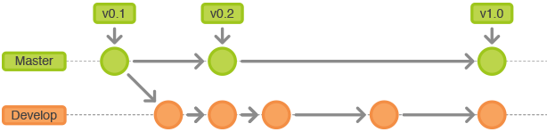
</div>

### 2.2 Feature分支

> 分支名最好统一加前缀`feature`
`Feature`分支做完后必须合并回`Develop`分支， 合并完分支后一般会删点这个`Feature`分支

<div align="center">    
    
</div>

### 2.3 Release分支

>分支名最好统一加前缀`release`
>`Release`分支基于`Develop`分支创建，完成`Release`分支之后可以在这个`Release`分支上测试，修改`Bug`等
>
>同时其它开发人员可以基于`Develop`开发新的`Feature` (记住一旦打了`Release`分支之后不要从`Develop`分支上合并新的改动到`Release`分支)。发布`Release`分支时合并`Release`到`Master`和`Develop`， 同时在`Master`分支上打个`Tag`记住`Release`版本号，然后可以删除`Release`分支了

<div align="center">    
    
</div>

### 2.4 维护分支Hotfix

> 分支名最好统一加前缀`hotfix`
`hotfix`分支基于`Master`分支创建，开发完后需要合并回`Master`和`Develop`分支，同时在`Master`打标签

<div align="center">    
    
</div>

## 3. 示例

### 3.1 创建develop分支

```linux
git branch develop
git push -u origin develop
```

### 3.2 开始新Feature开发

```linux
git checkout -b some-feature develop

# Optionally, push branch to origin:
git push -u origin some-feature

# 做一些改动
git status
git add some-file
git commit
```

### 3.3 完成Feature

```linux
git pull origin develop
git checkout develop
git merge --no-ff some-feature
git push origin develop
git branch -d some-feature

# If you pushed branch to origin:
git push origin --delete some-feature
```

### 3.4 开始Relase

```linux
git checkout -b release-0.1.0 develop
```

### 3.5 完成Release

```linux
git checkout master
git merge --no-ff release-0.1.0
git push

git checkout develop
git merge --no-ff release-0.1.0
git push

git branch -d release-0.1.0

# If you pushed branch to origin:
git push origin --delete release-0.1.0

git tag -a v0.1.0 master
git push --tags
```

### 3.6 开始Hotfix

```linux
git checkout -b hotfix-0.1.1 master
```

### 3.7 完成Hotfix

```linux
git checkout master
git merge --no-ff hotfix-0.1.1
git push


git checkout develop
git merge --no-ff hotfix-0.1.1
git push

git branch -d hotfix-0.1.1

git tag -a v0.1.1 master
git push --tags
```

## 4. Git flow Tool

> 其实就算很理解了但是实际操作的时候也难免有操作手误的时候
>
> 所以这个时候就需要那些聪明且懒得人创造的`Git flow script`【方便使用`Git`工作流】

### 4.1 安装

- OS X

  ```shell
  brew install git-flow
  ```

- Linux

  ```shell
  apt-get install git-flow
  ```

- Windows

  ```shell
  wget -q -O - --no-check-certificate https://github.com/nvie/gitflow/raw/develop/contrib/gitflow-installer.sh | bash
  ```

### 4.2 使用

- 初始化:`git flow init`

- 开始新`Feature`:`git flow feature start MYFEATURE`

- `Publish`一个`Feature`(也就是`push`到远程):`git flow feature publish MYFEATURE`

- 获取`Publish`的`Feature`:`git flow feature pull origin MYFEATURE`

- 完成一个`Feature`:`git flow feature finish MYFEATURE`

- 开始一个`Release`:`git flow release start RELEASE [BASE]`

- `Publish`一个`Release`:`git flow release publish RELEASE`

- 发布`Release`:`git flow release finish RELEASE`别忘了`git push --tags`

- 开始一个`Hotfix`:`git flow hotfix start VERSION [BASENAME]`

- 发布一个`Hotfix`:`git flow hotfix finish VERSION`

<div align="center">    
    
</div>

### 4.3 推荐使用工具

#### 4.3.1 sourceTree

> 当你用`Git-flow`初始化后，基本上你只需要点击`git flow`菜单选择`start feature, release`或者`hotfix`, 做完后再次选择`git flow`菜单，点击`Done Action`

<div align="center">    
    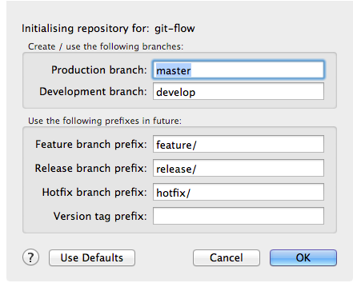
</div>

<div align="center">    
    
</div>

#### 4.3.2 idea plugin - Git Flow Integration

> 首先你的`idea`里已经集成好了`git`(这个必须的)，然后去插件库下载`Git Flow Integration`插件即可。

- 如何使用？

  下载插件完成后，如图所示位置点击`Init Repo`
  <div align="center">    
      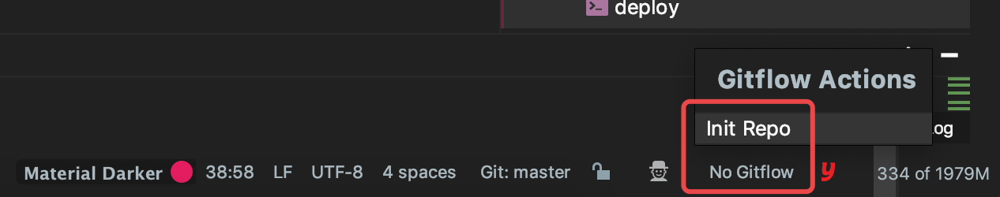
  </div>
  
  之后弹出框勾选对号修改标红的地方，最后单击`ok`即可(现在可能还没有创建`develop`分支会执行失败)
	<div align="center">    
      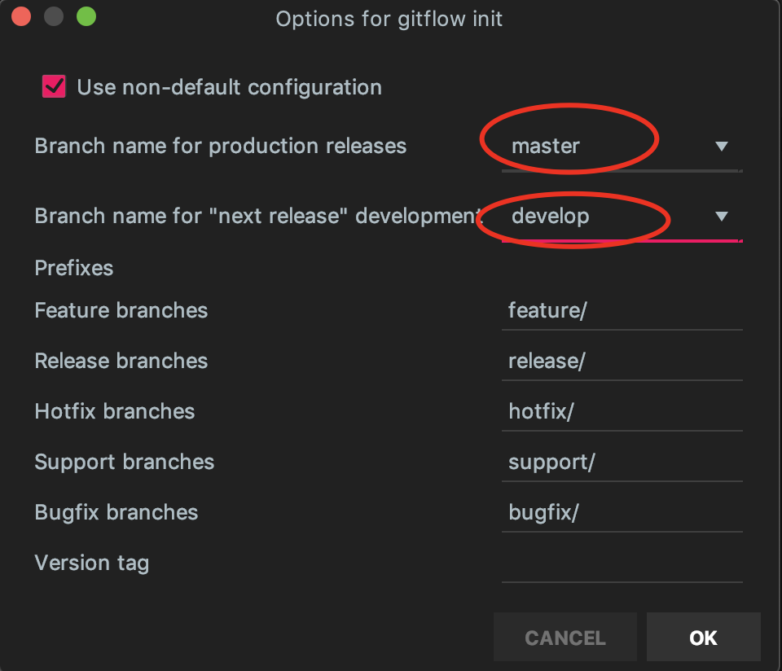
  </div>

## 5. Git Flow 没毛病?

### 乱序

> 其实任何`flow`都很难说能解决乱序问题，举个栗子

- 当三个人`ABC`各自有自己的分支`future_a`、`future_b`、`future_c`，都自测完毕合并到了`develop`分支，并发布到`release`分支，但是这个时候有一个分支有问题，其他两个没问题但是着急上线，怎么处理呢？方案：
  - 1. 对每个功能都设置开关，这样就算上线了也不会相互影响

  - 2. 也可以用`--no-ff`(禁止快速合并)合并分支，然后结合`cherry-pick`功能挑选所需的`commit`进行合并


## 6. 执行gitflow工作流

> 下面展开对`gitflow`的使用，基于`sourceTree`来进行讲解。

- 创建一个本地仓库名为`gitflow-test`

  <div align="center">    
      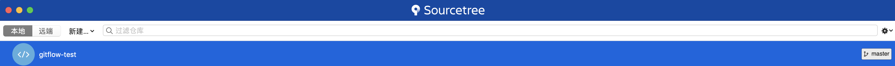
  </div>

- 对仓库进行初始化 

  <div align="center">    
      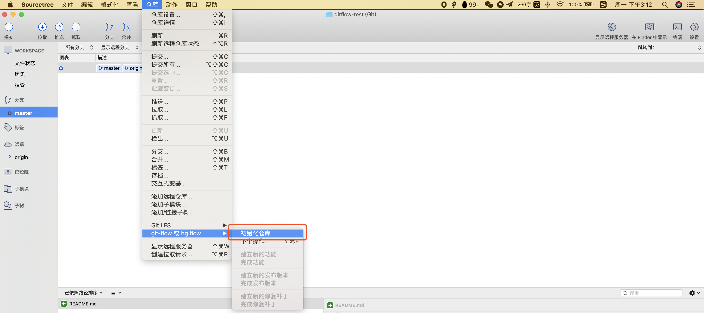
  </div>

- 初始化配置

  <div align="center">    
      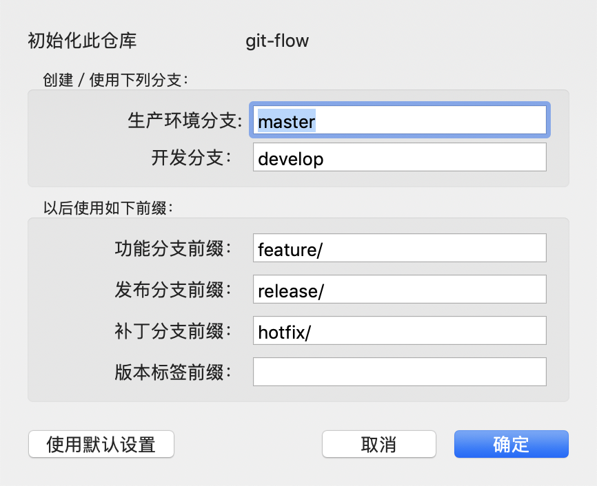
  </div>

- 新建新的功能

  <div align="center">    
      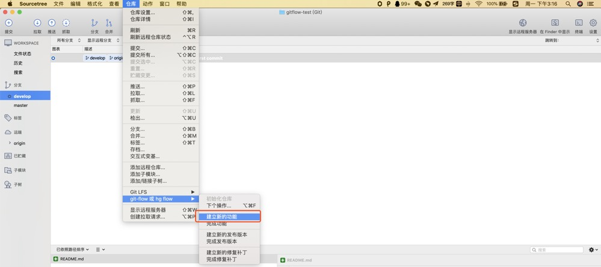
  </div>

- 填写功能名称`rocket`， 这个会在`develop`中新建一个`feature/rocket`的新分支并切换过去

  <div align="center">    
      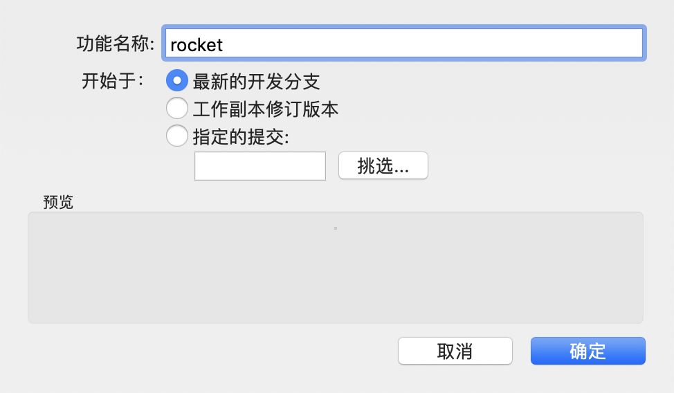
  </div>

  <div align="center">    
      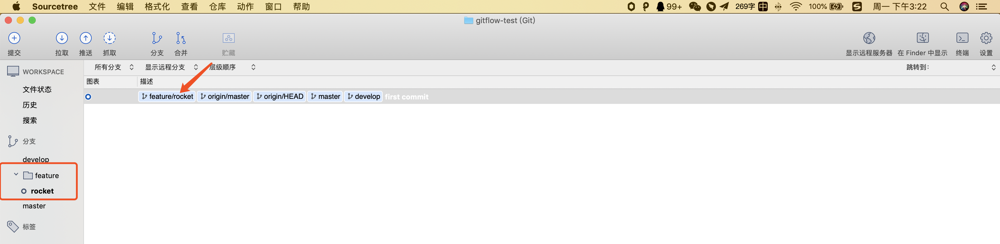
  </div>

- 添加一个`rocket`的文本文件并提交

  <div align="center">    
      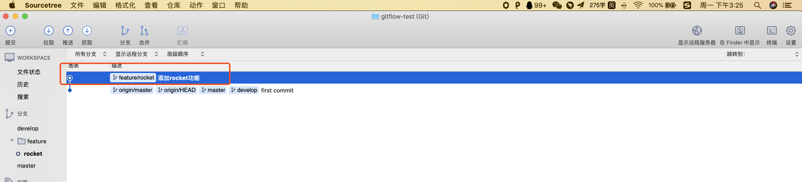
  </div>

- 点击完成当前项目

  <div align="center">    
      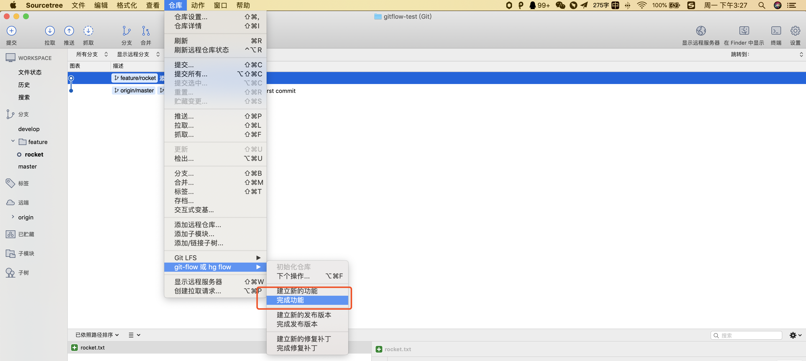
  </div>

- 这里会删除`feature/rocket`这个功能分支，把功能合并到`develop`中，`master`不变

  <div align="center">    
      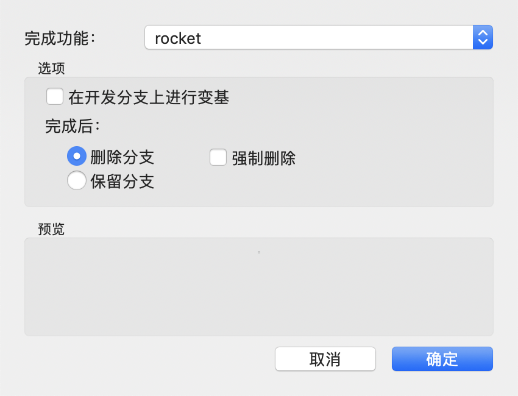
  </div>

  <div align="center">    
      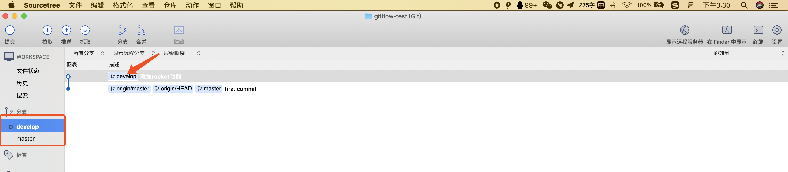
  </div>

- 当功能开发完成后进行发布

  <div align="center">    
      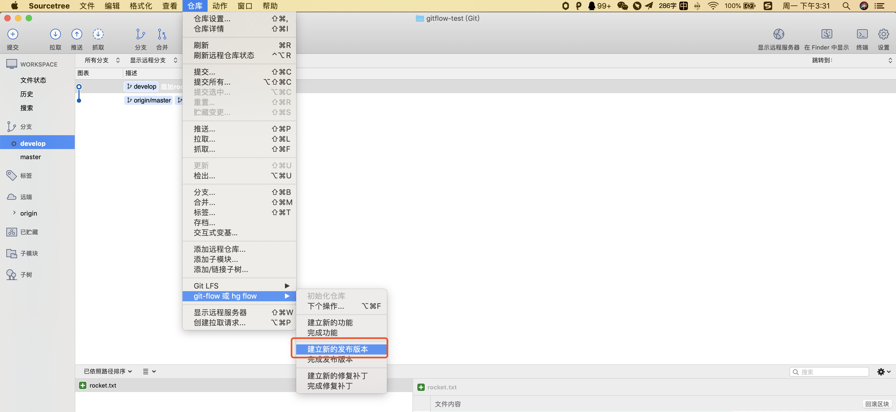
  </div>

- 设置发布的版本号

  <div align="center">    
      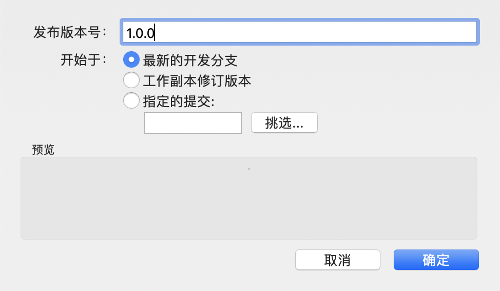
  </div>

- 发布完成后会创建新的`Release`分支

  <div align="center">    
      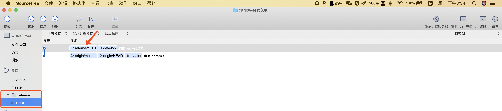
  </div>

- 发现火箭有毛病飞不起来，修复一下提交

  <div align="center">    
      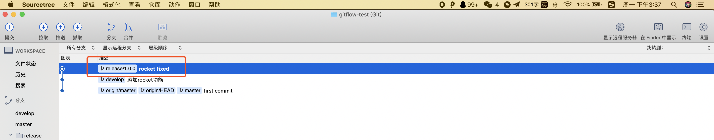
  </div>

- 点击完成发布版本

  <div align="center">    
      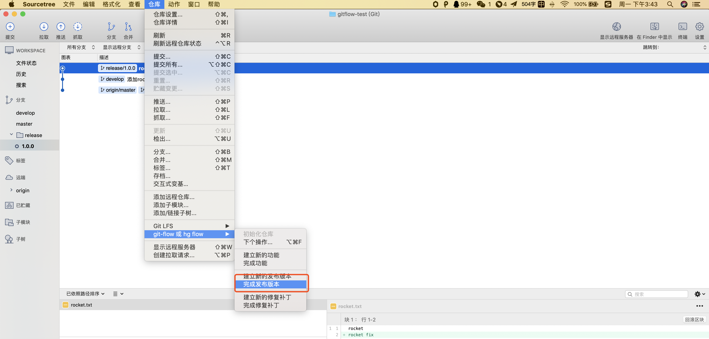
  </div>

- 这里会用刚才设置的版本号在`master`上打`tag`并删除`release`分支，且会合并到`master`和`develop`分支上

- <div align="center">    
      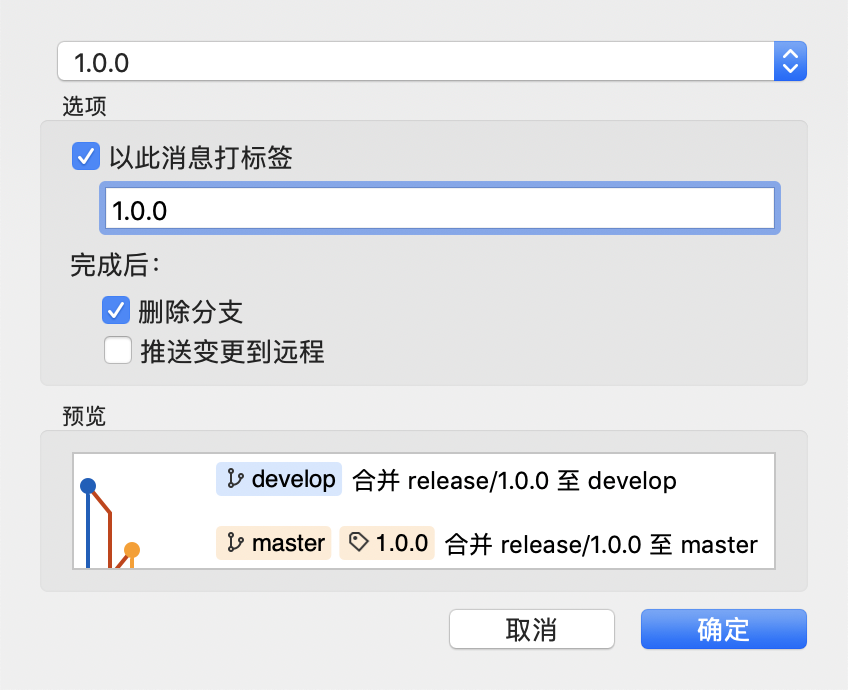
  </div>

- 检查一下结果没毛病

  <div align="center">    
      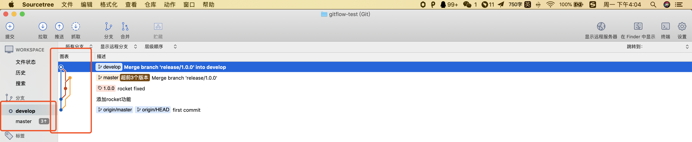
  </div>

## 7. 结合maven

> 其实要结合`maven`的原因主要是，需要以下步骤：

- 从`develop`分支拉出一个`release`分支

- 当`release`完成后，需要修改`maven`的`pom`版本号为正式版

  如当前的版本是`1.0.0-SNAPSHOT`即要改为`1.0.0`版本合并至`master`

- 而此时需要修改`pom`为`1.1.0-SNAPSHOT`，增加开发版的快照版本，合并到`develop`分支上

- 删除`Release`分支

因此直接使用`gitflow`则不会修改`maven`的版本号，所以我们引入的新东西`Git-Flow Maven Plugin`。

### 7.1 Git-Flow Maven Plugin

> 这个是支持多种`git`工作流的`maven`插件
>
> 也就是可以通过`mvn`命令行来自动完成上面所说的缺失的版本修改的步骤

- `Maven`配置参考

  ```xml
  <build>
      <plugins>
          <plugin>
              <groupId>com.amashchenko.maven.plugin</groupId>
              <artifactId>gitflow-maven-plugin</artifactId>
              <version>1.13.0</version>
              <configuration>
                  <!-- optional configuration -->
                  <gitFlowConfig>
                      <productionBranch>master</productionBranch>
                      <developmentBranch>develop</developmentBranch>
                      <featureBranchPrefix>feature/</featureBranchPrefix>
                      <releaseBranchPrefix>release/</releaseBranchPrefix>
                      <hotfixBranchPrefix>hotfix/</hotfixBranchPrefix>
                      <supportBranchPrefix>support/</supportBranchPrefix>
                      <versionTagPrefix></versionTagPrefix>
                      <origin>origin</origin>
                  </gitFlowConfig>
              </configuration>
          </plugin>
      </plugins>
  </build>
  ```

  插件使用参考地址:[官网参数地址](https://aleksandr-m.github.io/gitflow-maven-plugin/plugin-info.html)