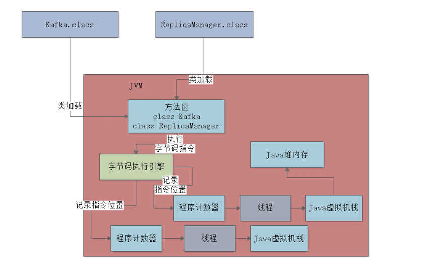

# 内存区域划分

从一张图来看Java内存区域划分

- 方法区:方法区是各个线程共享的内存区域，它用于存储已被虚拟机加载的类型信息、常量、静态变量、即时编译器编译后的代码缓存等数据
- 程序计数器:程序计数器是一块较小的内存空间，它可以看作是当前线程所执行的字节码的行号指示器。为了线程切换后能恢复到正确的执行位置，每条线程都需要有一个独立的程序计数器，各条线程之间计数器互不影响，独立存储，我们称这类内存区域为"线程私有"的内存
- 虚拟机栈:虚拟机栈描述的是Java方法执行的线程内存模型:每个方法被执行的时候Java虚拟机都会同步创建一个栈帧用于存储局部变量表、操作数栈、动态连接、方法出口等信息。每一个方法被调用直至执行完毕的过程，就对应着一个栈帧在虚拟机栈中从入栈到出栈的过程。虚拟机栈也是线程私有的
- 堆内存:Java堆(Java Heap)是虚拟机所管理的内存中最大的一块。Java堆是被所有线程共享的一块内存区域，在虚拟机启动时创建。此内存区域的唯一目的就是存放对象实例，Java世界里“几乎”所有的对象实例都在这里分配内存
- 本地方法栈:本地方法栈与虚拟机栈所发挥的作用是非常相似的，其区别只是虚拟机栈为虚拟机执行Java方法(也就是字节码)服务，而本地方法栈则是为虚拟机使用到的本地(Native)方法服务

