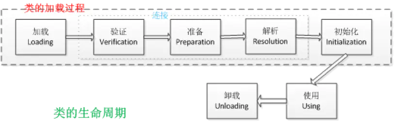
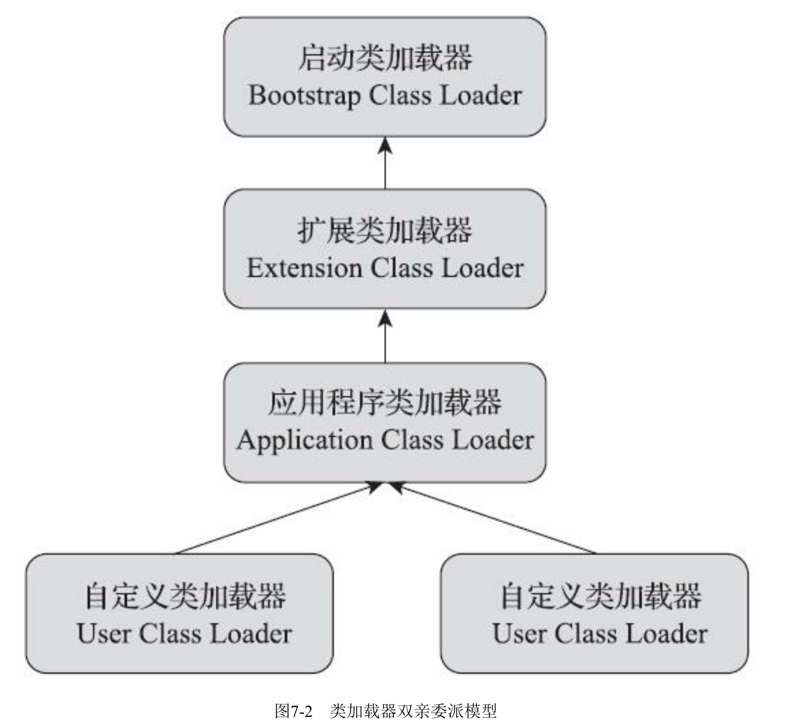

# 类加载过程及双亲委派模型

类的整个生命周期包括**加载、验证、准备、解析、初始化、使用和卸载**7个阶段，其中验证、准备、解析这3个部分统称为**连接**，如下图所示

## 类加载

### 加载

简单来说就是将.class文件读入内存，并为之创建一个Class对象。对于HotSpot虚拟机而言，Class对象存放在方法区里面

### 连接

- 验证:验证是连接阶段的第一步，这一阶段的目的是为了确保Class文件的字节流中包含的信息符合当前虚拟机的要求，并且不会危害虚拟机自身的安全

- 准备:准备阶段是正式为类变量分配内存并设置类变量(即静态变量，被static修饰的变量)初始值的阶段，这些变量所使用的内存都将在方法区中进行分配。**实例变量的初始化是在对象实例化的时候进行初始化，而且分配的内存区域是Java堆。注意:这里的初始值也就是在编程中默认值也就是零值**

    例如public static int value = 123，value在准备阶段后的初始值是0而不是123，因为此时尚未执行任何的Java方法，而把value赋值为123的putStatic指令是程序被编译后，存放在类构造器clinit()方法之中，把value赋值为123的动作将在初始化阶段才会执行

    特殊情况：如果类字段的字段属性表中存在ConstantValue属性，那在准备阶段变量就会被初始化为ConstantValue属性所指定的值，例如public static final int value = 123编译时javac将会为value生成ConstantValue属性，在准备阶段虚拟机就会根据ConstantValue的设置将变量赋值为123

- 解析:解析阶段是Java虚拟机将常量池内的符号引用替换为直接引用的过程。《Java虚拟机规范》之中并未规定解析阶段发生的具体时间

### 初始化

到了初始化阶段虚拟机才开始真正执行Java程序代码，前文讲到对类变量的初始化但那是仅仅赋初值，用户自定义的值还没有赋给该变量。只有到了初始化阶段才开始真正执行这个自定义的过程，所以也可以说初始化阶段是执行类构造器方法clinit()的过程。\<clinit\>()方法是由编译器自动收集类中的所有类变量的赋值动作和静态语句块(static{}块)中的语句合并产生的，编译器收集的顺序是由语句在源文件中出现的顺序决定的，静态语句块中只能访问到定义在静态语句块之前的变量，定义在它之后的变量在前面的静态语句块可以赋值但是不能访问

## 类在哪些情况下会被加载

关于在什么情况下需要开始类加载过程的第一个阶段"加载"，<<Java虚拟机规范>>并没有进行强制约束

但是对于初始化阶段<<Java虚拟机规范>>则是严格规定只有六种情况下必须对类进行"初始化"

- 遇到new、getstatic、putstatic、invokestatic这四个字节指令时，如果类没有进行过初始化则需要先对其进行初始化
    - 使用new关键字实例化对象的时候
    - 读取或设置一个类的类的静态字段(被final修饰，已在编译期把结果放入常量池的静态字段除外)
    - 调用一个类的静态方法时候
- 使用java.lang.reflect包的方法对类型进行放射调用的时候如果该类还没初始化
- 当类初始化的时候，如果发现其父类还没进行初始化则需要先触发父类的初始化
- 当虚拟机启动时用户需要指定一个执行类的主类(包括main方法的那个类)，虚拟机会先初始化这个类
- 当JDK1.7的动态语言支持时，如果一个java.lang.invoke.MethodHandler实例最后的解析结果为REF_getStatic、REF_putStatic、REF_invokeStatic、REF_newInvokeSpecial这四种的句柄方法，并且这个方法句柄对应的类没有进行过初始化，则需要先进行初始化出发
- 当一个接口中定义了JDK8新加入的默认方法(被default关键字修饰的接口方法)时，如果这个接口实现类发生了初始化，那么该接口要在其之前进行初始化

对于这六种会触发类进行初始化的场景，<<Java虚拟机规范>>中使用了一个非常强烈的限定语句(有且只有)这六种场景中的行为称为对一个类进行主动引用，除此之外所有引用类型方式都不会触发初始化，称为被动引用。即只有主动引用会触发类的初始化过程

## 双亲委派模型

- 类与类加载器

    每一个类加载器都有独立的类命名空间，这句话可以表达的更通俗一点就是比较两个类是否相等只有在两个类是由同一个个类加载器加载的前提下才有意义，否则即使两个类来源于同一个`Class`文件被同一个`Java`虚拟机加载，只要它们的类加载器不同那这两个类就必定不相同。每一个类加载器都有自己的命名空间，命名空间由该加载器及所有父加载器所加载的类构成。子加载器可以访问所有父加载器加载的类，但是父加载器加载的类无法访问子加载器所加载的类

- 双亲委派模型

    

    - 启动类加载器:这个类加载器负责加载存放在<JAVA_HOME>/lib目录或者被-Xbootclasspath参数所指定的路径中存放的而且是Java虚拟机能够识别的
    
        (按照文件名识别，如rt.jar、tools.jar。名字不符合的类库即使放在lib目录中也不会被加载)类库加载到虚拟机的内存中。启动类加载器无法被Java对象直接引用，用户在编写自定义类加载器的时候如果需要把请求委派到引导类加载器去处理直接用null代替即可
    
    - 扩展类加载器:这个类加载器是在类sum.misc.Launcher$ExtClassLoader中以Java代码实现的
    
        它负责加载<JAVA_HOME>/lib/ext目录中，或者被java.ext.dirs系统变量所指定的路径中的所有类库
    
    - 应用类加载器:这个类加载器是在类sum.misc.Launcher$AppClassLoader中以Java代码实现的
    
        由于应用类加载器是ClassLoader类中的getSystemClassLoader()方法的返回值，所以有些场合也称为系统类加载器
    
        它负责加载用户类路径ClassPath下的所有类库。开发者同样可以直接在代码中使用该类加载器
    
    双亲委派模型要求除了顶层类加载器外，其余的类加载器都应该有自己的父类加载器【通过组合方式实现】。双亲委派模型的工作流程是如果一个类加载器收到了类加载的请求，它首先不会自己去尝试加载这个类，而是把这个请求委托给父类加载器去完成，每一层的类加载器都是如此，因此所有的类加载请求最终都应该传送到最顶层的启动类加载器中，只有当父类加载器反馈自己无法完成这个加载请求的时候(它的搜索范围没有找到所需的类)，子加载器才会尝试自己去完成加载

## 附录

- 了解Tomcat类加载机制