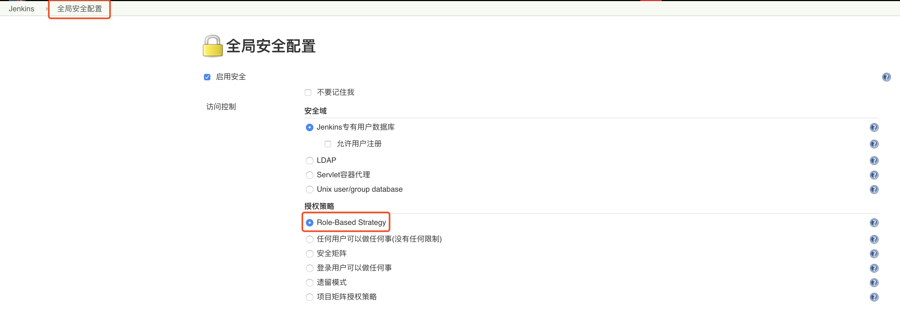
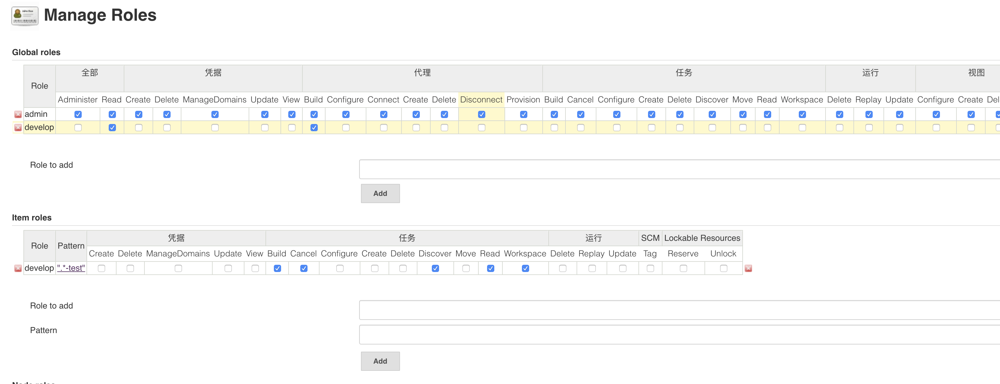
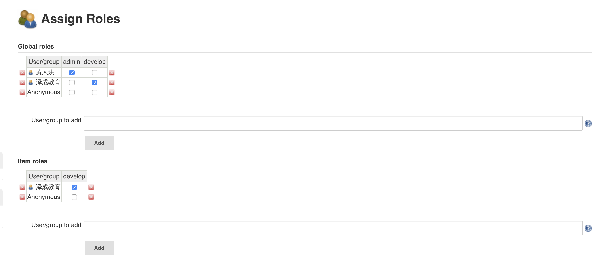

# Jenkins环境搭建

## 安装

- 拉取`Jenkins`库，安装`Jenkins`

  ```shell
  sudo wget -O /etc/yum.repos.d/jenkins.repo https://pkg.jenkins.io/redhat-stable/jenkins.repo
  
  sudo rpm --import https://pkg.jenkins.io/redhat-stable/jenkins.io.key
  
  yum install -y jenkins
  ```

- 如果需要对`Jenkins`进行更新可以使用如下命令

  ```shell
  yum update jenkins
  ```

- 开启和关闭`Jenkins`服务

  ```shell
  service jenkins start
  
  service jenkins stop
  ```

- 可能出现的问题`fixed`

  - `Starting Jenkins bash: /usr/bin/java: No such file or direct`

    ```shell
    # 1.编辑Jenkins服务启动文件
    vim /etc/init.d/jenkins
    
    # 将candidates中的/usr/bin/java修改为系统的JAVA路径 如下
    /usr/local/sdkman/candidates/java/current/bin/java
    ```
  
- `Jenkins`系统配置文件路径为`/etc/sysconfig/jenkins`

- `Jenkin`默认工作目录为`/var/lib/jenkins`

- `Jenkins`的`JOB`配置转为`XML`的地址为

  ```
  {JenkinsURL}/job/{jobName}/config.xml
  ```

## 插件安装

如果插件安装失败，可替换插件源

- 先加载好所有的可用插件【系统管理->插件管理->可用插件】等页面刷新完成

- 修改地址文件替换为国内源地址

    ```shell
    cd /var/lib/jenkins/updates/
    
    sed -i 's/http:\/\/updates.jenkins-ci.org\/download/https:\/\/mirrors.tuna.tsinghua.edu.cn\/jenkins/g' default.json && sed -i 's/http:\/\/www.google.com/https:\/\/www.baidu.com/g' default.json
    ```

- `系统管理->管理插件->高级->选择升级站点`

    ```reStructuredText
    https://mirrors.tuna.tsinghua.edu.cn/jenkins/updates/update-center.json
    ```

- 重启`Jenkins`使配置生效

常用的插件

- `credentials Binding`凭据管理
- `git`源码管理
- `Git Parameter`构建时候支持`Git`分支选择
- `Deploy to container`将构建结果部署到容器中
- `Maven Integration plugin` `Maven`项目构建
- `Pipeline`+`Pipeline: SCM Step`使用流水线构建项目
- `GitLab`+`GitLab Hook`钩子触发构建过程
- `Publish Over SSH`通过`SSH`发布项目
- `NodeJS`构建`NodeJS`项目
- `Email Extension Template`发送邮件相关插件

## 权限管理

- 安装`Role-based Authorization Strategy`插件并启用

    

- 配置角色和权限对应关系，其中`Global roles`为全局权限，`Project roles`为项目权限

    

- 添加完对应角色配置后，需要为用户分配对应角色

    

    

具体可参考关于`Jenkins`权限管理读这一篇就够用了:[https://www.cnblogs.com/kazihuo/p/9022899.html](https://www.cnblogs.com/kazihuo/p/9022899.html)

## Vue项目自动化部署配置

- `Jenkins`配置

  ```xml
  <?xml version="1.0" encoding="utf-8"?>
  
  <project> 
    <actions/>  
    <description/>  
    <keepDependencies>false</keepDependencies>  
    <properties> 
      <jenkins.model.BuildDiscarderProperty> 
        <strategy class="hudson.tasks.LogRotator"> 
          <daysToKeep>5</daysToKeep>  
          <numToKeep>5</numToKeep>  
          <artifactDaysToKeep>-1</artifactDaysToKeep>  
          <artifactNumToKeep>-1</artifactNumToKeep> 
        </strategy> 
      </jenkins.model.BuildDiscarderProperty>  
      <hudson.model.ParametersDefinitionProperty> 
        <parameterDefinitions> 
          <net.uaznia.lukanus.hudson.plugins.gitparameter.GitParameterDefinition plugin="git-parameter@0.9.11"> 
            <name>BRANCH</name>  
            <description>分支名称</description>  
            <uuid>9a9b8ea5-5a40-4484-8572-8f3e30a43222</uuid>  
            <type>PT_BRANCH_TAG</type>  
            <branch/>  
            <tagFilter>*</tagFilter>  
            <branchFilter>.*</branchFilter>  
            <sortMode>NONE</sortMode>  
            <defaultValue>master</defaultValue>  
            <selectedValue>NONE</selectedValue>  
            <quickFilterEnabled>false</quickFilterEnabled>  
            <listSize>5</listSize> 
          </net.uaznia.lukanus.hudson.plugins.gitparameter.GitParameterDefinition> 
        </parameterDefinitions> 
      </hudson.model.ParametersDefinitionProperty> 
    </properties>  
    <scm class="hudson.plugins.git.GitSCM" plugin="git@3.12.0"> 
      <configVersion>2</configVersion>  
      <userRemoteConfigs> 
        <hudson.plugins.git.UserRemoteConfig> 
          <url>https://gitee.com/roberto/live-training-font.git</url>  
          <credentialsId>1910c253-9f97-459c-8705-7584a2eafba0</credentialsId> 
        </hudson.plugins.git.UserRemoteConfig> 
      </userRemoteConfigs>  
      <branches> 
        <hudson.plugins.git.BranchSpec> 
          <name>$BRANCH</name> 
        </hudson.plugins.git.BranchSpec> 
      </branches>  
      <doGenerateSubmoduleConfigurations>false</doGenerateSubmoduleConfigurations>  
      <submoduleCfg class="list"/>  
      <extensions/> 
    </scm>  
    <canRoam>true</canRoam>  
    <disabled>false</disabled>  
    <blockBuildWhenDownstreamBuilding>false</blockBuildWhenDownstreamBuilding>  
    <blockBuildWhenUpstreamBuilding>false</blockBuildWhenUpstreamBuilding>  
    <triggers/>  
    <concurrentBuild>false</concurrentBuild>  
    <builders> 
      <hudson.tasks.Shell> 
        <command>npm install npm run build</command> 
      </hudson.tasks.Shell> 
    </builders>  
    <publishers> 
      <jenkins.plugins.publish__over__ssh.BapSshPublisherPlugin plugin="publish-over-ssh@1.20.1"> 
        <consolePrefix>SSH:</consolePrefix>  
        <delegate plugin="publish-over@0.22"> 
          <publishers> 
            <jenkins.plugins.publish__over__ssh.BapSshPublisher plugin="publish-over-ssh@1.20.1"> 
              <configName>测试服务器</configName>  
              <verbose>false</verbose>  
              <transfers> 
                <jenkins.plugins.publish__over__ssh.BapSshTransfer> 
                  <remoteDirectory>live-training-front/html-new</remoteDirectory>  
                  <sourceFiles>dist/**</sourceFiles>  
                  <excludes/>  
                  <removePrefix>dist/</removePrefix>  
                  <remoteDirectorySDF>false</remoteDirectorySDF>  
                  <flatten>false</flatten>  
                  <cleanRemote>false</cleanRemote>  
                  <noDefaultExcludes>false</noDefaultExcludes>  
                  <makeEmptyDirs>false</makeEmptyDirs>  
                  <patternSeparator>[, ]+</patternSeparator>  
                  <execCommand>rm -rf /usr/local/live-training-front/html/* mv /usr/local/live-training-front/html-new/* /usr/local/live-training-front/html/</execCommand>  
                  <execTimeout>120000</execTimeout>  
                  <usePty>false</usePty>  
                  <useAgentForwarding>false</useAgentForwarding> 
                </jenkins.plugins.publish__over__ssh.BapSshTransfer> 
              </transfers>  
              <useWorkspaceInPromotion>false</useWorkspaceInPromotion>  
              <usePromotionTimestamp>false</usePromotionTimestamp> 
            </jenkins.plugins.publish__over__ssh.BapSshPublisher> 
          </publishers>  
          <continueOnError>false</continueOnError>  
          <failOnError>false</failOnError>  
          <alwaysPublishFromMaster>false</alwaysPublishFromMaster>  
          <hostConfigurationAccess class="jenkins.plugins.publish_over_ssh.BapSshPublisherPlugin" reference="../.."/> 
        </delegate> 
      </jenkins.plugins.publish__over__ssh.BapSshPublisherPlugin> 
    </publishers>  
    <buildWrappers> 
      <jenkins.plugins.nodejs.NodeJSBuildWrapper plugin="nodejs@1.3.3"> 
        <nodeJSInstallationName>NodeJS</nodeJSInstallationName>  
        <cacheLocationStrategy class="jenkins.plugins.nodejs.cache.DefaultCacheLocationLocator"/> 
      </jenkins.plugins.nodejs.NodeJSBuildWrapper> 
    </buildWrappers> 
  </project>
  ```

- `Nginx`配置如下

  ```shell
  #user  nobody;
  worker_processes  1;
  
  #error_log  logs/error.log;
  #error_log  logs/error.log  notice;
  #error_log  logs/error.log  info;
  
  #pid        logs/nginx.pid;
  
  
  events {
      worker_connections  1024;
  }
  
  http {
      include       mime.types;
      default_type  application/octet-stream;
  
      #log_format  main  '$remote_addr - $remote_user [$time_local] "$request" '
      #                  '$status $body_bytes_sent "$http_referer" '
      #                  '"$http_user_agent" "$http_x_forwarded_for"';
  
      #access_log  logs/access.log  main;
  
      sendfile        on;
      #tcp_nopush     on;
  
      #keepalive_timeout  0;
      keepalive_timeout  65;
  
      #gzip  on;
  
      server {
          listen       80;
          server_name  localhost;
  
          #charset koi8-r;
  
          #access_log  logs/host.access.log  main;
  
          location / {
            root   /usr/local/live-training-front/html; #默认访问目录
            index  index.html; #默认访问文件
            try_files $uri $uri/ /index.html; #目录不存在则执行index.html
          }
  
          #error_page  404              /404.html;
  
          # redirect server error pages to the static page /50x.html
          #
          error_page   500 502 503 504  /50x.html;
          location = /50x.html {
              root   html;
          }
  
          # proxy the PHP scripts to Apache listening on 127.0.0.1:80
          #
          #location ~ \.php$ {
          #    proxy_pass   http://127.0.0.1;
          #}
  
          # pass the PHP scripts to FastCGI server listening on 127.0.0.1:9000
          #
          #location ~ \.php$ {
          #    root           html;
          #    fastcgi_pass   127.0.0.1:9000;
          #    fastcgi_index  index.php;
          #    fastcgi_param  SCRIPT_FILENAME  /scripts$fastcgi_script_name;
          #    include        fastcgi_params;
          #}
  
          # deny access to .htaccess files, if Apache's document root
          # concurs with nginx's one
          #
          #location ~ /\.ht {
          #    deny  all;
          #}
      }
  
  
      # another virtual host using mix of IP-, name-, and port-based configuration
      #
      #server {
      #    listen       8000;
      #    listen       somename:8080;
      #    server_name  somename  alias  another.alias;
  
      #    location / {
      #        root   html;
      #        index  index.html index.htm;
      #    }
      #}
  
  
      # HTTPS server
      #
      #server {
      #    listen       443 ssl;
      #    server_name  localhost;
  
      #    ssl_certificate      cert.pem;
      #    ssl_certificate_key  cert.key;
  
      #    ssl_session_cache    shared:SSL:1m;
      #    ssl_session_timeout  5m;
  
      #    ssl_ciphers  HIGH:!aNULL:!MD5;
      #    ssl_prefer_server_ciphers  on;
  
      #    location / {
      #        root   html;
      #        index  index.html index.htm;
      #    }
      #}
  }
  ```

参考链接:[https://www.chenchen.org/2018/01/16/Jenkins_NodeJs_Vue_CI.html](https://www.chenchen.org/2018/01/16/Jenkins_NodeJs_Vue_CI.html)

## SpringBoot项目部署脚本(deploy.sh)

```shell
#!/bin/bash
# loading profile and env
if [ -f "/etc/profile" ]; then
	source /etc/profile
fi
if [ -f "~/.bashrc" ]; then
	source ~/.bashrc
fi
if [ -f "~/.profile" ]; then
	source ~/.profile
fi
if [ -f "~/.bash_profile" ]; then
	source ~/.bash_profile
fi

SERVICE_HOME=/usr/local
SERVICE_NAME="live-training"

FILENEW=$SERVICE_HOME/$SERVICE_NAME/filenew
FILEBAK=$SERVICE_HOME/$SERVICE_NAME/filebak

echo "**********   DEPLOY START   **********"
# 如果文件夹不存在则创建
if [ ! -d $FILENEW  ];then
	mkdir -p $FILENEW
fi
# 如果文件夹不存在则创建
if [ ! -d $FILEBAK  ];then
	mkdir -p $FILEBAK
fi

# 获取服务器端项目的进程
echo "NOW start closing the old process..."
tpid=`ps -ef | grep "$SERVICE_NAME" | grep -v "grep" | awk '{print $2}'`
# 如果存在已有的进程则进行关闭
for id in $tpid
do
	echo "founding running instance of " $SERVICE_NAME $id ", stoping..."
	kill -15 $id
done
echo "Closing the old process finished..."

# 备份当前版本数据
echo "NOW backup and remove the current version..."
TIMESTAMP=`date +%Y%m%d%H%M%S`
cd $FILENEW

# 备份日志文件
if [ -d logs  ];then
	echo "backup log..."
	tar cf $FILEBAK/$SERVICE_NAME.logs.$TIMESTAMP.tar.gz logs/
fi

# 备份安装包文件
if [ -f $SERVICE_NAME-*.jar ];then
	echo "backup install package..."
	tar cf $FILEBAK/$SERVICE_NAME.$TIMESTAMP.tar.gz $SERVICE_NAME-*.jar
fi
echo "backup and remove the current version finished..."

# 删除旧版安装包
echo "Start deleting old installation packages..."
rm -rf $FILENEW/*
echo "deleting old installation packages finished..."

# 将最新上传的war包从上传目录移动到项目启动目录
mv $SERVICE_HOME/$SERVICE_NAME/$SERVICE_NAME-*.jar $FILENEW

# 启动项目
cd $FILENEW
echo "Start preparing to deploy a new version..."
nohup java -Dspring.profiles.active=test -jar $SERVICE_NAME-*.jar >/dev/null 2>&1 &
echo "Deployment of new version is finished..."
echo "**********   DEPLOY SUCCESS   **********
```

