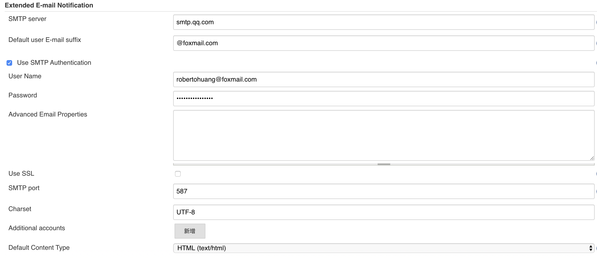

# Jenkins环境搭建

## 安装

- 拉取`Jenkins`库，安装`Jenkins`

  ```shell
  sudo wget -O /etc/yum.repos.d/jenkins.repo https://pkg.jenkins.io/redhat-stable/jenkins.repo
  
  sudo rpm --import https://pkg.jenkins.io/redhat-stable/jenkins.io.key
  
  yum install -y jenkins
  ```

- 如果需要对`Jenkins`进行更新可以使用如下命令

  ```shell
  yum update jenkins
  ```

- 开启和关闭`Jenkins`服务

  ```shell
  service jenkins start
  
  service jenkins stop
  ```

- 可能出现的问题`fixed`

  - `Starting Jenkins bash: /usr/bin/java: No such file or direct`

    ```shell
    # 1.编辑Jenkins服务启动文件
    vim /etc/init.d/jenkins
    
    # 将candidates中的/usr/bin/java修改为系统的JAVA路径 如下
    /usr/local/sdkman/candidates/java/current/bin/java
    ```
  
- `Jenkins`系统配置文件路径为`/etc/sysconfig/jenkins`，默认工作目录为`/var/lib/jenkins`

- `Jenkins`的`JOB`配置转为`XML`的地址为`{JenkinsURL}/job/{jobName}/config.xml`

## 插件安装

如果插件安装失败，可替换插件源

- 先加载好所有的可用插件【系统管理->插件管理->可用插件】等页面刷新完成

- 修改地址文件替换为国内源地址

    ```shell
    cd /var/lib/jenkins/updates/
    
    sed -i 's/http:\/\/updates.jenkins-ci.org\/download/https:\/\/mirrors.tuna.tsinghua.edu.cn\/jenkins/g' default.json && sed -i 's/http:\/\/www.google.com/https:\/\/www.baidu.com/g' default.json
    ```

- `系统管理->管理插件->高级->选择升级站点`

    ```reStructuredText
    https://mirrors.tuna.tsinghua.edu.cn/jenkins/updates/update-center.json
    ```

- 重启`Jenkins`使配置生效

常用的插件

- `credentials Binding`凭据管理
- `git`源码管理
- `Git Parameter`构建时候支持`Git`分支选择
- `Deploy to container`将构建结果部署到容器中
- `Maven Integration plugin` `Maven`项目构建
- `Pipeline`+`Pipeline: SCM Step`使用流水线构建项目
- `GitLab`+`GitLab Hook`钩子触发构建过程
- `Publish Over SSH`通过`SSH`发布项目
- `NodeJS`构建`NodeJS`项目
- `Email Extension Template`发送邮件相关插件

## 权限管理

- 安装`Role-based Authorization Strategy`插件并启用

    

- 配置角色和权限对应关系，其中`Global roles`为全局权限，`Project roles`为项目权限

    

- 添加完对应角色配置后，需要为用户分配对应角色

    

    

具体可参考关于`Jenkins`权限管理读这一篇就够用了:[https://www.cnblogs.com/kazihuo/p/9022899.html](https://www.cnblogs.com/kazihuo/p/9022899.html)

## 构建邮件通知配置

需要安装插件`Eamil Extension Plugin`

- 用`Jenkins`内置默认的邮件通知配置测试有效性

    点击`系统管理 > 系统设置`，找到`Jenkins Locaction`项填入`Jenkins URL`和系统管理员邮件地址，系统管理员邮件地址一定要配置，否则发不了邮件通知。因为邮件通知都是由系统管理员的邮箱发出来的

    

- 找到邮件通知项，填入`SMTP`服务器信息及用户名、密码等认证信息，选中通过发送测试邮件测试配置，点击 `Testconfiguration`按钮，如果如图所示则表示配置成功

    

- 这时在邮件中应该能看到刚刚我们发送的测试邮件啦，至此，内置邮件配置的作用已完成

- 安装插件，同样点击`系统管理 > 系统设置`，找到`Extension E-mail Notification`项进行全局配置

    基本信息:填写上述测试并正确的邮件信息

    `Default Content Type`默认内容类型，选择`HTML(text/html) Default Subject`

    默认邮件主题`Default Content`默认内容，此处我填写的是一段`HTML`文本

    `Default Triggers`:选择`Failure(Any)`和`Success`即构建成功或失败的时候发送邮件

    

    

    `Default Recipients`需要填入默认需要发送通知的邮件账户，多个账户以逗号隔开

    

    邮件默认配置内容如下

    ```html
    <!DOCTYPE html>  
    <html>  
    <head>  
      <meta charset="UTF-8">  
      <title>${ENV, var="JOB_NAME"}-第${BUILD_NUMBER}次构建日志</title>  
    </head>  
    
    <body leftmargin="8" marginwidth="0" topmargin="8" marginheight="4" offset="0">  
    <table width="95%" cellpadding="0" cellspacing="0" style="font-size: 11pt; font-family: Tahoma, Arial, Helvetica, sans-serif">  
    <tr>  
      <td><br />  
        <b><font color="#0B610B">构建信息</font></b>  
        <hr size="2" width="100%" align="center" />
      </td>  
    </tr>  
    <tr>  
      <td>  
        <ul>  
          <li>项目名称 ：${PROJECT_NAME}</li>  
          <li>构建状态 ：${BUILD_STATUS}</li>
          <li>构建编号 ：第${BUILD_NUMBER}次构建</li>  
          <li>触发原因 ：${CAUSE}</li>  
          <li>构建日志 ：<a href="${BUILD_URL}console">${BUILD_URL}console</a></li>  
          <li>构建URL ：<a href="${BUILD_URL}">${BUILD_URL}</a></li>  
          <li>工作目录 ：<a href="${PROJECT_URL}ws">${PROJECT_URL}ws</a></li>  
          <li>项目URL ：<a href="${PROJECT_URL}">${PROJECT_URL}</a></li>  
        </ul>  
      </td>  
    </tr>  
    <tr>  
      <td><b><font color="#0B610B">变更集</font></b>  
        <hr size="2" width="100%" align="center" />
      </td>  
    </tr>  
    
    <tr>  
      <td>${JELLY_SCRIPT,template="html"}<br/>  
        <hr size="2" width="100%" align="center" />
      </td>  
    </tr>  
    
    </table>  
    </body>  
    </html>  
    ```
    
- **项目配置** 进入到具体的项目配置界面点击"配置"，在配置界面点击"增加构建后操作步骤"，选择`Editable Email Notification`在设置中保存默认就可以啦。可以在`Advanced Settings`中针对项目进行个性化设置

- 更多关于邮件通知配置可参考:[Jenkins邮件通知配置](https://github.com/whihail/AutoArchive/wiki/%E5%AE%A2%E6%88%B7%E7%AB%AFJenkins%E8%87%AA%E5%8A%A8%E6%9E%84%E5%BB%BA%E6%8C%87%E5%8D%97%E4%B9%8B%E9%82%AE%E4%BB%B6%E9%80%9A%E7%9F%A5)和[Jenkins邮件通知插件配置项说明](https://blog.csdn.net/allenchan3721/article/details/84194886)

## Jenkins Pipeline使用详解

建议安装两个插件:`Blue Ocean`和`Blue Ocean Pipeline Editor`

### NodeJS项目

- `Jenkins Pipeline`配置

    ```
    pipeline {
        agent any;
        
        tools {
            nodejs 'NodeJS'
        }
        
        options {
            timestamps();
        }
        
        parameters {
            // https://plugins.jenkins.io/git-parameter/
            gitParameter name: 'BRANCH', type: 'PT_BRANCH_TAG', defaultValue: 'master', description: '构建的分支'
        }
      
        stages {
            stage ("环境配置信息") {
                steps {
                    sh '''
                        echo "PATH = ${PATH}"
                    ''' 
                }
            }
            
            stage("检出代码"){
                steps {
                    checkout([$class: 'GitSCM', branches: [[name: '$BRANCH']], doGenerateSubmoduleConfigurations: false, extensions: [], submoduleCfg: [], userRemoteConfigs: [[credentialsId: '29db3a41-8aa3-40dc-ae3d-a26644433c5b', url: 'http://118.24.206.22:6677/frontend/admin.git']]])
                }
            }
            
            stage("构建源代码") {
                steps {
                    sh '''
                        pwd
                        npm install
                        npm run build
                    '''
                }
            }
            
            stage("发布安装包到远程服务器") {
                // https://jenkins.io/doc/pipeline/steps/publish-over-ssh/
                steps ([$class: 'BapSshPromotionPublisherPlugin']) {
                    sshPublisher(
                        continueOnError: false, 
                        failOnError: true,
                        publishers: [
                            sshPublisherDesc(
                                // 这里的configName是系统配置里头SSH服务器的Name
                                configName: "测试服务器",
                                verbose: true,
                                transfers: [
                                    sshTransfer(
                                        sourceFiles: "dist/**",
                                        removePrefix: "dist/",
                                        remoteDirectory: "live-training-admin-front/html-new",
                                        execCommand: "rm -rf /usr/local/live-training-admin-front/html/* \r\n mv /usr/local/live-training-admin-front/html-new/* /usr/local/live-training-admin-front/html/",
                                    ),
                                ]
                            )
                        ]
                    )
                }
            }
        }
    
        post {
            success {
                // https://jenkins.io/doc/pipeline/steps/email-ext/
                script{
                    emailext (
                        mimeType: "text/html",
                        from: "robertohuang@foxmail.com",
                        subject: '$DEFAULT_SUBJECT',
                        body: '$DEFAULT_CONTENT',
                        to: "robertohuang@foxmail.com",
                        replyTo: '$DEFAULT_REPLYTO', 
                        presendScript: '$DEFAULT_PRESEND_SCRIPT',
                        postsendScript: '$DEFAULT_POSTSEND_SCRIPT'
                    )
                }
            }
            failure {
                // https://jenkins.io/doc/pipeline/steps/email-ext/
                script{
                    emailext (
                        mimeType: "text/html",
                        from: "robertohuang@foxmail.com",
                        subject: '$DEFAULT_SUBJECT',
                        body: '$DEFAULT_CONTENT',
                        to: "robertohuang@foxmail.com",
                        replyTo: '$DEFAULT_REPLYTO', 
                        presendScript: '$DEFAULT_PRESEND_SCRIPT',
                        postsendScript: '$DEFAULT_POSTSEND_SCRIPT'
                    )
                }
            }
        }
    }
    ```

- `Nginx`相关配置

    ```
    location / {
        alias  /usr/local/live-training-main-front/html; #默认访问目录
        index  index.html; #默认访问文件
        try_files $uri $uri/ /index.html; #目录不存在则执行index.html
    }
    ```

### SpringBoot项目

- `Jenkins Pipeline`配置

    ```
    pipeline {
        agent any;
        
        tools {
            jdk 'JDK1.8'
            maven 'Maven'
        }
        
        options {
            timestamps();
        }
        
        parameters {
            // https://plugins.jenkins.io/git-parameter/
            gitParameter name: 'BRANCH', type: 'PT_BRANCH_TAG', defaultValue: 'master', description: '构建的分支'
        }
      
        stages {
            stage ("环境配置信息") {
                steps {
                    sh '''
                        echo "PATH = ${PATH}"
                        echo "M2_HOME = ${M2_HOME}"
                    ''' 
                }
            }
            
            stage("检出代码"){
                steps {
                    checkout([$class: 'GitSCM', branches: [[name: '$BRANCH']], doGenerateSubmoduleConfigurations: false, extensions: [], submoduleCfg: [], userRemoteConfigs: [[credentialsId: '29db3a41-8aa3-40dc-ae3d-a26644433c5b', url: 'http://118.24.206.22:6677/backend/live-training.git']]])
                }
            }
            
            stage("构建源代码") {
                steps {
                    sh '''
                        mvn clean install -DskipTests=true -P test
                    '''
                }
            }
            
            stage("发布安装包到远程服务器") {
                // https://jenkins.io/doc/pipeline/steps/publish-over-ssh/
                steps ([$class: 'BapSshPromotionPublisherPlugin']) {
                    sshPublisher(
                        continueOnError: false, 
                        failOnError: true,
                        publishers: [
                            sshPublisherDesc(
                                // 这里的configName是系统配置里头SSH服务器的Name
                                configName: "测试服务器",
                                verbose: true,
                                transfers: [
                                    sshTransfer(
                                        sourceFiles: "target/live-training-1.0.0-SNAPSHOT.jar",
                                        removePrefix: "target/",
                                        remoteDirectory: "live-training",
                                        execCommand: "cd /usr/local/live-training \r\n ./deploy.sh",
                                    ),
                                ]
                            )
                        ]
                    )
                }
            }
        }
    
        post {
            success {
                // https://jenkins.io/doc/pipeline/steps/email-ext/
                script{
                    emailext (
                        mimeType: "text/html",
                        from: "robertohuang@foxmail.com",
                        subject: '$DEFAULT_SUBJECT',
                        body: '$DEFAULT_CONTENT',
                        to: "robertohuang@foxmail.com",
                        replyTo: '$DEFAULT_REPLYTO', 
                        presendScript: '$DEFAULT_PRESEND_SCRIPT',
                        postsendScript: '$DEFAULT_POSTSEND_SCRIPT'
                    )
                }
            }
            failure {
                // https://jenkins.io/doc/pipeline/steps/email-ext/
                script{
                    emailext (
                        mimeType: "text/html",
                        from: "robertohuang@foxmail.com",
                        subject: '$DEFAULT_SUBJECT',
                        body: '$DEFAULT_CONTENT',
                        to: "robertohuang@foxmail.com",
                        replyTo: '$DEFAULT_REPLYTO', 
                        presendScript: '$DEFAULT_PRESEND_SCRIPT',
                        postsendScript: '$DEFAULT_POSTSEND_SCRIPT'
                    )
                }
            }
        }
    }
    ```

- `deploy.sh`脚本

    ```shell
    #!/bin/bash
    # loading profile and env
    if [ -f "/etc/profile" ]; then
    	source /etc/profile
    fi
    if [ -f "~/.bashrc" ]; then
    	source ~/.bashrc
    fi
    if [ -f "~/.profile" ]; then
    	source ~/.profile
    fi
    if [ -f "~/.bash_profile" ]; then
    	source ~/.bash_profile
    fi
    
    SERVICE_HOME=/usr/local
    SERVICE_NAME="live-training"
    
    FILENEW=$SERVICE_HOME/$SERVICE_NAME/filenew
    FILEBAK=$SERVICE_HOME/$SERVICE_NAME/filebak
    
    echo "**********   DEPLOY START   **********"
    # 如果文件夹不存在则创建
    if [ ! -d $FILENEW  ];then
    	mkdir -p $FILENEW
    fi
    # 如果文件夹不存在则创建
    if [ ! -d $FILEBAK  ];then
    	mkdir -p $FILEBAK
    fi
    
    # 获取服务器端项目的进程
    echo "NOW start closing the old process..."
    tpid=`ps -ef | grep "$SERVICE_NAME" | grep -v "grep" | awk '{print $2}'`
    # 如果存在已有的进程则进行关闭
    for id in $tpid
    do
    	echo "founding running instance of " $SERVICE_NAME $id ", stoping..."
    	kill -15 $id
    done
    echo "Closing the old process finished..."
    
    # 备份当前版本数据
    echo "NOW backup and remove the current version..."
    TIMESTAMP=`date +%Y%m%d%H%M%S`
    cd $FILENEW
    
    # 备份日志文件
    if [ -d logs  ];then
    	echo "backup log..."
    	tar cf $FILEBAK/$SERVICE_NAME.logs.$TIMESTAMP.tar.gz logs/
    fi
    
    # 备份安装包文件
    if [ -f $SERVICE_NAME-*.jar ];then
    	echo "backup install package..."
    	tar cf $FILEBAK/$SERVICE_NAME.$TIMESTAMP.tar.gz $SERVICE_NAME-*.jar
    fi
    echo "backup and remove the current version finished..."
    
    # 删除旧版安装包
    echo "Start deleting old installation packages..."
    rm -rf $FILENEW/*
    echo "deleting old installation packages finished..."
    
    # 将最新上传的war包从上传目录移动到项目启动目录
    mv $SERVICE_HOME/$SERVICE_NAME/$SERVICE_NAME-*.jar $FILENEW
    
    # 启动项目
    cd $FILENEW
    echo "Start preparing to deploy a new version..."
    nohup java -Dspring.profiles.active=test -jar $SERVICE_NAME-*.jar >/dev/null 2>&1 &
    echo "Deployment of new version is finished..."
    echo "**********   DEPLOY SUCCESS   **********
    ```

    