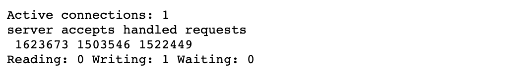

# Nginx使用详解


## 模块

- `http_stub_status_module`用于输出`nginx`的基本状态信息

    ```nginx
    # 用于输出Nginx状态信息
    location = /status {
      stub_status;
    }
    ```

    应用上诉配置后可以通过访问`http://hostname/status`获取`Nginx`运行状态信息

    

- `http_random_index_module`随机主页模块，启用该模块访问我们的网站可以出现不同的页面

- 

    