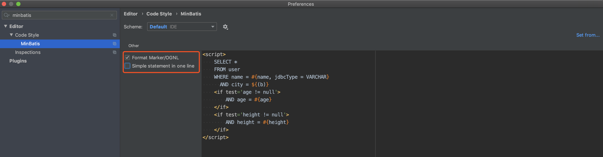
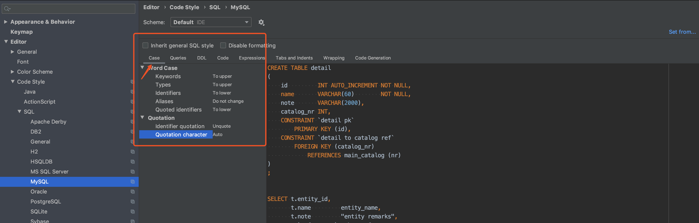
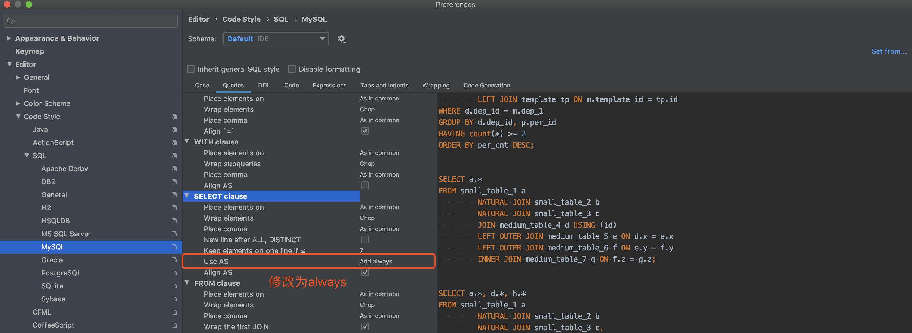
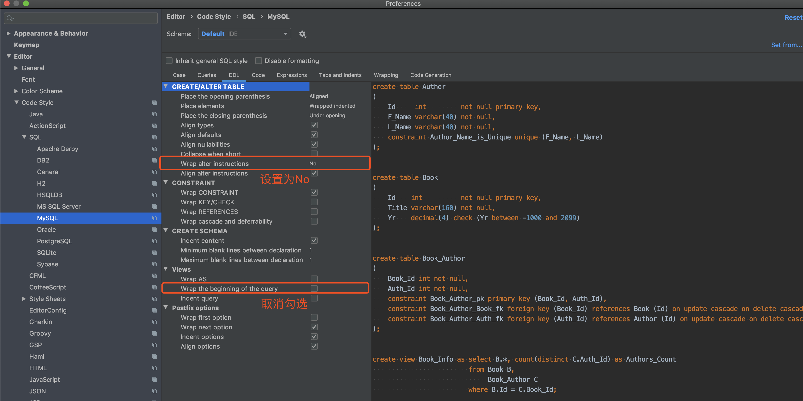
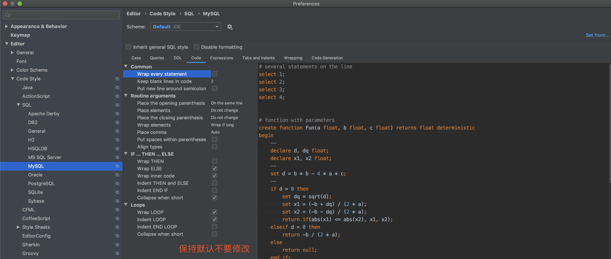
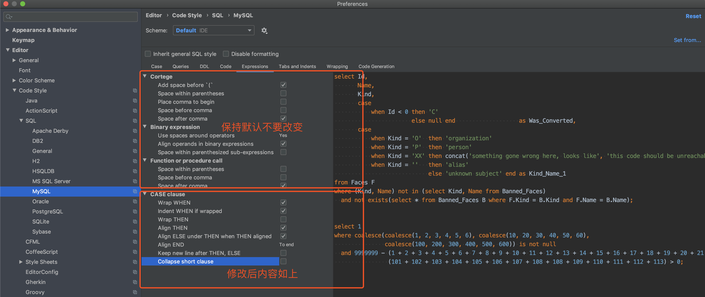
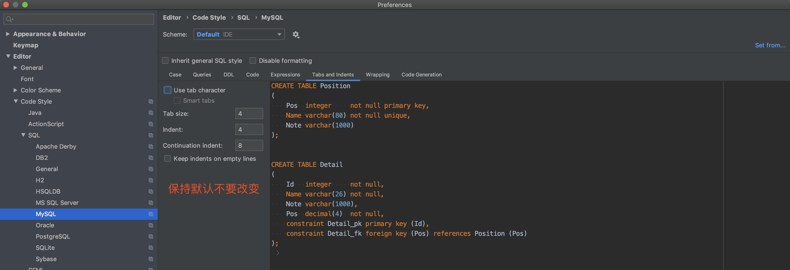
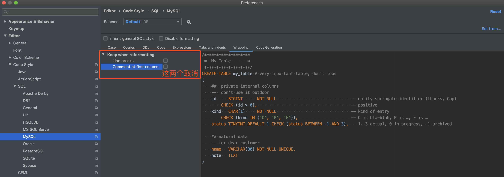
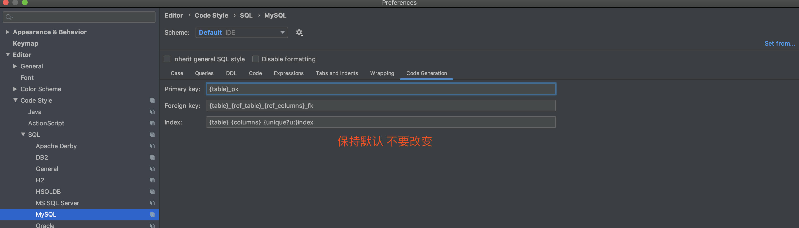

- 下载插件`Minbatis`

    该插件需要`IDEA 2019.3.3`或以上版本，建议下载`IDEA 2019.3.4`。[IDEA破解参考](https://zhuanlan.zhihu.com/p/110284543)

    下载完插件需要启用后重启`IDEA`，插件相关使用参考文档：[Minbatis Home](https://minbatis.codesmagic.com/)，下载后配置

    

- `MySQL`美化配置，请严格按下图进行配置并仔细检查

    

    

    

    

    

    

    

    

    检验标准以`SystemUserMapper.xml`为准，对`SystemUserMapper.xml`进行格式化后如果没发生格式改变即可

- 为了更好发挥插件的作用，需要添加数据库连接让插件更智能化

    

