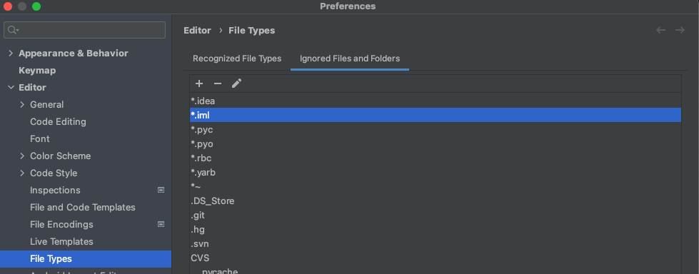
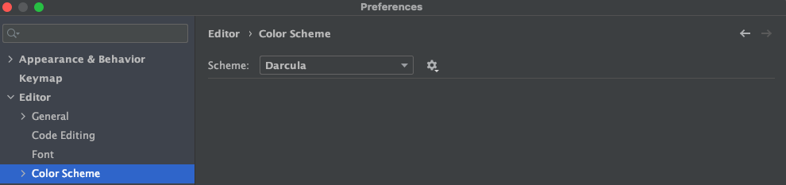
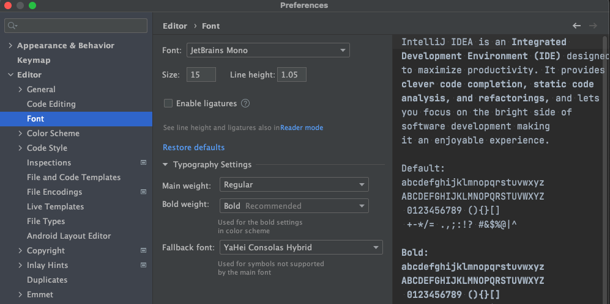
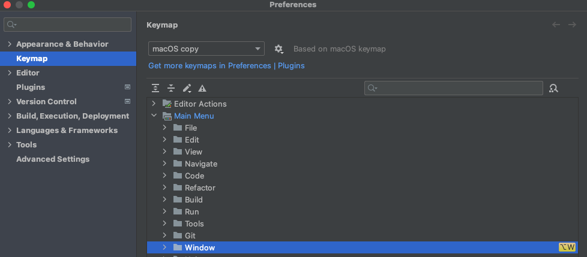
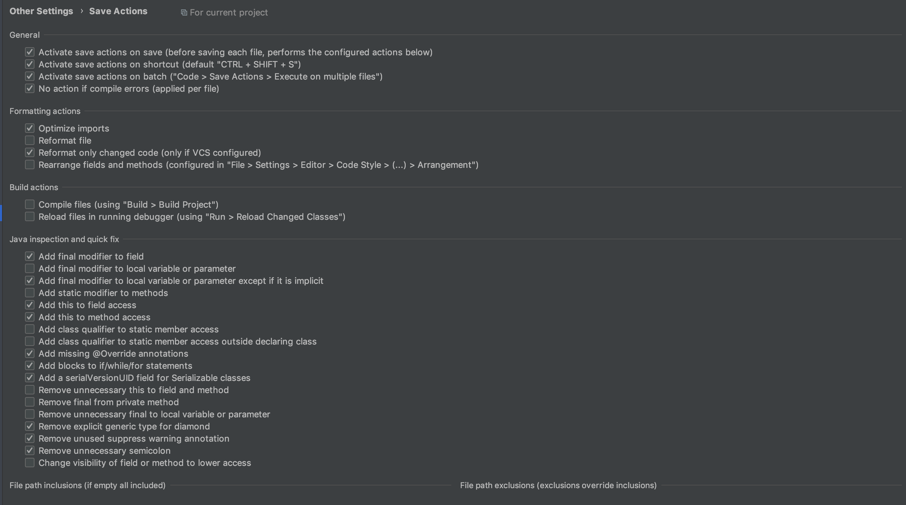

# IntelliJIDEA详细配置和使用教程

正所谓工欲善其事必先利其器，对开发人员而言若想提高编码效率，一款高效的开发工具是必不可少的

## 隐藏.idea文件夹和.iml等文件

`IntelliJ IDEA`项目会自动生成一个`.idea`文件夹和`.iml`文讲，看着实在是碍眼

在`File->Settings->Editor->File Types`下的`"Ignore files and folders"`一栏添加`*.idea;*.iml;`等配置如下图所示



## 禁止导入包.*的优化

    设置 -> Editor -> Code Style -> java -> imports
    设置 Class count to use import with '*'  值为500
    设置 Names count to use static import with '*' 值为300

## 代码编辑器主题风格

主题用的是IDEA自带的



字体设置



## 配置创建类模板

在`File->Settings->Editor->File and Code Templates`下分别修改`Class，Interface，Enum`等注释模板，如类模板修改如下

```
/**
* FileName: ${NAME}
* Author:   HuangTaiHong
* Date:     ${DATE}
* Description: ${DESCRIPTION}
* History:
* <author>          <time>          <version>          <desc>
* 作者姓名           修改时间           版本号              描述
*/
#if (${PACKAGE_NAME} && ${PACKAGE_NAME} != "")package ${PACKAGE_NAME};#end
#parse("File Header.java")

/**
* 〈${DESCRIPTION}〉
*
* @author HuangTaiHong
* @since ${DATE}
*/
public class ${NAME} {
        
}
```

## 自定义快捷键

- 切换多个项目窗口

    


## 插件相关

- 代码注释

    ```
    1.插件仓库下载javadoc2
      插件wiki地址:https://github.com/setial/intellij-javadocs/wiki
    
    2.模板配置
    - Class level模板配置:
    Template regexp:.+
    Template content:空白即可(由创建类时指定)
    
    - Constructor level模板配置
    Template regexp:.+
    Template content:
                    /**\n
                    * Instantiates a new ${name}.\n
                    <#if element.parameterList.parameters?has_content>
                            *\n
                    </#if>
                    <#list element.parameterList.parameters as parameter>
                            * @param ${parameter.name} the ${paramNames[parameter.name]}\n
                    </#list>
                    <#if element.throwsList.referenceElements?has_content>
                            *\n
                    </#if>
                    <#list element.throwsList.referenceElements as exception>
                            * @throws ${exception.referenceName} the ${exceptionNames[exception.referenceName]}\n
                    </#list>
                    * @author HuangTaiHong \n
                    * @since ${.now?string["yyyy.MM.dd HH:mm:ss"]}
                    */
    
    - Method level模板配置
    Template regexp:^.*(public|protected|private)*\s*.*(\w(\s*<.+>)*)+\s+get\w+\s*\(.*\).+
    Template content:
                    /**\n
                    * Gets ${partName}.\n
                    <#if element.typeParameters?has_content>         * \n
                    </#if>
                    <#list element.typeParameters as typeParameter>
                            * @param <${typeParameter.name}> the type parameter\n
                    </#list>
                    <#if element.parameterList.parameters?has_content>
                            *\n
                    </#if>
                    <#list element.parameterList.parameters as parameter>
                            * @param ${parameter.name} the ${paramNames[parameter.name]}\n
                    </#list>
                    <#if isNotVoid>
                            *\n
                            * @return the ${partName}\n
                    </#if>
                    <#if element.throwsList.referenceElements?has_content>
                            *\n
                    </#if>
                    <#list element.throwsList.referenceElements as exception>
                            * @throws ${exception.referenceName} the ${exceptionNames[exception.referenceName]}\n
                    </#list>
                    * @author HuangTaiHong \n
                    * @since ${.now?string["yyyy.MM.dd HH:mm:ss"]}
                    */
    
    Template regexp:^.*(public|protected|private)*\s*.*(void|\w(\s*<.+>)*)+\s+set\w+\s*\(.*\).+
    Template content:
                    /**\n
                    * Sets ${partName}.\n
                    <#if element.typeParameters?has_content>         * \n
                    </#if>
                    <#list element.typeParameters as typeParameter>
                            * @param <${typeParameter.name}> the type parameter\n
                    </#list>
                    <#if element.parameterList.parameters?has_content>
                            *\n
                    </#if>
                    <#list element.parameterList.parameters as parameter>
                            * @param ${parameter.name} the ${paramNames[parameter.name]}\n
                    </#list>
                    <#if isNotVoid>
                            *\n
                            * @return the ${partName}\n
                    </#if>
                    <#if element.throwsList.referenceElements?has_content>
                            *\n
                    </#if>
                    <#list element.throwsList.referenceElements as exception>
                            * @throws ${exception.referenceName} the ${exceptionNames[exception.referenceName]}\n
                    </#list>
                    * @author HuangTaiHong \n
                    * @since ${.now?string["yyyy.MM.dd HH:mm:ss"]}
                    */
    
    Template regexp:^.*((public\s+static)|(static\s+public))\s+void\s+main\s*\(\s*String\s*(\[\s*\]|\.\.\.)\s+\w+\s*\).+
    Template content:
                    /**\n
                    * The entry point of application.\n
    
                        <#if element.parameterList.parameters?has_content>
                            *\n
                    </#if>
                        * @param ${element.parameterList.parameters[0].name} the input arguments\n
                    <#if element.throwsList.referenceElements?has_content>
                            *\n
                    </#if>
                    <#list element.throwsList.referenceElements as exception>
                            * @throws ${exception.referenceName} the ${exceptionNames[exception.referenceName]}\n
                    </#list>
                    * @author HuangTaiHong \n
                    * @since ${.now?string["yyyy.MM.dd HH:mm:ss"]}
                    */
    
    Template regexp:.+
    Template content:
                    /**\n
                    * ${name}.\n
                    <#if element.typeParameters?has_content>         * \n
                    </#if>
                    <#list element.typeParameters as typeParameter>
                            * @param <${typeParameter.name}> the type parameter\n
                    </#list>
                    <#if element.parameterList.parameters?has_content>
                            *\n
                    </#if>
                    <#list element.parameterList.parameters as parameter>
                            * @param ${parameter.name} the ${paramNames[parameter.name]}\n
                    </#list>
                    <#if isNotVoid>
                            *\n
                            * @return the ${return}\n
                    </#if>
                    <#if element.throwsList.referenceElements?has_content>
                            *\n
                    </#if>
                    <#list element.throwsList.referenceElements as exception>
                            * @throws ${exception.referenceName} the ${exceptionNames[exception.referenceName]}\n
                    </#list>
                    * @author HuangTaiHong \n
                    * @since ${.now?string["yyyy.MM.dd HH:mm:ss"]}
                    */
                    
    - Field level模板配置
    Template regexp:.+
    Template content:空白即可(字段注释生成人为指定就好 无须生成)
    ```

- 代码格式化

    代码格式化插件`Safe Action`，[插件地址](https://github.com/dubreuia/intellij-plugin-save-actions)。推荐配置如下图

    

- 热部署插件

    热部署插件`Jrebel`，至于怎么破解网上找一下一堆

    需要关闭`IDEA`自动编译功能，否则会导致`IDEA`运行卡顿

    ```
    Setting -> Build,Execution,Deployment -> Compiler -> Build project automatically
    ```

    当代码修改后使用`Ctrl + F9`进行手动编译，项目就会热加载

- 字节码查看插件`jclasslib bytecode viewer`

