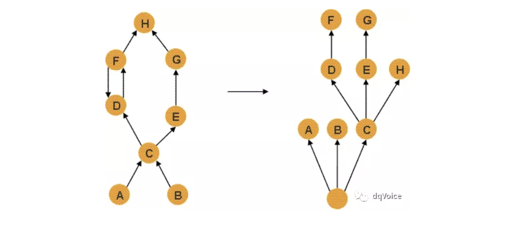

# MAT使用教程

> `MAT`全称`Eclipse Memory Analysis Tools`是一个`Java`堆数据的专业工具可以计算出内存中对象的实例数量、占用空间大小、引用关系等，看看是谁阻止了垃圾收集器的回收工作，从而定位内存泄漏的原因

配置

    
    

- `keep unreachable objects`:如果勾选在分析`dump`的时候回包含`dump`文件中的不可达对象
- `hide the getting started wizard`:隐藏分析完成后的展示内存泄漏分析、消耗最多内存的对象排序
- `Hide popup query help`:隐藏弹出查询帮助【不知道干啥的】
- `Hide Welcome screen on launch`：隐藏启动时候的欢迎界面
- `Bytes Display`:设置分析结果中内存大小的展示单位【正常情况下不需要修改】

## 关于Heap Dump

`Heap Dump`是`Java`进程在某个时刻的内存快照

不同`JVM`的实现的`Heap Dump`的文件格式可能不同，进而存储的数据也可能不同，但是一般来说

`Heap Dump`中主要包含当生成快照时堆中的`java`对象和类的信息，主要分为如下几类： 

- 对象信息:类名、属性、基础类型和引用类型 
- 类信息:类加载器、类名称、超类、静态属性 
- `gc roots`:`JVM`中的一个定义，进行垃圾收集时，要遍历可达对象的起点节点的集合 
- 线程栈和局部变量:快照生成时候的线程调用栈，和每个栈上的局部变量 

`Heap Dump`中没有包含对象的分配信息，因此它不能用来分析这种问题:对象何时被创建、对象被谁创建

## Shallow vs. Retained Heap

`Shallow heap`:是一个对象本身占用的堆内存大小

`Retained set`:对于某个对象`X`来说它的`Retained set`指的是——如果X被垃圾收集器回收了，那么这个集合中的对象都会被回收，同理如果X没有被垃圾收集器回收，那么这个集合中的对象都不会被回收

`Retained heap`:对象`X`的`Retained heap`指的时候它的`Retained set`中的所有对象的`Shallow heap`的和，换句话说`Retained heap`指的是对象`X`的保留内存大小，即由于它的存活导致多大的内存也没有被回收

`leading set`:对象`X`可能不止有一个这些对象统一构成了`leading set`。如果`leading set`中的对象都不可达，那么这个`leading set`对应的`retained set`中的对象就会被回收。一般有以下几种情况:

- 某个类的所有实例对象，这个类对象就是`leading object `

- 某个类记载器加载的所有类，以及这些类的实例对象，这个类加载器对象就是`leading object` 

- 一组对象，要达到其他对象的必经路径上的对象，就是`leading object` 

在下面这张图中`A`和`B`是`GC Roots`中的节点

    
    

可以看出`E`的存在会导致`G`无法被回收，因此`E`的`Retained set`是`E`和`G`

`C`的存在会导致`E、D、F、G、H`都无法被回收，因此`C`的`Retined set`是`C、E、D、F、G、H`

`A`和`B`的存在会导致`C、E、D、F、G、H`都无法被回收，因此`A`和`B`的`Retained set`是`A、B、C、E、D、F、G、H`

## Dominator Tree

`MAT`根据堆上的对象引用关系构建了支配树`Dominator Tree`，通过支配树可以很方便得识别出哪些对象占用了大量的内存，并可以看到它们之间的依赖关系。如果在对象图中从`GC Root`或者`x`上游的一个节点开始遍历，`x`是`y`的必经节点，那么就可以说`x`支配了`y` ，如果在对象图中`x`支配的所有对象中`y`的距离最近，那么就可以说`x`直接支配`y` 。支配树是基于对象的引用关系图建立的，在支配树中每个节点都是它的子节点的直接支配节点。基于支配树可以很清楚得看到对象之间的依赖关系，现在看个例子在下面这张图中

    
    

左图表示对象引用图右图表示左图所对应的支配树

- 对象A和B由根对象直接支配

- 由于在到对象C的路径中，可以经过A，也可以经过B，因此对象C的直接支配者也是根对象

- 对象F与对象D相互引用，因为到对象F的所有路径必然经过对象D，因此对象D是对象F的直接支配者

- 而到对象D的所有路径中，必然经过对象C，即使是从对象F到对象D的引用，从根点出发，也是经过对象C的，所以对象D的直接支配者为对象C，同理对象E支配对象G

- 到达对象H的可以通过对象D，也可以通过对象E，因此对象D和E都不能支配对象H，而经过对象C既可以到达D也可以到达E，因此对象C为对象H的直接支配者

## 如何生成Dump文件

- 过`jmap`命令生成`dump`文件 

1. - 命令格式:`jmap -dump:live,format=b,file=heap.bin  <pid>` 
    - 注意：如果要保留`heapdump`中的不可达对象则需要把`:live`去掉

- 通过设置`JVM`参数自动生成 使用`-XX:+HeapDumpOnOutOfMemoryError`这个`JVM`参数，在发生`OOM`的时候就会生成一个`heapdump`文件并写入到指定目录，一般用`-XX:HeapDumpPath=${HOME}/xxx`来设置

## 开始使用MAT

    
    

- 内存泄漏疑点分析报告

    在`MAT`工具栏下拉菜单中选择`Leak Suspects`即可生成一个`HTML`的报告

    
    
        
    

- 在`Overview`下选择`Top Consumers`查看大对象

    
    
    
    

## 工作中生产环境场景分析

