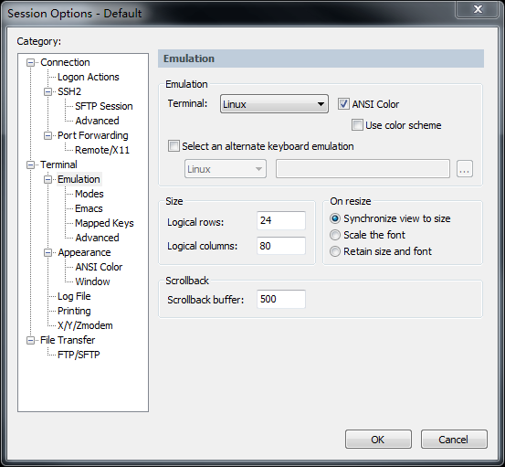
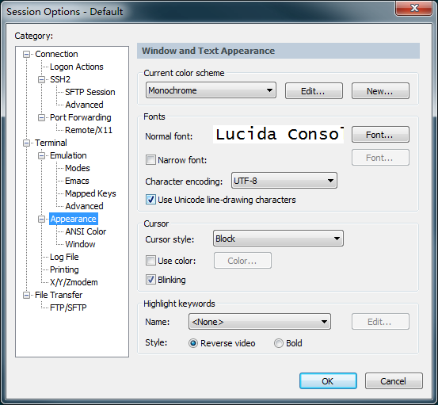

# 乱码配置

`选项(Options)->全局选项(Global Options)->常规(General)->默认会话(Default session)->编辑默认配置(Edit Default Settings)->终端(Terminal)->外观(Apperance)->(Character encoding)` 修改为`UTF-8`

# 配色方案

`选项(Options)->全局选项(Global Options)->常规(General)->默认会话(Default session)->编辑默认配置(Edit Default Settings)->终端(Terminal)->仿真(Emulation)->Terminal`为`Linux`且选中`ANSI Color`



`选项(Options)->全局选项(Global Options)->终端(Terminal)->外观(Apperance)->ANSI颜色(ANSI Color)`

```
Normal colors 第一个 E(128)   S(240)   L(25)
Normal colors 第八个 E(124)   S(20)    L(132)
Bold colors   第五个 E(140)   S(240)   L(120)
```
最终配色方案如下所示:


# 字体修改

`选项(Options)->全局选项(Global Options)->常规(General)->默认会话(Default session)->编辑默认设置(Edit Default Settings)->终端(Terminal)->外观(Appearance)将字体(Font)大小修改为18`



