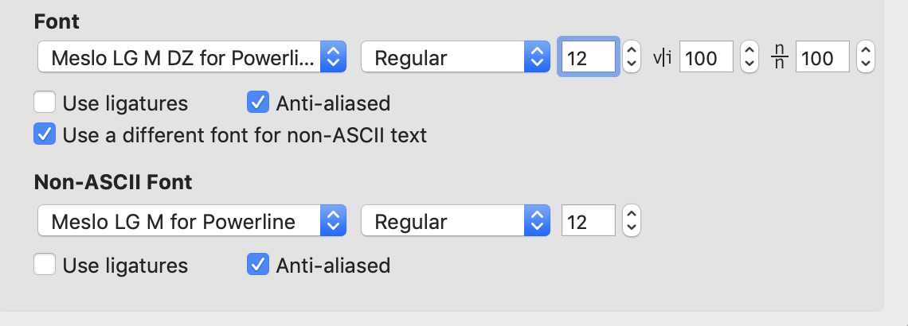

# Item2个性化配置

## 字体配置

- 下载安装字体

  ```shell
  # 下载字体
  git clone https://github.com/powerline/fonts.git --depth=1
  
  # 安装字体
  cd fonts
  ./install.sh
  
  # 删除文件
  cd ..
  rm -rf fronts
  ```

- 配置`iterm2`字体:`Preferences > Profiles > Default > Text`

  <div align="center">    
      
  </div>

## 配色方案

从[https://github.com/mbadolato/iTerm2-Color-Schemes](https://github.com/mbadolato/iTerm2-Color-Schemes)下载配色方案，并导入文件夹`schemes`下所有主题

推荐配色方案`Solarized Dark Higher Contrast`，`VIM`配色配置:编辑`/usr/share/vim/vimrc`添加如下行

```shell
syntax on
```

## Zsh和OhMyZsh安装与配置

- `Zsh`安装`brew install zsh`

- `OhMyZsh`一键安装脚本`sh -c "$(wget -O- https://raw.githubusercontent.com/robbyrussell/oh-my-zsh/master/tools/install.sh)"`。默认安装后使用的是`robbyrussell`主题，可以修改默认主题，从[下载](https://github.com/RobertoHuang/mydotfiles.git)这里获取，把主题文件下载到`~/.oh-my-zsh/themes`里面，然后修改`~/.zshrc`文件，配置好主题名字即可

  ```shell
  ZSH_THEME="lambda-mod"
  ```

- `ZSH`常用配置

  跟`Bash`一样`Bash`的配置文件叫做`.bashrc`，`Zsh`的配置文件也放在用户当前目录叫做`.zshrc`【路径别名、命令别名、切换目录、进程`id`补全、快速跳转、目录名简写与补全、常用命令参数补全、重复上一条命令】

- `zsh`常用插件推荐

  - `AutoJump`

    ```shell
    # 下载AutoJump
    brew install autojump
    
    # 编辑ZSH配置文件添加插件 在plugins后添加autojump插件
    vim ~/.zshrc
    plugins=(git autojump)
    
    # 在配置文件添加新的一行，重启后即可使用
    [[ -s $(brew --prefix)/etc/profile.d/autojump.sh ]] && . $(brew --prefix)/etc/profile.d/autojump.sh
    ```

  - 启用`sublime`插件

    ```shell
    # 编辑ZSH配置文件添加插件 在plugins后添加sublime插件
    vim ~/.zshrc
    plugins=(git autojump sublime)
    ```

    输入`st README.md`就可以调用机器上安装的`Sublime Text`打开当前目录的`README.md`进行编辑操作

  - 启用`web-search`插件

    ```shell
    # 编辑ZSH配置文件添加插件 在plugins后添加web-search插件
    vim ~/.zshrc
    plugins=(git autojump sublime web-search)
    ```

    - 输入 `baidu xxx` 直接在浏览器打开百度搜索关键字`xxx`
    - 输入 `google xxx` 直接在浏览器打开`Google`搜索关键字`xxx`

  - `zsh-syntax-highlighting`

    ```shell
    # 下载zsh-syntax-highlighting
    brew install zsh-syntax-highlighting
    
    # 在配置文件添加新的一行，重启后即可使用
    source /usr/local/share/zsh-syntax-highlighting/zsh-syntax-highlighting.zsh
    ```

  - `zsh-autosuggestions`

    ```shell
    # 下载zsh-autosuggestions
    git clone https://github.com/zsh-users/zsh-autosuggestions ${ZSH_CUSTOM:-~/.oh-my-zsh/custom}/plugins/zsh-autosuggestions
    
    # 编辑ZSH配置文件添加插件 在plugins后添加zsh-autosuggestions插件
    vim ~/.zshrc
    plugins=(git autojump sublime web-search zsh-autosuggestions)
    ```
    
    能记录平时你输入过的命令，下次再输入的时候它会提前提示你如果是你需要的命令直接 `Ctrl+F` 搞定

## 保存密码配置

- 安装`expect`

  ```shell
  brew install expect
  ```

  **如果遇到 man 目录的权限问题可以执行以下命令后在执行安装命令**

  ```shell
  sudo chown -R $(whoami) /usr/local/share/man/man5
  ```

- 创建except脚本

  ```shell
  #!/usr/bin/expect
  
  set timeout 30
  spawn ssh -p [lindex $argv 0] [lindex $argv 1]@[lindex $argv 2]
  expect {
          "(yes/no)?"
          {send "yes\n";exp_continue}
          "*assword:"
          {send "[lindex $argv 3]\n"}
  }
  interact
  ```

  这里`[lindex $argv 0 $argv 1 $argv 2 $argv 3]`分别代表着 **端口号 用户名 服务器地址 密码** 4个参数

  还需要给脚本执行权限

  ```shell
  sudo chmod +x /usr/local/bin/iterm2login.sh
  ```

- 新建`profiles`

  `iTerm2 -> Preferences -> Profiles`为每个服务器的连接，打上不同的`Tag`就自动按`Tag`分好组了

  <div  align="center">    
      
  </div>

  另外还可以在`Colors`中设置每个打开`Tab`的颜色，多个项目同时操作也不怕搞错了

  <div  align="center">    
      
  </div>

  <div  align="center">    
      
  </div>

- 最终效果

  如图，使用起来方便多了

  <div  align="center">    
      
  </div>

- 保持回话

  编辑或创建`~/.ssh/config`

  ```shell
  Host *
  ServerAliveCountMax 3
  ServerAliveInterval 300
  # 3 是最多发送的次数，如果想一直保持连接，本项目可以不写
  # 300 是发给服务端心跳的间隔，单位是秒，根据你自己的服务器情况设置
  ```

## 常用分屏快捷键

```shell
command + t：新建窗口

command + d：垂直分屏

command + shift + d：水平分屏

command + ] 和command + [  在最近使用的分屏直接切换.

command + alt + 方向键：切换到指定位置的分屏

command + 数字：切换标签页

command + 方向键：按方向切换标签页
```