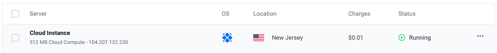

# 翻墙教程

科学上网`SSR`搭建教程，首先需要购买一款`VPS`，推荐大家使用

> https://www.vultr.com
>
> https://www.hostwinds.com

注册账号后可以自己选择一款符合需求的`VPS`按小时计费，不想用了或者`IP`被墙可以删掉重建，下次用了再重新搭建

- 部署实例

    在完善信息后对自己的账户进行充值

    

    充值完成后部署实例，选个中意的地区 > Centos7 > 带`IPV4`的每个月3.5刀部署起来

    


## 脚本方式部署

```shell
yum -y install git
git clone -b master https://github.com/flyzy2005/ss-fly
ss-fly/ss-fly.sh -ssr 

# 设置好相关参数后进行安装
# 全部选择结束后，会看到如下界面，就说明搭建ssr成功了
Congratulations, ShadowsocksR server install completed!
Your Server IP        :  
Your Server Port      :  
Your Password         :  
Your Protocol         :  
Your obfs             :  
Your Encryption Method:  

Welcome to visit:https://shadowsocks.be/9.html
Enjoy it!

# 相关操作ssr命令
启动：/etc/init.d/shadowsocks start
停止：/etc/init.d/shadowsocks stop
重启：/etc/init.d/shadowsocks restart
状态：/etc/init.d/shadowsocks status
 
配置文件路径：/etc/shadowsocks.json
日志文件路径：/var/log/shadowsocks.log
代码安装目录：/usr/local/shadowsocks

# 卸载ssr服务
./shadowsocksR.sh uninstall

# 一键开启BBR加速，装完后需要重启系统，输入y即可立即重启，或者之后输入reboot命令重启
ss-fly/ss-fly.sh -bbr
# 判断BBR加速有没有开启成功。输入以下命令
sysctl net.ipv4.tcp_available_congestion_control
# 如果返回值为net.ipv4.tcp_available_congestion_control = bbr cubic reno后面有bbr，则说明已经开启成功了
```

更多关于SSR部署可以参考:https://github.com/flyzy2005/ss-fly。启动后使用客户端配置后即可科学上网了