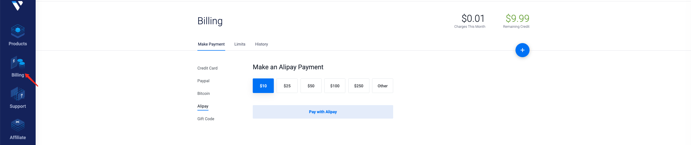

# 翻墙教程

科学上网`SSR`搭建教程，首先需要购买一款`VPS`，推荐大家使用

> https://www.vultr.com
>
> https://www.hostwinds.com

注册账号后可以自己选择一款符合需求的`VPS`按小时计费，不想用了或者`IP`被墙可以删掉重建，下次用了再重新搭建

- 部署实例

    在完善信息后对自己的账户进行充值

    

    充值完成后部署实例，选个中意的地区 > Centos7 > 带`IPV4`的每个月3.5刀部署起来

    

- 安装`Docker`

    ```
    sudo yum install -y yum-utils
    sudo yum-config-manager --add-repo https://download.docker.com/linux/centos/docker-ce.repo
    sudo yum install docker-ce docker-ce-cli containerd.io
    sudo service docker restart
    ```

- 启动容器

    ```
    docker run --privileged -d -p 8008:8008/tcp -p 8008:8008/udp --name ssr-bbr-docker letssudormrf/ssr-bbr-docker -p 8008 -k password -m rc4-md5 -O auth_aes128_md5 -o plain
    ```

    更多关于`SSR-BBR`可参考:https://github.com/letssudormrf/ssr-bbr-docker。启动后使用客户端配置后即可科学上网了

