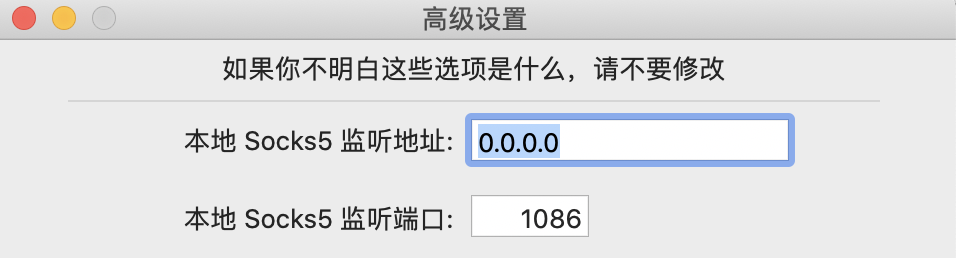
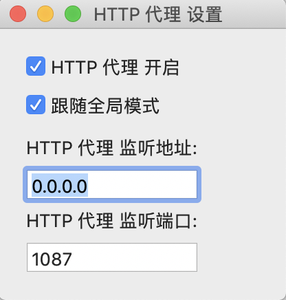

# 科学上网配置

本博客是介绍终端窗口如何进行科学上网(阅读下属内容建议建立在浏览器已经能科学上网的前提下)

- 配置`socks5`和`http`以及`https`全都代理

    ```
    alias setproxy='export socks5_proxy=socks5://127.0.0.1:1086;
                    export http_proxy=http://127.0.0.1:1087;
                    export https_proxy=http://127.0.0.1:1087;
                    git config --global http.proxy "socks5://127.0.0.1:1086"
                    git config --global https.proxy "socks5://127.0.0.1:1086"'
                    
    alias unsetproxy='unset socks5_proxy http_proxy https_proxy
                      git config --global --unset http.proxy
                      git config --global --unset https.proxy'
    ```

    如果使用`Shadowsocks`的话，上诉配置的地址查看界面分别是

    

    这里`Socks5`地址我修改成`0.0.0.0`的原因是因为我的虚拟机也想共享宿主机的`Shadowsocks`配置

    

    这里的`HTTP`地址修改为`0.0.0.0`的原因同上。通过上诉配置后那么`wget` `curl git clone` 这类命令都会经过代理
