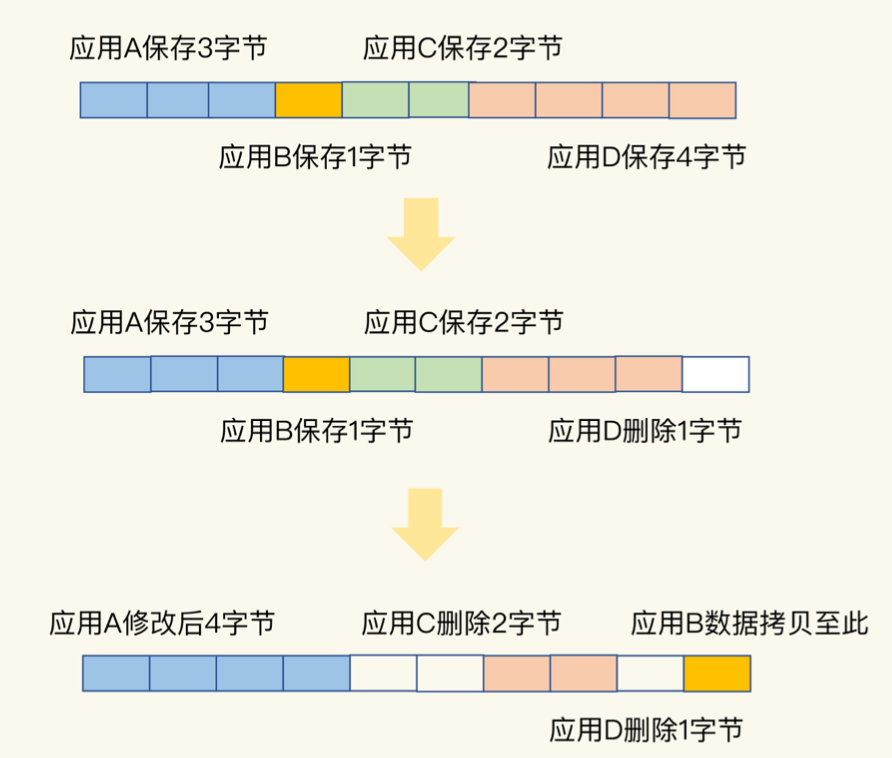
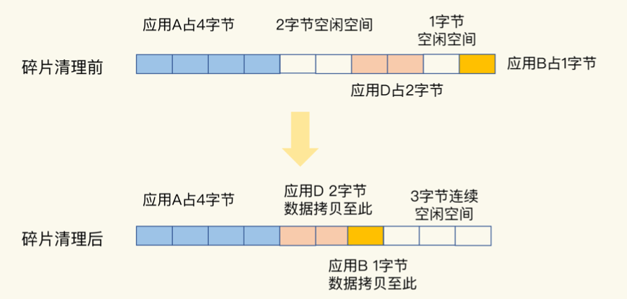

# Redis内存碎片

在使用Redis时我们经常会遇到这样一个问题:明明做了数据删除，数据量已经不大了，为什么使用top命令查看时，还会发现Redis占用了很多内存呢?

实际上这是因为当数据删除后Redis释放的内存空间会由内存分配器管理，并不会立即返回给操作系统。所以操作系统仍然会记录着给Redis分配了大量内存

但是这往往会伴随一个潜在的风险点:Redis释放的内存空间可能并不是连续的，那么这些不连续的内存空间很有可能处于一种闲置的状态

这就会导致一个问题:虽然有空闲空间，Redis却无法用来保存数据，不仅会减少Redis能够实际保存的数据量，还会降低Redis运行机器的成本回报率

## 内存碎片如何形成的

内存碎片的形成有内因和外因两个层面的原因

- **内因**:内存分配器的分配策略就决定了操作系统无法做到"按需分配"
    这是因为内存分配器一般是按固定大小来分配内存，而不是完全按照应用程序申请的内存空间大小给程序分配

    Redis可以使用libc、jemalloc、tcmalloc多种内存分配器来分配内存，默认使用jemalloc

    jemalloc的分配策略之一是按照一系列固定的大小划分内存空间，例如8字节、16字节、32字节、48字节，... 2KB、4KB、8KB等

    当程序申请的内存最接近某个固定值时，jemalloc会给它分配相应大小的空间，这样的分配方式本身是为了减少分配次数

    例如Redis申请一个 20 字节的空间保存数据，jemalloc就会分配32字节，此时如果应用还要写入10字节的数据，Redis就不用再向操作系统申请空间了，因为刚才分配的32字节已经够用了，这就避免了一次分配操作。但是如果Redis每次向分配器申请的内存空间大小不一样，这种分配方式就会有形成碎片的风险

- **外因**:删改操作

    键值对会被修改和删除，这会导致空间的扩容和释放

    具体来说，一方面如果修改后的键值对变大或变小了，就需要占用额外的空间或者释放不用的空间。另一方面删除的键值对就不再需要内存空间了。此时，就会把空间释放出来，形成空闲空间。但是由于空闲空间不一定连续，所以当需要一块连续的大内存的时候，不能满足需求

    

## 如何判断是否有内存碎片

使用`info memory`命令

这里有一个`mem_fragmentation_ratio`的指标，它表示的就是Redis当前的内存碎片率

```
mem_fragmentation_ratio = used_memory_rss/ used_memory
```

mem_fragmentation_ratio小于1说明Redis内存不够用了，换了一部分到swap中，会严重影响Redis性能

mem_fragmentation_ratio大于1但小于1.5这种情况是合理的，这是因为上述那些因素是难以避免的

mem_fragmentation_ratio大于1.5这表明内存碎片率已经超过了50%。一般情况下就需要采取一些措施来降低内存碎片率了

## 如何清理内存碎片



- 重启Redis实例（不太优雅，不推荐）

- 从4.0-RC3版本以后，Redis自身提供了一种内存碎片自动清理的方法，相关配置

    ```
    # 开启自动内存碎片整理(总开关)
    activedefrag yes
    # 当碎片达到100mb时，开启内存碎片整理
    active-defrag-ignore-bytes 100mb
    # 当碎片超过百分10时，开启内存碎片整理
    active-defrag-threshold-lower 10
    # 内存碎片超过百分100，则尽最大努力整理
    active-defrag-threshold-upper 100
    
    # 碎片清理是有代价的，操作系统需要把多份数据拷贝到新位置，把原有空间释放出来，这会带来时间开销
    # 因为Redis是单线程，在数据拷贝时Redis只能等着，这就导致Redis无法及时处理请求，性能就会降低
    # 有的时候数据拷贝还需要注意顺序，就像上图清理内存碎片的例子，操作系统需要先拷贝D并释放D的空间后才能拷贝B。这种对顺序性的要求会进一步增加Redis的等待时间，导致性能降低
    # 表示自动清理过程所用CPU时间的比例不低于25%，保证清理能正常开展
    active-defrag-cycle-min 25
    # 表示自动清理过程所用CPU时间的比例不高于75%，一旦超过就停止清理，从而避免在清理时大量的内存拷贝阻塞Redis，导致响应延迟升高
    active-defrag-cycle-max 75
    ```

内存碎片自动清理涉及内存拷贝，这对Redis而言是个潜在的风险。如果你在实践过程中遇到Redis性能变慢，记得通过日志看下是否正在进行碎片清理

