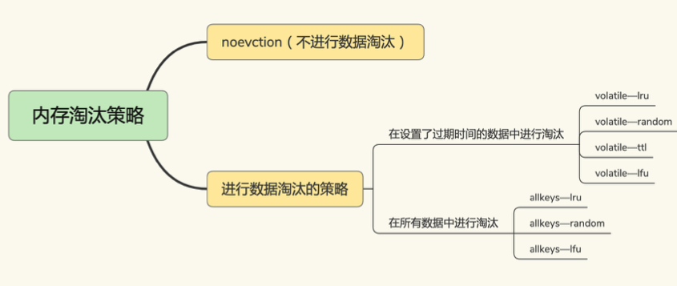

# Redis过期Key删除策略、内存淘汰策略

## 过期键的删除策略

如果一个键是过期的那它到了过期时间之后是不是马上就从内存中被被删除呢？如果不是那过期后到底什么时候被删除呢？其实有三种不同的删除策略

- 立即删除。在设置键的过期时间时创建一个回调事件，当过期时间达到时由时间处理器自动执行键的删除操作**【对cpu是最不友好的】**
- 惰性删除。键过期了就过期了不管，每次从字典中查询时判断是否已经过期，如果过期了就删除并返回nil，如果没过期就返回键值**【浪费内存】**
- 定时删除。每隔一段时间，对expires字典进行检查，删除里面的过期键**【折中方案】**

Redis使用的过期键值删除策略是:**惰性删除加上定期删除**，两者配合使用

## 内存淘汰策略

- Redis对LRU算法的实现

    LRU(least recently used)是一种缓存置换算法。即在缓存有限的情况下如果有新的数据需要加载进缓存，则需要将最不可能被继续访问的缓存剔除掉

    LRU算法在实际实现时需要用链表管理所有的缓存数据，这会带来额外的空间开销。而且当有数据被访问时，需要在链表上把该数据移动到MRU端，如果有大量数据被访问，就会带来很多链表移动操作会很耗时，进而会降低Redis缓存性能

    所以在Redis中LRU算法被做了简化，以减轻数据淘汰对缓存性能的影响。具体来说Redis默认会记录每个数据的最近一次访问的时间戳(由键值对数据结构 RedisObject中的lru字段记录)。然后Redis在决定淘汰的数据时，第一次会随机选出N个数据，把它们作为一个候选集合。接下来Redis会比较这N个数据的 lru 字段，把lru字段值最小的数据从缓存中淘汰出去。**Redis提供了一个配置参数maxmemory-samples，这个参数就是Redis选出的数据个数N**

    当需要再次淘汰数据时Redis需要挑选数据进入第一次淘汰时创建的候选集合。这儿的挑选标准是:能进入候选集合的数据的lru字段值必须小于候选集合中最小的lru值。当有新数据进入候选数据集后，如果候选数据集中的数据个数达到了maxmemory- samples，Redis就把候选数据集中lru字段值最小数据淘汰出去

    这样一来，Redis 缓存不用为所有的数据维护一个大链表，也不用在每次数据访问时都移动链表项，提升了缓存的性能

