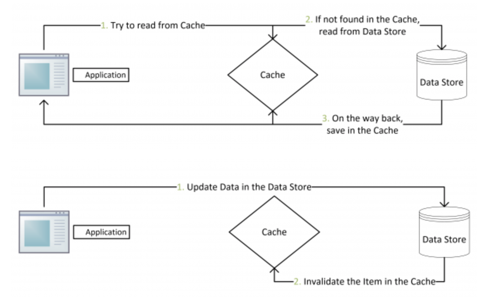
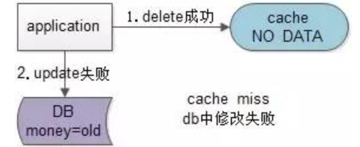

# 缓存和数据库一致性

你只要用缓存，就可能会涉及到缓存与数据库双存储双写，你只要是双写，就一定会有数据一致性的问题，那么你如何解决一致性问题

有一点我们要注意缓存和数据库的一致性，我们指的更多的是最终一致性。我们使用缓存只要是提高读操作的性能，真正在写操作的业务逻辑，还是以数据库为准。例如说我们可能缓存用户钱包的余额在缓存中，在前端查询钱包余额时读取缓存，在使用钱包余额时读取数据库

## Cache Aside Pattern

最经典的缓存+数据库读写的模式，就是Cache Aside Pattern

- **失效**：应用程序先从cache取数据，没有得到则从数据库中取数据，成功后放到缓存中

- **命中**：应用程序从cache中取数据，取到后返回

- **更新**：先把数据存到数据库中，成功后再让缓存失效

**为什么是删除缓存，而不是更新缓存**

原因很简单，很多时候，在复杂点的缓存场景，缓存不单单是数据库中直接取出来的值

比如可能更新了某个表的一个字段，然后其对应的缓存，是需要查询另外两个表的数据并进行运算，才能计算出缓存最新的值的

另外更新缓存的代价有时候是很高的。是不是说每次修改数据库的时候，都一定要将其对应的缓存更新一份？也许有的场景是这样，但是对于**比较复杂的缓存数据计算的场景**，就不是这样了。如果你频繁修改一个缓存涉及的多个表，缓存也频繁更新。但是问题在于**这个缓存到底会不会被频繁访问到？**

举个栗子，一个缓存涉及的表的字段，在1分钟内就修改了20次或者是100次，那么缓存更新20次、100次；但是这个缓存在1分钟内只被读取了1次，有**大量的冷数据**。实际上如果你只是删除缓存的话，那么在1分钟内这个缓存不过就重新计算一次而已，开销大幅度降低。**用到缓存才去算缓存**。这是一种懒加载的思想

**先操作数据库 VS 先操作缓存**

- 先写数据库，再淘汰缓存

    

    假设先写数据库再淘汰缓存:如果删缓存失败了，或者存在并发问题如下：

    （1）缓存刚好失效

    （2）请求A查数据库，得旧值

    （3）请求B将新值写入数据库

    （4）请求B删除缓存

    （5）请求A将旧值写入缓存

    都会导致数据不一致，但是这种并发问题概率很低(个人推荐使用该方式)

- 先淘汰缓存，再写数据库

    

    假设先淘汰缓存再写数据库，存在并发问题如下

    （1）请求A进行写操作，删除缓存

    （2）请求B读取缓存不存在

    （3）请求B查数据旧值

    （4）请求B将旧值写入缓存

    （5）请求A更新数据库

    这种情况也会导致脏数据的出现，而且只要存在并发场景这种问题出现的概率非常的高

## 缓存一致性解决方案

- 设置过期时间

    对Redis的缓存Key设置过期时间，达到最终一致性(延迟时间太长)

- 串行写

    在写请求时在淘汰缓存之前先获取该分布式锁。在读请求发现缓存不存在时，先获取分布式锁

- 延迟双删策略

    线程A写数据时先删除Redis的数据然后修改Mysql，之后再延迟一个业务时间后删除Redis的数据。延迟的业务时间不好明确，并且会影响系统的处理能力

- 基于消息队列来实现

    首先写入数据库，然后发送带有缓存KEY和VALUE的事务消息(需要有支持事务消息特性的消息队列)。消费者消费该消息更新到缓存中

