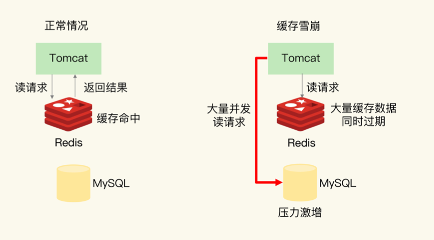
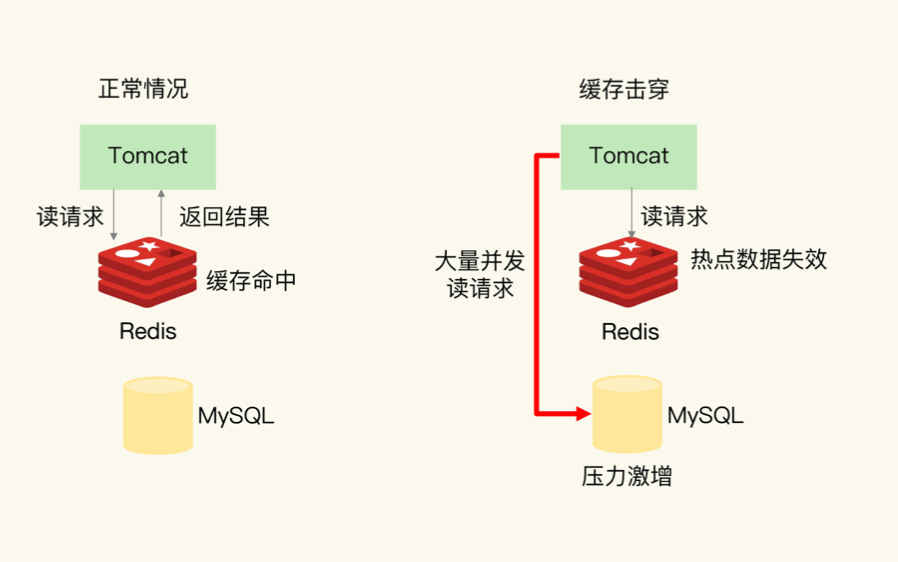
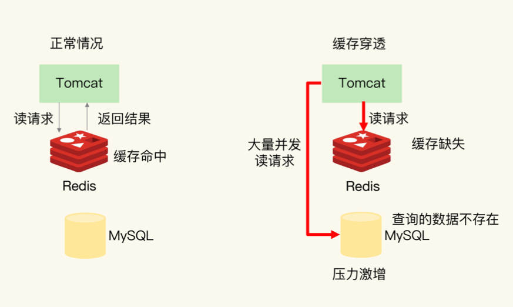
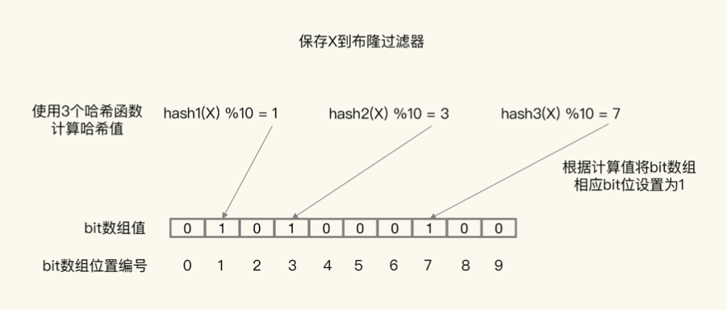

# 缓存雪崩、缓存击穿、缓存穿透

## 缓存雪崩

缓存雪崩是指大量的应用请求无法在Redis缓存中进行处理，紧接着应用将大量请求发 送到数据库层，导致数据库层的压力激增

**缓存雪崩原因和解决方案**

- 缓存中有大量数据同时过期，导致大量请求无法得到处理

    **避免给大量的数据设置相同的过期时间**:如果业务层的确要求有些数据同时失效，你可以在用EXPIRE命令给每个数据设置过期时间时，给这些数据的过期时间增 加一个较小的随机数(例如随机增加 1~3 分钟)，这样一来不同数据的过期时间有所差别但差别又不会太大，既避免了大量数据同时过期，同时也保证了这些数据基本在相近的时间失效，仍然能满足业务需求

    **服务降级，针对不同的数据采取不同的处理方式**:如当业务应用访问的是非核心数据时，暂时停止从缓存中查询这些数据，而是直接返回预定义信息、空值或是错误信息。当业务应用访问的是核心数据时，仍然允许查询缓存，如果缓存缺失也可以继续通过数据库读取

- Redis缓存实例发生故障宕机了

    **业务系统中实现服务熔断或请求限流机制**:服务熔断是指在发生缓存雪崩时，为了防止引发连锁的数据库雪崩，甚至是整个系统的崩溃，我们暂停业务应用对缓存系统的接口访问。 服务熔断虽然可以保证数据库的正常运行，但是暂停了整个缓存系统的访问，对业务应用的影响范围大。为了尽可能减少这种影响，我们也可以进行请求限流。这里说的请求限流就是指我们在业务系统的请求入口前端控制每秒进入系统的请求数，避免过多的请求被发送到数据库

    **事前预防，构建Redis缓存高可靠集群及本地缓存降级**

    如果Redis缓存的主节点故障宕机了，从节点还可以切换成为主节点，继续提供缓存服务

    如果整个Redis集群宕机可以将缓存降级到本地的`ehcache`避免了由于缓存实例宕机而导致的缓存雪崩问题

## 缓存击穿

缓存击穿是指针对某个访问非常频繁的热点数据的请求，无法在缓存中进行处理，紧接着访问该数据的大量请求一下子都发送到了后端数据库，导致了数据库压力激增，会影响数据库处理其他请求。缓存击穿的情况经常发生在热点数据过期失效时

为了避免缓存击穿给数据库带来的激增压力，我们的解决方法也比较直接，对于访问特别频繁的热点数据可以进行缓存预热，并且我们就不设置过期时间了。这样一来对热点数据的访问请求，都可以在缓存中进行处理，而Redis 数万级别的高吞吐量可以很好地应对大量的并发请求访问

## 缓存穿透

缓存穿透是指要访问的数据既不在Redis缓存中也不在数据库中，导致请求在访问缓存时发生缓存缺失，再去访问数据库时发现数据库中也没有要访问的数据。此时应用也无法从数据库中读取数据再写入缓存，这样一来，缓存也就成了“摆设”，如果应用持续有大量请求访问数据，就会同时给缓存和数据库带来巨大压力

为了避免缓存穿透的影响，我来给你提供三种应对方案

- **缓存空值或缺省值**:一旦发生缓存穿透我们就可以针对查询的数据，在Redis中缓存一个空值或是和业务层协商确定的缺省值**【需设置过期时间】**(例如库存的缺省值可以设为0)。紧接着，应用发送的后续请求再进行查询时，就可以直接从 Redis 中读取空值或缺省值，返回给业务应用了，避免了把大 量请求发送给数据库处理，保持了数据库的正常运行

- **使用布隆过滤器快速判断数据是否存在**

    布隆过滤器工作原理:布隆过滤器由一个初值都为0的bit数组和N个哈希函数组成，可以用来快速判断某个数据是否存在。当我们想标记某个数据存在时(例如数据已被写入数据库)，布隆过滤器会通过三个操作完成标记

    - 使用N个哈希函数，分别计算这个数据的哈希值，得到N个哈希值(减少冲突误判)
    - 然后我们把这N个哈希值对bit数组的长度取模，得到每个哈希值在数组中的对应位置
    - 最后我们把对应位置的bit位设置为1，这就完成了在布隆过滤器中标记数据的操作

    

    正是基于布隆过滤器的快速检测特性，我们可以在把数据写入数据库时使用布隆过滤器做个标记。当缓存缺失后应用查询数据库时，可以通过查询布隆过滤器快速判断数据是否存在，如果不存在就不用再去数据库中查询了。这样一来即使发生缓存穿透了，大量请求只会查询Redis和布隆过滤器，而不会积压到数据库，也就不会影响数据库的正常运行。布隆过滤器可以使用Redis 实现，本身就能承担较大的并发访问压力

    关于布隆过滤器的结论:**布隆过滤器认为存在的数据，它不一定存在。布隆过滤器认为不存在的数据一定不存在**

- **前端进行请求检测**

    缓存穿透的一个原因是有大量的恶意请求访问不存在的数据，所以一个有效的应对方案是在请求入口前端，对业务系统接收 到的请求进行合法性检测，把恶意的请求(例如请求参数不合理、请求参数是非法值、请求字段不存在)直接过滤掉，不让它们访问后端缓存和数据库。这样一来也就不会出现缓存穿透问题了

