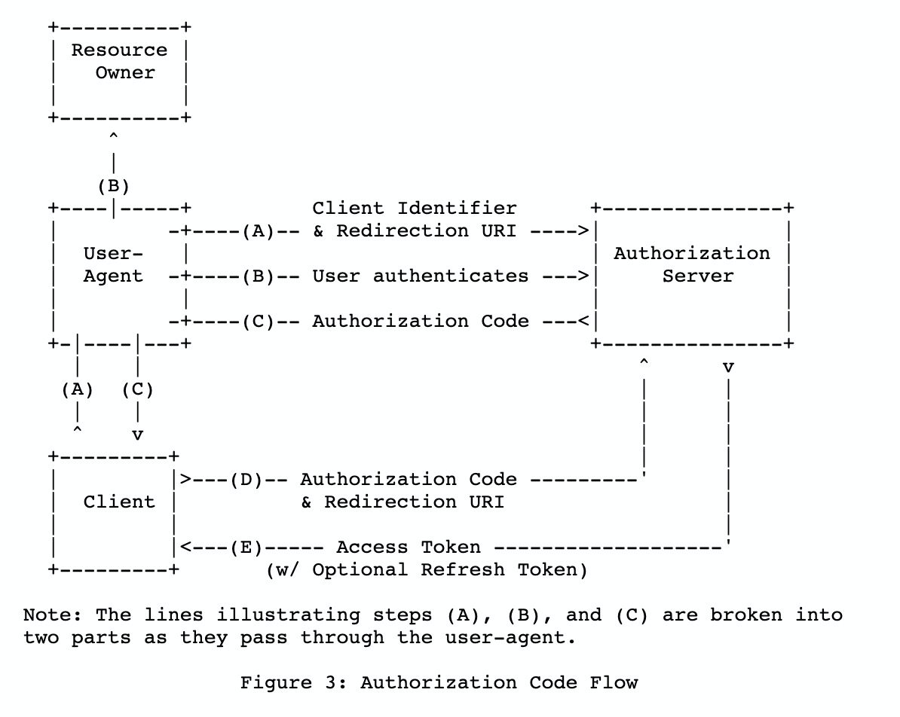
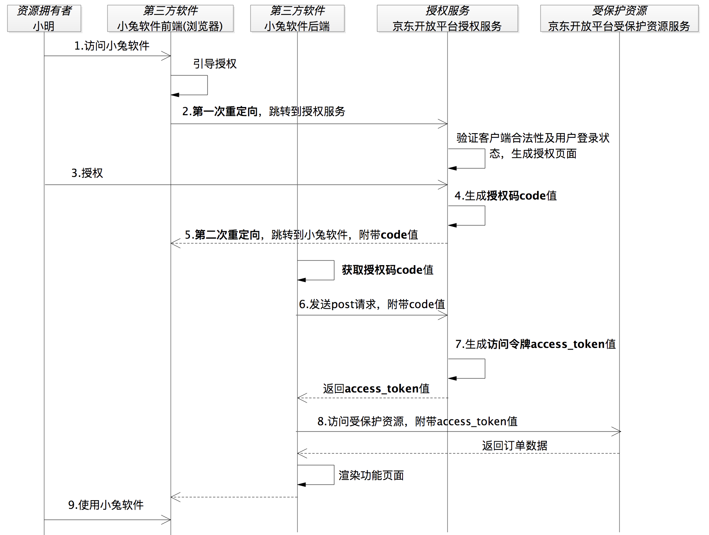
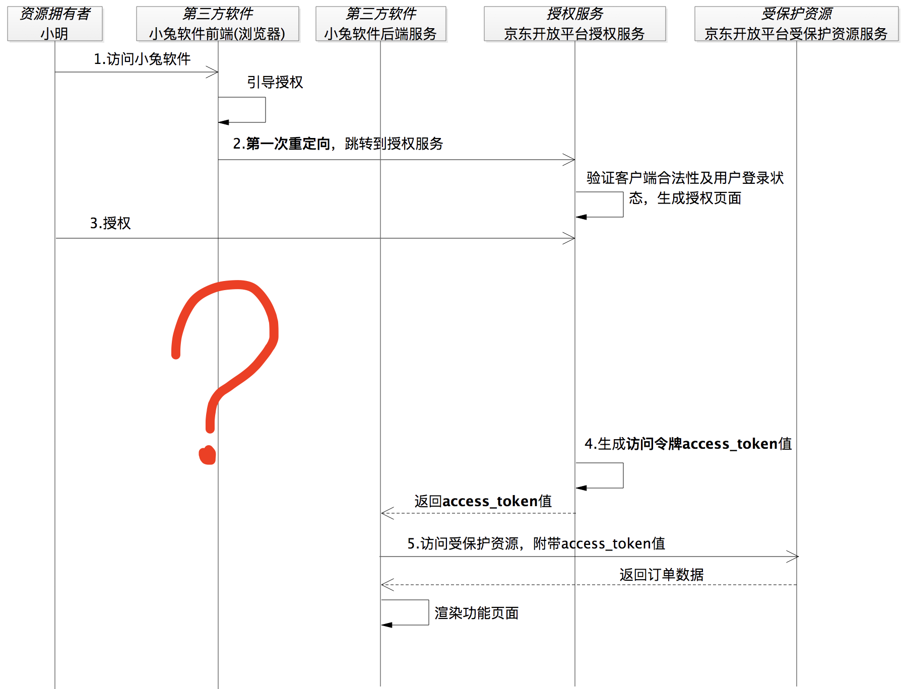

# Spring Security OAuth2

本博客只是学习笔记，如果文章涉嫌版权问题请第一时间联系下架

`Oauth2`是一种授权协议，而`Spring Security`是一个框架，它只是对`Oauth2`提供了提供了实现

`OAuth2`中数据的所有者告诉系统，同意授权第三方应用进入系统获取这些数据。系统从而产生一个短期的进入令牌`token`，用来代替密码供第三方应用使用。令牌`token`与密码`password`的作用是一样的，都可以进入系统，但是有三点差异

- 令牌是短期的，到期会自动失效，用户自己无法修改。密码一般长期有效，用户不修改，就不会发生变化
- 令牌可以被数据所有者撤销，会立即失效
- 令牌有权限范围`scope`。对于网络服务来说，只读令牌就比读写令牌更安全。密码一般是完整权限

上面这些设计保证了令牌既可以让第三方应用获得权限，同时又随时可控，不会危及系统安全。这就是`OAuth2`的优点

## 授权码模式

- 什么是授权码模式

    

    1. 客户端将资源拥有者引导到认证服务器的授权页面
    2. 资源拥有者在授权页面进行授权(登录)，表示资源拥有者允许客户端访问资源拥有者的资源
    3. 认证服务器生成授权码，带上授权码重定向回客户端
    4. 客户端凭借授权码，向认证服务器索要`token`
    5. 最后客户端使用`token`向资源服务器换取资源拥有者的资源

- 授权码模式中为什么一定要有授权码

    上述的过程相当的繁琐，这里以极客时间王新栋OAuth2实战课一个小兔打车实例进行一个演示一个真实流程

    

    从图中看到在第4步授权服务生成了授权码`code`，如果不要授权码这一步实际上就可以直接返回访问令牌`access_token`了。按着这个没有授权码的思路继续想，如果这里直接返回访问令牌那我们肯定不能使用重定向的方式。因为这样会把安全保密性要求极高的访问令牌暴露在浏览器上，从而将会面临访问令牌失窃的安全风险。显然这是不能被允许的。也就是说如果没有授权码的话，我们就只能把访问令牌发送给第三方软件小兔的后端服务。按照这样的逻辑，上面的流程图就会变成下面这样

    

    到这里看起来天衣无缝。小明访问小兔软件，小兔软件说要打单你得给我授权，然后小兔软件就引导小明跳转到了京东的授权服务

    到授权服务之后，京东商家开放平台验证了小兔的合法性以及小明的登录状态后，生成了授权页面。紧接着，小明赶紧点击同意授权，这时候京东商家开放平台知道可以把小明的订单数据给小兔软件

    这样问题就来了，当小明被浏览器重定向到授权服务上之后，小明跟小兔软件之间的"连接"就断了，相当于此时此刻小明跟授权服务建立了"连接"后将一直"停留在授权服务的页面上"。你会看到上图中问号处的时序上小明再也没有重新"连接"到小兔软件

    这时，考虑到“小明的感受”，小兔软件应该要通知到小明，但是如何做呢？

    为了让小兔软件能很容易地通知到小明，还必须让小明跟小兔软件重新建立起"连接"。这就是为什么我们需要授权码进行第二次重定向。这样才可以在小明授权之后重新重定向回到了小兔软件的地址上让小明就跟小兔软件有了新的"连接"

- 既然`AccessToken`直接通过重定向方式返回不安全，那授权码通过重定向返回是不是也不安全

    既然说第一次重定向的时候直接返回`AccessToken`是不安全的，那重定向中返回授权码是不是也是不安全的？毕竟别人知道第三方服务的地址后还是可以通过授权码进行换取`AccessToken`的。这里其实正常不会有这个问题存在，因为授权码通常是一次性的，在浏览器重定向的时候会把该授权码消耗掉，所以即使授权码被盗用别人也无法恶意通过授权码换取`AccessToken`了

- 在跳转到第三方授权软件的时候会不会存在钓鱼的网站

    这授权过程中第一步会将用户重定向到认证服务器进行授权，这个过程中其实是存在风险的，因为第三方软件可能弄了个虚假的授权服务器页面，而且页面和真正的认证服务器页面一样，这个是没办法避免的。只能通过监管部门进行查处

- 

## 为什么需要AT和RT

- 简化模式

    没有后台，只有客户端

- 授权码模式

    

# 参考资料

阮一峰 OAuth 2.0的一个简单解释:[http://www.ruanyifeng.com/blog/2019/04/oauth_design.html](http://www.ruanyifeng.com/blog/2019/04/oauth_design.html)

极客时间王新栋 OAuth2实战课:[https://time.geekbang.org/column/intro/321](https://time.geekbang.org/column/intro/321)读完豁然开朗 不是营销广告 真的值得一看

