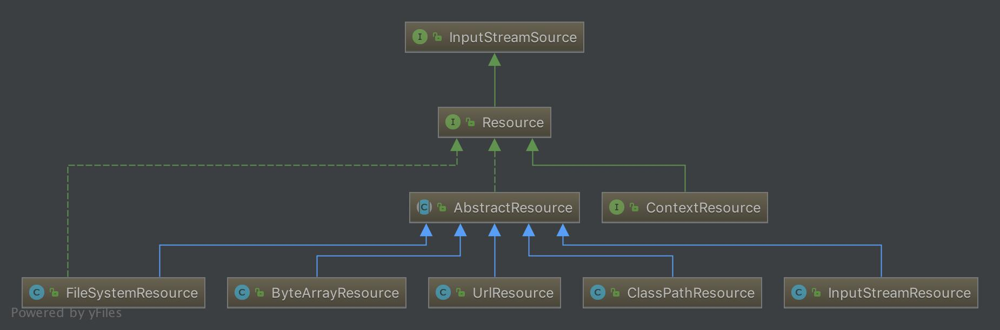

# Spring统一资源加载策略

在学`Java SE`的时候我们学习了一个标准类`java.net.URL`，该类在`Java SE`中的定位为统一资源定位器

但是我们知道它的实现基本只限于网络形式发布的资源的查找和定位。然而实际上资源的定义比较广泛，除了网络形式的资源，还有以二进制形式存在的、以文件形式存在的、以字节流形式存在的等等。而且它可以存在于任何场所，比如网络、文件系统、应用程序中。所以`java.net.URL`的局限性迫使`Spring`必须实现自己的资源加载策略，该资源加载策略需要满足如下要求:

- 职能划分清楚:资源的定义和资源的加载应该要有一个清晰的界限
- 统一的抽象:统一的资源定义和资源加载策略。资源加载后要返回统一的抽象给客户端

## Resource

```java
public interface Resource extends InputStreamSource {
    /**
     * 资源是否存在
     */
    boolean exists();

    /**
     * 资源是否可读
     */
    default boolean isReadable() {
        return true;
    }

    /**
     * 资源所代表的句柄是否被一个stream打开了
     */
    default boolean isOpen() {
        return false;
    }

    /**
     * 是否为 File
     */
    default boolean isFile() {
        return false;
    }

    /**
     * 返回资源的URL的句柄
     */
    URL getURL() throws IOException;

    /**
     * 返回资源的URI的句柄
     */
    URI getURI() throws IOException;

    /**
     * 返回资源的File的句柄
     */
    File getFile() throws IOException;

    /**
     * 返回ReadableByteChannel
     */
    default ReadableByteChannel readableChannel() throws IOException {
        return Channels.newChannel(getInputStream());
    }

    /**
     * 资源内容的长度
     */
    long contentLength() throws IOException;

    /**
     * 资源最后的修改时间
     */
    long lastModified() throws IOException;

    /**
     * 根据资源的相对路径创建新资源
     */
    Resource createRelative(String relativePath) throws IOException;

    /**
     * 资源的文件名
     */
    @Nullable
    String getFilename();

    /**
     * 资源的描述
     */
    String getDescription();
}
```

<div align="center">    
    
</div>

从上图可以看到`Resource`根据资源的不同类型提供不同的具体实现，如下:

- `FileSystemResource`:对`java.io.File`类型资源的封装，跟`File`打交道的基本上与 `FileSystemResource`也可以打交道。支持文件和`URL`的形式，实现`WritableResource`接口【且从`Spring Framework 5.0`开始`FileSystemResource`使用`NIO.2 API`进行读/写交互】
- `ByteArrayResource`:对字节数组提供的数据的封装，如果通过`InputStream`形式访问该类型的资源，该实现会根据字节数组的数据构造一个相应的`ByteArrayInputStream`
- `UrlResource`:对 `java.net.URL`类型资源的封装。内部委派`URL`进行具体的资源操作
- `ClassPathResource`:`class path`类型资源的实现。使用给定的`ClassLoader`或者给定的`Class`来加载资源
- `InputStreamResource`:将给定的`InputStream`作为一种资源的`Resource`的实现类

### AbstractResource

`AbstractResource`为`Resource`接口的默认实现，它实现了`Resource`接口的大部分的公共实现

```java
public abstract class AbstractResource implements Resource {
    /**
     * 判断文件是否存在，若判断过程产生异常（因为会调用SecurityManager来判断），就关闭对应的流
     */
    @Override
    public boolean exists() {
        try {
            return getFile().exists();
        } catch (IOException ex) {
            // Fall back to stream existence: can we open the stream?
            try {
                InputStream is = getInputStream();
                is.close();
                return true;
            } catch (Throwable isEx) {
                return false;
            }
        }
    }

    /**
     * 直接返回true，表示可读
     */
    @Override
    public boolean isReadable() {
        return true;
    }

    /**
     * 直接返回 false，表示未被打开
     */
    @Override
    public boolean isOpen() {
        return false;
    }

    /**
     *  直接返回false，表示不为File
     */
    @Override
    public boolean isFile() {
        return false;
    }

    /**
     * 抛出FileNotFoundException异常，交给子类实现
     */
    @Override
    public URL getURL() throws IOException {
        throw new FileNotFoundException(getDescription() + " cannot be resolved to URL");
    }

    /**
     * 基于 getURL() 返回的 URL 构建 URI
     */
    @Override
    public URI getURI() throws IOException {
        URL url = getURL();
        try {
            return ResourceUtils.toURI(url);
        } catch (URISyntaxException ex) {
            throw new NestedIOException("Invalid URI [" + url + "]", ex);
        }
    }

    /**
     * 抛出FileNotFoundException异常，交给子类实现
     */
    @Override
    public File getFile() throws IOException {
        throw new FileNotFoundException(getDescription() + " cannot be resolved to absolute file path");
    }

    /**
     * 根据getInputStream()的返回结果构建ReadableByteChannel
     */
    @Override
    public ReadableByteChannel readableChannel() throws IOException {
        return Channels.newChannel(getInputStream());
    }

    /**
     * 获取资源的长度
     *
     * 这个资源内容长度实际就是资源的字节长度，通过全部读取一遍来判断
     */
    @Override
    public long contentLength() throws IOException {
        InputStream is = getInputStream();
        try {
            long size = 0;
            byte[] buf = new byte[255];
            int read;
            while ((read = is.read(buf)) != -1) {
                size += read;
            }
            return size;
        } finally {
            try {
                is.close();
            } catch (IOException ex) {
            }
        }
    }

    /**
     * 返回资源最后的修改时间
     */
    @Override
    public long lastModified() throws IOException {
        long lastModified = getFileForLastModifiedCheck().lastModified();
        if (lastModified == 0L) {
            throw new FileNotFoundException(getDescription() + "cannot be resolved in the file system for resolving its last-modified timestamp");
        }
        return lastModified;
    }


    protected File getFileForLastModifiedCheck() throws IOException {
        return getFile();
    }

    /**
     * 交给子类实现
     */
    @Override
    public Resource createRelative(String relativePath) throws IOException {
        throw new FileNotFoundException("Cannot create a relative resource for " + getDescription());
    }

    /**
     * 获取资源名称，默认返回 null
     */
    @Override
    @Nullable
    public String getFilename() {
        return null;
    }


    /**
     * 返回资源的描述
     */
    @Override
    public String toString() {
        return getDescription();
    }

    @Override
    public boolean equals(Object obj) {
        return (obj == this ||
            (obj instanceof Resource && ((Resource) obj).getDescription().equals(getDescription())));
    }

    @Override
    public int hashCode() {
        return getDescription().hashCode();
    }
}
```

如果我们想要实现自定义的`Resource`不要实现`Resource`接口

而应该继承`AbstractResource`抽象类，然后根据当前的具体资源特性覆盖相应的方法即可

## ResourceLoader

一开始就说了`Spring`将资源的定义和资源的加载区分开了

`Resource`定义了统一的资源，那资源的加载则由`ResourceLoader`来统一定义

`org.springframework.core.io.ResourceLoader`为`Spring`资源加载的统一抽象，具体的资源加载则由相应的实现类来完成，所以我们可以将`ResourceLoader`称作为统一资源定位器

```java
public interface ResourceLoader {
    String CLASSPATH_URL_PREFIX = ResourceUtils.CLASSPATH_URL_PREFIX;

    Resource getResource(String location);

    ClassLoader getClassLoader();
}
```

- `getResource()`根据所提供资源的路径`location`返回`Resource`实例

    但它不确保该`Resource`一定存在，需要调用`Resource.exist()`方法判断。该方法支持以下模式的资源加载:

    - `URL`位置资源，如`file:C:/test.dat`
    - `ClassPath`位置资源，如`classpath:test.dat`
    - 相对路径资源，如`WEB-INF/test.dat`，此时返回的`Resource`实例根据实现不同而不同

    该方法的主要实现是在其子类`DefaultResourceLoader`中实现

- `getClassLoader()`返回`ClassLoader`实例，对于想要获取`ResourceLoader`使用的`ClassLoader`用户来说，可以直接调用该方法来获取，在分析`Resource`时提到了一个类`ClassPathResource`，这个类是可以根据指定的`ClassLoader`来加载资源的

作为`Spring`统一的资源加载器，它提供了统一的抽象，具体的实现则由相应的子类来负责实现

<div align="center">    
    
</div>

### DefaultResourceLoader

`DefaultResourceLoader`是`ResourceLoader`的默认实现

它接收`ClassLoader`作为构造函数的参数或者使用不带参数的构造函数，在使用不带参数的构造函数时，使用的`ClassLoader`为默认的`ClassLoader`一般为`Thread.currentThread().getContextClassLoader()`，可以通过 `ClassUtils.getDefaultClassLoader()`获取。当然也可以调用 `setClassLoader()`方法进行后续设置

```java
public DefaultResourceLoader() {
    this.classLoader = ClassUtils.getDefaultClassLoader();
}

public DefaultResourceLoader(@Nullable ClassLoader classLoader) {
    this.classLoader = classLoader;
}

public void setClassLoader(@Nullable ClassLoader classLoader) {
    this.classLoader = classLoader;
}

@Override
@Nullable
public ClassLoader getClassLoader() {
    return (this.classLoader != null ? this.classLoader : ClassUtils.getDefaultClassLoader());
}
```

`ResourceLoader`中最核心的方法为`getResource()`

它根据提供的`location`返回相应的`Resource`，而`DefaultResourceLoader`对该方法提供了核心实现(它的两个子类都没有提供覆盖该方法，所以可以断定`ResourceLoader`的资源加载策略就封装`DefaultResourceLoader`中)

```java
public Resource getResource(String location) {
    Assert.notNull(location, "Location must not be null");

    for (ProtocolResolver protocolResolver : this.protocolResolvers) {
        Resource resource = protocolResolver.resolve(location, this);
        if (resource != null) {
            return resource;
        }
    }

    if (location.startsWith("/")) {
        return getResourceByPath(location);
    } else if (location.startsWith(CLASSPATH_URL_PREFIX)) {
        return new ClassPathResource(location.substring(CLASSPATH_URL_PREFIX.length()), getClassLoader());
    } else {
        try {
            // Try to parse the location as a URL...
            URL url = new URL(location);
            return (ResourceUtils.isFileURL(url) ? new FileUrlResource(url) : new UrlResource(url));
        } catch (MalformedURLException ex) {
            // No URL -> resolve as resource path.
            return getResourceByPath(location);
        }
    }
}
```

首先通过`ProtocolResolver`来加载资源，成功返回`Resource`，否则调用如下逻辑:

- 若`location`以`/`开头，则调用`getResourceByPath()`构造`ClassPathContextResource`类型资源并返回
- 若`location`以`classpath:`开头，则构造`ClassPathResource`类型资源并返回
- 构造`URL`，尝试通过它进行资源定位
    - 若在加载过程中抛出`MalformedURLException`异常，则委派 `getResourceByPath()`实现资源定位加载
    - 若没有抛出`MalformedURLException`异常则判断是否为`FileURL`
        - 如果是则构造`FileUrlResource`类型资源，如果不是则构造`UrlResource`类型资源

#### ProtocolResolver

`ProtocolResolver` 用户自定义协议资源解决策略

作为`DefaultResourceLoader`的`SPI`，它允许用户自定义资源加载协议而不需要继承`ResourceLoader`的子类

介绍`Resource`时提到如果要实现自定`Resource`只需要继承`DefaultResource`即可，但有`ProtocolResolver`后我们不需要继承`DefaultResourceLoader`改为实现`ProtocolResolver`接口也可以实现自定义`ResourceLoader`

```java
Resource resolve(String location, ResourceLoader resourceLoader);
```

该方法接收两个参数:资源路径`location`，指定的加载器`ResourceLoader`，返回为相应的`Resource`

在`Spring`中你会发现该接口并没有实现类，它需要用户自定义，自定义的`Resolver`如何加入`Spring`体系呢？调用 `DefaultResourceLoader.addProtocolResolver()` 即可，如下

```java
public void addProtocolResolver(ProtocolResolver resolver) {
    Assert.notNull(resolver, "ProtocolResolver must not be null");
    this.protocolResolvers.add(resolver);
}
```

#### DefaultResourceLoader例子

```java
ResourceLoader resourceLoader = new DefaultResourceLoader();

Resource fileResource1 = resourceLoader.getResource("D:/Users/xxx.txt");
System.out.println("fileResource1 is FileSystemResource:" + (fileResource1 instanceof FileSystemResource));

Resource fileResource2 = resourceLoader.getResource("/Users/xxx.txt");
System.out.println("fileResource2 is ClassPathResource:" + (fileResource2 instanceof ClassPathResource));

Resource urlResource1 = resourceLoader.getResource("file:/Users/xxx.txt");
System.out.println("urlResource1 is UrlResource:" + (urlResource1 instanceof UrlResource));

Resource urlResource2 = resourceLoader.getResource("http://www.baidu.com");
System.out.println("urlResource1 is urlResource:" + (urlResource2 instanceof  UrlResource));
```

对于`fileResource1`我们希望是`FileSystemResource`资源类型，但是事与愿违它是`ClassPathResource`类型

在`getResource()`资源加载策略中，我们知道`D:/Users/xxx.txt`资源其实在该方法中没有相应的资源类型，那么它就会在抛出`MalformedURLException`异常时通过`getResourceByPath()`构造一个`ClassPathResource`类型的资源。而指定协议前缀的资源路径则通过`URL`就可以定义，返回`UrlResource`类型

#### FileSystemResourceLoader

从上面的示例我们看到其实`DefaultResourceLoader`对`getResourceByPath(String)`方法处理其实不是很恰当，这个时候我们可以使用`FileSystemResourceLoader`，它覆写了`getResourceByPath(String)`，使之从文件系统加载资源并以`FileSystemResource`类型返回，这样我们就可以得到想要的资源类型，如下

```java
@Override
protected Resource getResourceByPath(String path) {
    if (path.startsWith("/")) {
        path = path.substring(1);
    }
    return new FileSystemContextResource(path);
}
```

### ResourcePatternResolver

`ResourceLoader`的`Resource getResource(String location)`每次只能根据`location`返回一个`Resource`，当需要加载多个资源时我们只能多次调用 `getResource()`。`ResourcePatternResolver`是`ResourceLoader`的扩展，它支持根据指定的资源路径匹配模式每次返回多个`Resource`实例，其定义如下

```java
public interface ResourcePatternResolver extends ResourceLoader {
    String CLASSPATH_ALL_URL_PREFIX = "classpath*:";

    Resource[] getResources(String locationPattern) throws IOException;
}
```

`ResourcePatternResolver`在`ResourceLoader`的基础上增加了`getResources(String locationPattern)`

以支持根据路径匹配模式返回多个`Resource`实例，同时也新增了一种新的协议前缀`classpath*:`

#### PathMatchingResourcePatternResolver

`PathMatchingResourcePatternResolver`为`ResourcePatternResolver`最常用的子类

它除了支持`ResourcePatternResolver`新增的`classpath*:` 前缀外，还支持`Ant`风格的路径匹配模式

> `Spring`中`classpath:`和`classpath*:`的含义
>
> - `classpath`和`classpath*:`都是相对于类的根路径加载资源(包括`jar`包)
> - 假设多个`JAR`包或文件系统类路径都有一个相同的配置文件，`classpath:`只会在第一个加载的类路径下查找，`classpath*:`会扫描所有这些`JAR`包及类路径下出现的同名文件

`PathMatchingResourcePatternResolver`提供了三个构造方法，如下

```java
public PathMatchingResourcePatternResolver() {
    this.resourceLoader = new DefaultResourceLoader();
}

public PathMatchingResourcePatternResolver(ResourceLoader resourceLoader) {
    Assert.notNull(resourceLoader, "ResourceLoader must not be null");
    this.resourceLoader = resourceLoader;
}

public PathMatchingResourcePatternResolver(@Nullable ClassLoader classLoader) {
    this.resourceLoader = new DefaultResourceLoader(classLoader);
}
```

在构造时可以指定一个`ResourceLoader`，如果不指定的话它会在内部构造一个`DefaultResourceLoader`

`getResource()` 方法直接委托给相应的`ResourceLoader`来实现

所以如果我们在实例化的`PathMatchingResourcePatternResolver`的时候，如果不指定`ResourceLoader`

那么在加载资源时，其实就是`DefaultResourceLoader`的过程

在下面介绍的`Resource[] getResources(String locationPattern)`也相同，只不过返回的资源时多个而已

```java
public Resource[] getResources(String locationPattern) throws IOException {
    Assert.notNull(locationPattern, "Location pattern must not be null");
    // 以classpath*:开头
    if (locationPattern.startsWith(CLASSPATH_ALL_URL_PREFIX)) {
        // 路径包含通配符
        if (getPathMatcher().isPattern(locationPattern.substring(CLASSPATH_ALL_URL_PREFIX.length()))) {
            return findPathMatchingResources(locationPattern);
        } else {
            // 路径不包含通配符
            return findAllClassPathResources(locationPattern.substring(CLASSPATH_ALL_URL_PREFIX.length()));
        }
    } else {
        int prefixEnd = (locationPattern.startsWith("war:") ? locationPattern.indexOf("*/") + 1 : locationPattern.indexOf(':') + 1);
        // 路径包含通配符
        if (getPathMatcher().isPattern(locationPattern.substring(prefixEnd))) {
            return findPathMatchingResources(locationPattern);
        } else {
            // 路径不包含通配符
            return new Resource[] {getResourceLoader().getResource(locationPattern)};
        }
    }
}
```

【`classpath`和`classpath*`本质区别在于最终调用的是`ClassLoader`的`getResrouce`还是`getResources`】

## 总结

至此`Spring`整个资源记载过程已经分析完毕。下面简要总结下:

- `Spring`提供了`Resource`和`ResourceLoader`来统一抽象整个资源及其定位。使得资源与资源的定位有了一个更加清晰的界限，并且提供了合适的`Default`类，使得自定义实现更加方便和清晰
- `AbstractResource`为`Resource`的默认实现，它对`Resource`接口做了一个统一的实现，子类继承该类后只需要覆盖相应的方法即可，同时对于自定义的`Resource`我们也是继承该类
- `DefaultResourceLoader`同样也是`ResourceLoader`的默认实现，在自定`ResourceLoader`的时候我们除了可以继承该类外还可以实现`ProtocolResolver`接口来实现自定资源加载协议
- `DefaultResourceLoader`每次只能返回单一的资源，所以`Spring`针对这个提供了另外一个接口`ResourcePatternResolver`，该接口提供了根据指定的`locationPattern`返回多个资源的策略。其子类`PathMatchingResourcePatternResolver`是一个集大成者的`ResourceLoader`，因为它即实现了`Resource getResource(String location)`也实现了`Resource[] getResources(String locationPattern)`