[toc]

# Spring源码环境搭建

## Spring源码下载慢问题

- 使用码云做中转

- 使用翻墙软件加快下载速度，以`Shadowsocks`为例

    - 查看`Shadowsocks`高级配置

        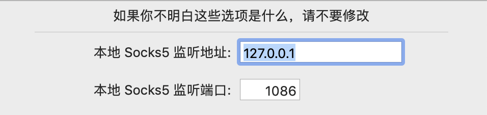
        
    - 配置`Git`命令行代理【终端上面使用的`git`不是走系统的代理，需要配置如下】

        ```shell
    git config --global http.proxy 'socks5://127.0.0.1:1086'
        git config --global https.proxy 'socks5://127.0.0.1:1086'
        
        # 如果需要取消代理 可以使用如下配置
        git config --global --unset http.proxy
        git config --global --unset https.proxy
        ```
    
    - 设置`Shadowsocks`代理模式为全局代理模式

        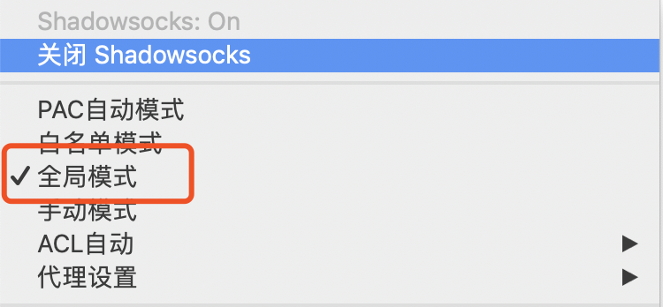

## Spring导入IDEA编译运行

- 将`Spring`源码导入`IDEA`

- 修改`build.gradle`文件，`repositories`添加阿里云的源

    ```reStructuredText
    maven{ url 'http://maven.aliyun.com/nexus/content/groups/public'}
    ```

- 导入完成后可能`spring-core`项目可能会报错(如果没有报错自己重新构建`build --> build project`)，这是`Spring`为了避免第三方`class`文件的冲突，把最新的`cglib`和`objenesis`重新打包后放在了`jar`包中，并没有放在源码中，从而导致编译错误，需要我们自己导入这两个`jar`包

    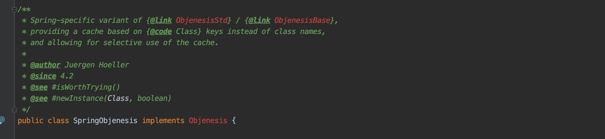
    
    解决上面源码中缺失`cglib`和`objenesis`的问题，网上给的解决方法是手动下载这两个`jar`包放到项目中或是自己用`jar`命令打包，笔者这里用`gradle`提供的打包工具解决以上问题

    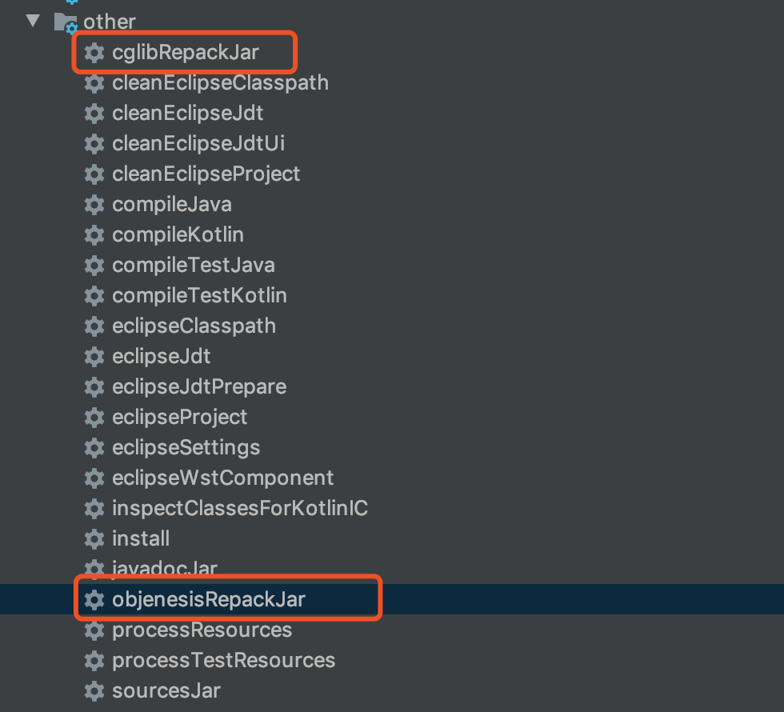

- 解决了以上问题后再重新编译又报找不到`AnnotationCacheAspect`这个符号，而我们打开项目目录发现可以到`AnnotationCacheAspect.aj`这个文件，该类的声明使用的是`aspect`而不是`class`，`IDEA`默认使用的编译器是`javac`识别不了`aspect`这样的语法的。`aspect`这个关键字是`AspectJ`才能识别的关键字，`AspectJ`是实现`AOP`编程的，`spring-aspects`这个项目和`AOP`有关，所以就需要用到`AspectJ`，需要`AspectJ`的编译器`Ajc`来对和`AOP`有关的`*.aj`文件进行编译

    - `AspectJ`安装

        - 下载地址

            ```reStructuredText
            https://www.eclipse.org/aspectj/downloads.php
            ```

        - 开始安装

            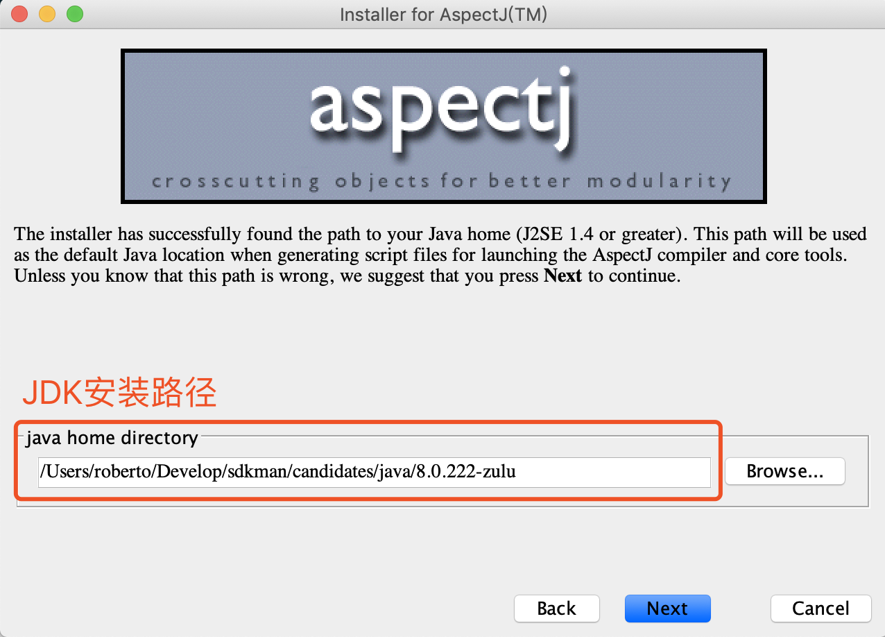
            
            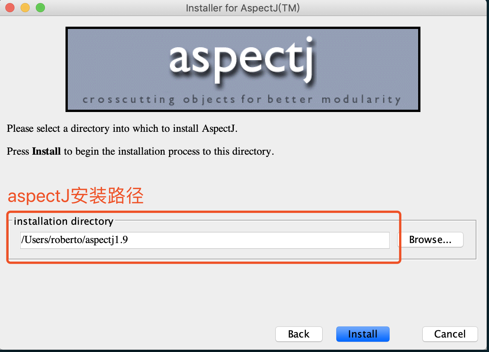

    - `IDEA`对`AspectJ`的支持
    
      `Spring-Aop`工程添加`Facets`属性

      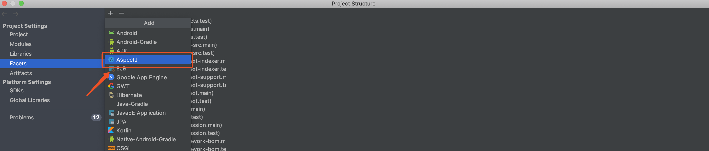
  
      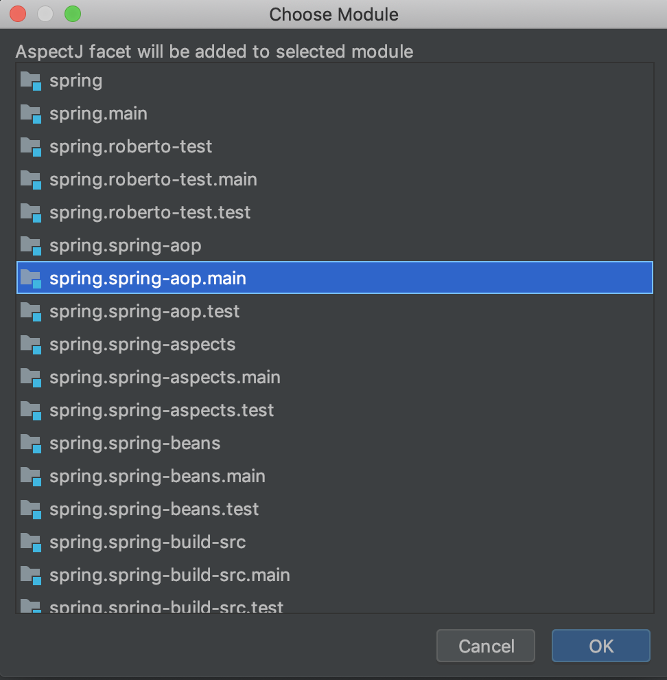

      添加完成后查看`Modules`验证
      
      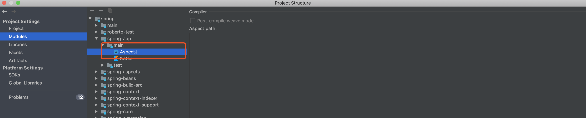

      `spring-aspects`模块添加`Facets`属性
      
      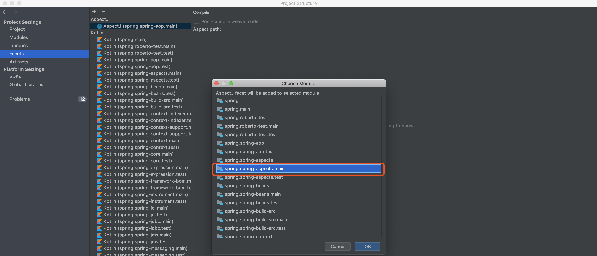

      更改`IDEA`编译器，使`IDEA`能够编译`*.aj`文件，步骤如下
      
      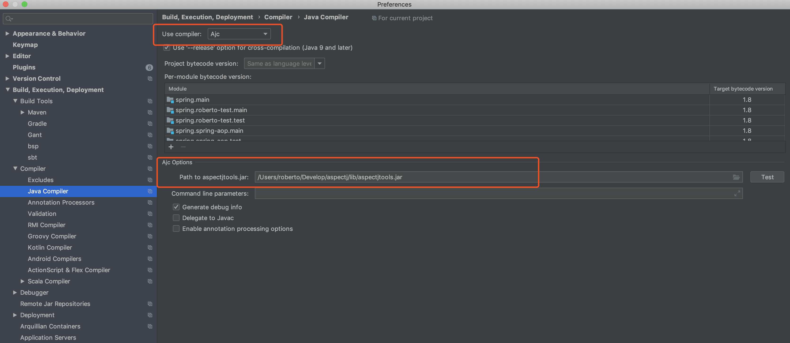

- 至此我们已经完成了`Spring`的环境搭建工作，还有一些单测类的错误已经不影响源码阅读，没有必要浪费时间去解决删掉就好。有兴趣的读者可以自行解决