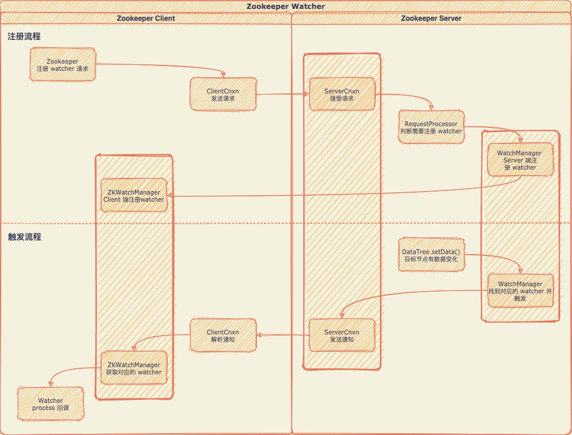
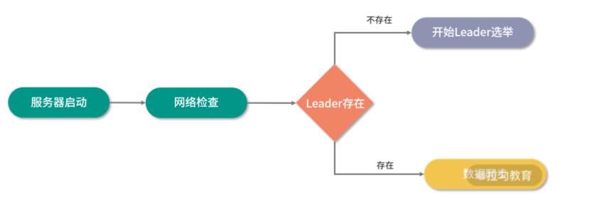
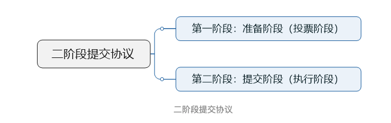
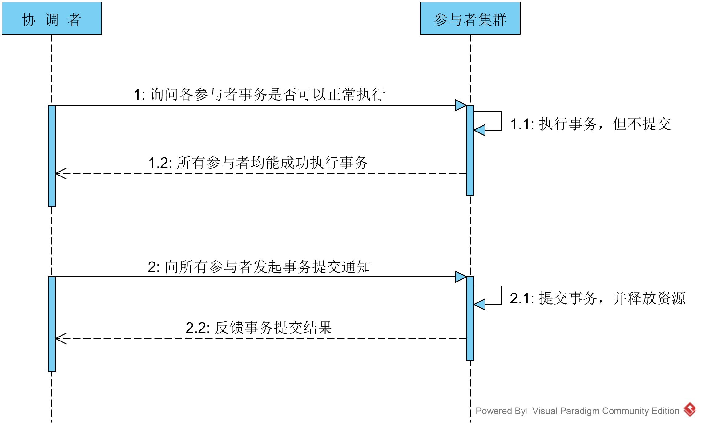
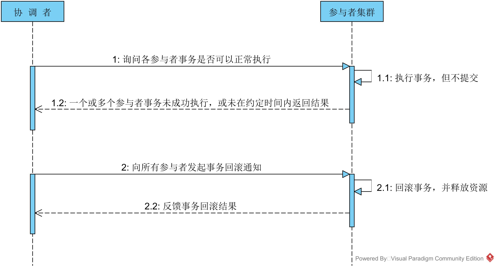
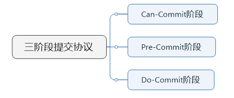
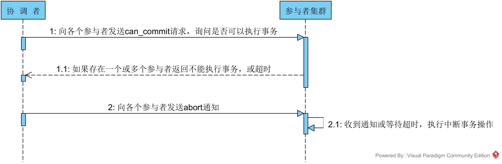
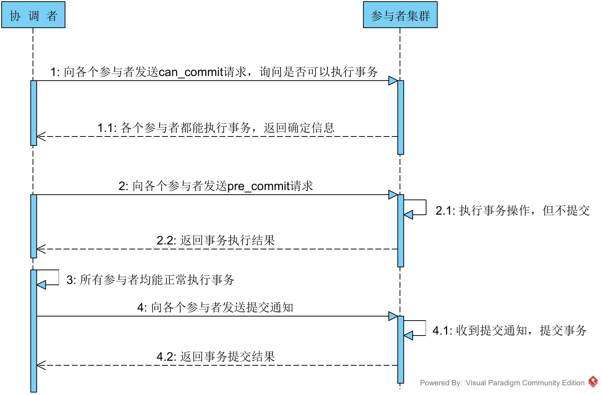
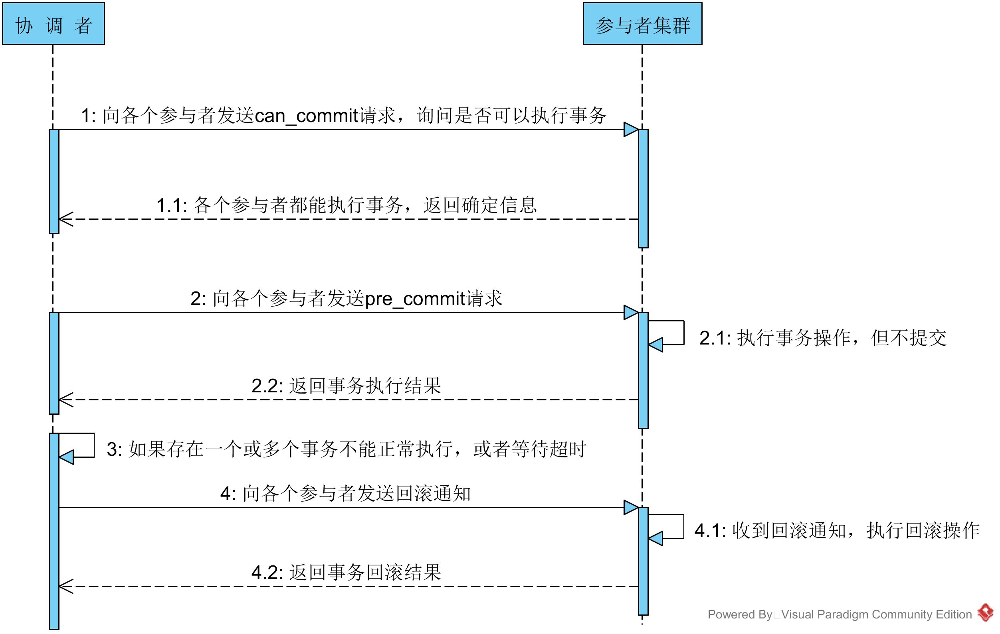

# Zookeeper

## 集群角色

在ZooKeeper集群中将服务器分成Leader、Follow、Observer三种角色服务器，在集群运行期间这三种服务器所负责的工作各不相同

- Leader

    - 集群内部各服务器的调度者

    - 事物请求的唯一调度和处理者，保证集群事物处理的顺序性

- Follow

    - 处理客户端非事物请求、转发事物请求给Leader服务器
    - 参与Leader选举的投票
    - 参与事物请求Proposal的投票(需要半数以上服务器通过才能通知Leader commit数据

- Observer

    简单来说Observer服务器只提供非事物请求服务，通常在于不影响集群事物处理能力的前提下提升集群非事物处理的能力

    从字面来理解该角色充当了观察者的角色，观察Zookeeper集群中的最新状态变化并将这些状态变化同步到Observer服务器上

    Observer的工作原理与Follower角色基本一致，而它和Follower角色唯一的不同在于Observer不参与任何形式的投票

    **存在的意义**:当ZooKeeper集群的规模变大，集群中Follow服务器数量逐渐增多的时候，ZooKeeper处理创建数据节点等事务性请求操作的性能就会逐渐下降。这是因为ZooKeeper集群在处理事务性请求操作时要在ZooKeeper集群中对该事务性的请求发起投票，只有超过半数的Follow服务器投票一致才会执行该条写入操作

    Observer不会接收来自Leader服务器提交的投票请求，且不会接收网络中的Proposal请求信息，只会从网络中接收INFORM类型的信息包。而INFORM信息的内部只包含已经被Commit操作过的投票信息，因为Observer服务器只接收已经被提交处理的Proposal请求不会接收未被提交的会话请求，这样就从底层信息的角度隔离了Observer参与投票操作，进而使Observer只负责查询等相关非事务性操作，保证扩展多个Observer服务器时不会对ZooKeeper集群写入操作的性能产生影响

## 节点类型

ZooKeeper中的数据节点分为持久节点、临时节点和有序节点三种类型

### 持久节点

持久节点是在ZooKeeper最为常用的，几乎所有业务场景中都会包含持久节点的创建

之所以叫作持久节点是因为一旦将节点创建为持久节点，该数据节点会一直存储在ZooKeeper服务器上

即使创建该节点的客户端与服务端的会话关闭了，该节点依然不会被删除。如果我们想删除持久节点，就要显式调用delete函数进行删除操作

### 临时节点

所谓临时性是指如果将节点创建为临时节点，那么该节点数据不会一直存储在ZooKeeper服务器上

当创建该临时节点的客户端会话因超时或发生异常而关闭时，该节点也相应在ZooKeeper服务器上被删除。 同样我们可以像删除持久节点一样主动删除临时节点

### 有序节点

有序节点并不算是一种单独种类的节点，而是在之前提到的持久节点和临时节点特性的基础上，增加了一个节点有序的性质

所谓节点有序是说在我们创建有序节点的时 候，ZooKeeper服务器会自动使用一个单调递增的数字作为后缀，追加到我们创建节点的后边

## Zookeeper Watch机制

Watch的注册与触发流程大致如下

为了高性能考虑Zookeeper的watcher被设计成很轻量级

上图Client与Server交互过程中，Client并没有把watcher实例传给Server端，而只是设置一个标识位告诉它要监听某个节点的变化

同理Server端节点发生变化的时候，只能简单"通知"Client"变化的事件，而具体发生了什么变化则需要Client自己去Server端再次获取

### watch是一次性的吗

是的，普通的watcher确实是一次性的，当事件被触发之后所对应的watcher会被立马删除

如此设计的原因依然是出于性能考虑。试想如果Server端的每次数据变更都通知Client，在更新非常频繁的情况下会影响性能。同时Client其实并不一定想知道每次数据更新，更多的是需要知道**最新**的数据。 不过如果Client想继续监听节点变化，如何注册一个**永久的watcher**呢？

Zookeeper提供的方案是在后续如`getData()`获取Server端最新数据时再注册一遍watcher即可。**Zookeeper在Session发生变化的时候会触发所有的watch**

## Leader是怎么选举的

- 服务启动时Leader选举

    在ZooKeeper集群启动时需要在集群中的服务器之间确定一台Leader服务器。当ZooKeeper集群中的三台服务器启动之后首先会进行通信检查，确保集群中的服务器之间能够进行通信。集群中的三台机器开始尝试寻找集群中的Leader服务器并进行数据同步等操作。如何这时没有搜索到Leader服务器，说明集群中不存在Leader服务器。这时ZooKeeper集群开始发起Leader服务器选举。在整个ZooKeeper集群中Leader选举主要可以分为三大步骤分别是:发起投票、接收投票、统计投票

    

    ### 发起投票

    在ZooKeeper服务器集群初始化启动的时候，集群中的每一台服务器都会将自己作为Leader服务器进行投票。也就是每次投票时，发送的服务器的myid(服务器标识 符)和 ZXID(集群投票信息标识符)等选票信息字段都指向本机服务器。 而一个投票信息就是通过这两 个字段组成。以集群中三个服务器Serverhost1、Serverhost2、Serverhost3为例，三个服务器的 投票内容分别是:Severhost1的投票是(1，0)、Serverhost2服务器的投票是(2，0)、 Serverhost3服务器的投票是(3，0)

    ### 接收投票

    集群中各个服务器在发起投票的同时，也通过网络接收来自集群中其他服务器的投票信息

    在接收到网络中的投票信息后，服务器内部首先会判断该条投票信息的有效性

    检查该条投票信息的时效性，是否是本轮最新的投票，并检查该条投票信息是否是处于LOOKING状态的服务器发出的

    ### 统计投票

    在接收到投票后，ZooKeeper 集群就该处理和统计投票结果了

    对于每条接收到的投票信息，集群中的每一台服务器都会将自己的投票信息与其接收到的ZooKeeper集群中的其他投票信息进行对比。主要进行对比的内容是ZXID，ZXID数值比较大的投票信息优先作为Leader服务器。如果每个投票信息中的ZXID相同，就会接着比对投票信息中的myid信息字段，选举出myid较大的服务器作为Leader服务器。拿上面列举的三个服务器组成的集群例子来说，对于Serverhost1服务器的投票信息是(1，0)，该服务器接收到的Serverhost2服务器的投票信息是(2，0)

    在 ZooKeeper集群服务运行的过程中首先会对比ZXID，发现结果相同之后对比myid，发现Serverhost2服务器的myid比较大，于是更新自己的投票信息并重新向ZooKeeper集群中的服务器发送新的投票信息。而Serverhost2服务器则保留自身的投票信息，并重新向ZooKeeper集群服务器中发送投票息

    而当每轮投票过后ZooKeeper服务都会统计集群中服务器的投票结果，判断是否有过半数的机器投出一样的信息。如果存在过半数投票信息指向的服务器，那么该台服务器就被选举为Leader服务器。比如上面我们举的例子中ZooKeeper集群会选举Severhost2服务器作为Leader服务器。当ZooKeeper集群选举出 Leader服务器后，ZooKeeper集群中的服务器就开始更新自己的角色信息，除被选举成Leader的服务器之外其他集群中的服务器角色变更为Following

- 服务运行时的Leader选举

    当ZooKeeper集群中的Leader服务器发生崩溃时，集群会暂停处理事务性的会话请求，直到ZooKeeper集群中选举出新的Leader服务器。而整个ZooKeeper 集群在重新选举Leader时也经过了四个过程，分别是变更服务器状态、 发起投票、接收投票、统计投票。发起投票、接收投票、统计投票与服务启动时一致

    ### 状态变更

    在ZooKeeper集群服务运行的过程中，集群中每台服务器的角色已经确定了，当Leader服务器崩溃后 ，ZooKeeper集群中的其他服务器会首先将自身的状态信息变为LOOKING状态，该状态表示服务器已经做好选举新Leader服务器的准备了，这之后整个ZooKeeper集群开始进入选举新的Leader服务器过程

## Leader Follower数据同步策略

**Zookeeper的数据同步方式为推模型，具体如何同步参考:https://www.cnblogs.com/youngchaolin/p/13211752.html**

## 附录

- Zookeeper实现分布式锁的原理

    大家都是上来直接创建一个锁节点下的一个接一个的临时顺序节点

    如果自己不是第一个节点，就**对自己上一个节点加监听器**，只要上一个节点释放锁自己就排到前面去了才算获取到锁

    相当于是一个排队机制。而且用临时顺序节点的另外一个用意就是，如果某个客户端创建临时顺序节点之后，不小心自己宕机了也没关系，ZK感知到那个客户端宕机，会自动删除对应的临时顺序节点，相当于自动释放锁或者是自动取消自己的排队

- Zookeeper会话超时时间的坑

    ZooKeeper实际起作用的超时时间是通过客户端和服务端协商决定。 ZooKeeper客户端在和服务端建立连接的时候，会提交一个客户端设置的会话超时间，而该超时时间会和服务端设置的最大超时时间和最小超时时间进行比对，如果正好在其允许的范围内则采用客户端的超时时间管理会话。如果大于或者小于服务端设置的超时时间，则采用服务端设置的值管理会话

    - 服务端配置文件配置了maxSessionTimeOut和minSessionTimeOut

        最终SessionTimeOut必须在minSessionTimeOut和maxSessionTimeOut区间里，如果跨越上下界则以跨越的上届或下界为准

    - 配置文件没有配置maxSessionTimeOut和minSessionTimeOut

        maxSessionTimeout没配置则maxSessionTimeOut设置为 20 * tickTime。minSessionTimeOut没配置则minSessionTimeOut设置为2 * tickTime

- 两阶段提交

    **当一个事务跨越多个节点时，为了保持事务的ACID特性**，需要**引入一个作为协调者的组件**来统一掌控所有节点(称作参与者)的操作结果并最终指示这些节点是否要把操作结果进行真正的提交。因此**二阶段提交的算法思路可以概括为:参与者将操作成败通知协调者，再由协调者根据所有参与者的反馈情报决定各参与者是否要提交操作还是中止操作**

    

    ### 投票阶段

    事务**协调者**给每个**参与者**发送**Prepare消息**，每个参与者**要么直接返回失败要么(锁定资源)在本地执行事务，写本地的redo和undo日志但不提交**

    - **协调者**节点向所有参与者节点**询问**是否可以执行**提交操作(vote)**，并开始等待各参与者节点的响应

    - 参与者节点检查事务权限，执行询问发起为止的所有事务操作，并将Undo信息和Redo信息写入日志。**为什么在执行任务前需要先写本地日志，主要是为了故障后恢复用，本地日志起到现实生活中凭证的效果，如果没有本地日志(凭证)出问题容易死无对证**

    - 各参与者节点响应协调者节点发起的询问。**如果参与者节点的事务操作实际执行成功**，则它返回一个"同意"消息，否则返回一个"中止"消息

    ### 提交阶段

    如果协调者收到了参与者的失败消息或者超时，直接给每个参与者发送回滚(Rollback)消息；否则发送提交(Commit)消息。参与者根据协调者的指令执行提交或者回滚操作，释放所有事务处理过程中使用的锁资源

    ### 理想情况下的场景

    - 事务正常提交

        

    - 事务异常终止

        

        

    ### 两阶段提交可能存在的问题

    - **同步阻塞问题**

        执行过程中所有参与节点都是事务阻塞型的。当参与者占有公共资源时其他第三方节点访问公共资源不得不处于阻塞状态。也就是说从投票阶段到提交阶段完成这段时间资源是被锁住的

    - **单点故障**

        由于协调者的重要性，**一旦协调者发生故障。参与者会一直阻塞下去。**尤其在第二阶段协调者发生故障，那么所有的参与者还都处于**锁定事务资源的状态中**，而无法继续完成事务操作。(如果是协调者挂掉，可以重新选举一个协调者，但是**无法解决因为协调者宕机导致的参与者处于阻塞状态的问题**)

    - **数据不一致**

        在二阶段提交的**阶段二中**当协调者向参与者发送commit请求之后，发生了局部网络异常或者在发送commit请求过程中协调者发生了故障，这回导致只有一部分参与者接受到了commit请求。而在这部分参与者接到commit请求之后就会执行commit操作。但是其他部分未接到commit请求的机器则无法执行事务提交。于是整个分布式系统便出现了数据不一致性的现象

- 三阶段提交

    与两阶段提交不同的是，三阶段提交有两个改动点

    - 引入**超时机制**。同时在协调者和参与者中都引入超时机制
    - 引入Can-Commit阶段，**主要是为了在预执行之前，保证所有参与者都具备可执行条件，从而减少资源浪费**

    也就是说除了引入超时机制之外，3PC把**2PC的投票阶段再次一分为二**，这样三阶段提交就有`CanCommit`、`PreCommit`、`DoCommit`三个阶段

    

    ### 为什么要把投票阶段一分为二

    **假设有1个协调者，9个参与者。其中有一个参与者不具备执行该事务的能力。**协调者发出prepare消息之后其余参与者都将资源锁住，执行事务写入undo和redo日志。协调者收到相应之后发现有一个参与者不能参与。所以又出一个roolback消息。其余8个参与者又对消息进行回滚。这样子，是不是做了很多无用功？所以**，**引入can-Commit阶段**主要是为了在预执行之前，保证所有参与者都具备可执行条件，从而减少资源浪费**

    ### CanCommit阶段

    3PC的CanCommit阶段其实和2PC的准备阶段很像。协调者向参与者发送commit请求，参与者如果可以提交就返回Yes响应，否则返回No响应

    - **事务询问** 协调者向参与者发送CanCommit请求。询问是否可以执行事务提交操作。然后开始等待参与者的响应
    - **响应反馈** 参与者接到CanCommit请求之后，正常情况下，如果其自身认为可以顺利执行事务，则返回Yes响应，并进入预备状态。否则反馈No

    ### PreCommit阶段

    本阶段协调者会根据第一阶段的询盘结果采取相应操作，询盘结果主要有两种

    - 假如协调者从所有的参与者获得的反馈都是Yes响应，那么就会执行事务的预执行

        - **发送预提交请求** 协调者向参与者发送PreCommit请求，并进入Prepared阶段
        - **事务预提交** 参与者接收到PreCommit请求后，会执行事务操作并将undo和redo信息记录到事务日志中
        - **响应反馈** 如果参与者成功的执行了事务操作，则返回ACK响应，同时开始等待最终指令

    - 假如有任何一个参与者向协调者发送了No响应，或者等待超时之后协调者都没有接到参与者的响应，那么就执行事务的中断

        - **发送中断请求** 协调者向所有参与者发送abort请求。
        - **中断事务** 参与者收到来自协调者的abort请求之后(或超时之后，仍未收到协调者的请求)，执行事务的中断

        

    ### doCommit阶段

    - 事务正常提交

        

    - 事务异常终止

        

    ## 与两阶段提交的对比

    相对于2PC，**3PC主要解决的单点故障问题，并减少阻塞，**因为一旦参与者无法及时收到来自协调者的信息之后他会默认执行commit。而不会一直持有事务资源并处于阻塞状态。因为当进入第三阶段时说明参与者在第二阶段已经收到了PreCommit请求，那么Coordinator产生PreCommit请求的前提条件是他在第二阶段开始之前，收到所有参与者的CanCommit响应都是Yes。一旦参与者收到了PreCommit意味他知道大家其实都同意修改了。所以一句话概括就是，**当进入第三阶段时，由于网络超时等原因，虽然参与者没有收到commit或者abort响应，但是他有理由相信：成功提交的几率很大**

    但是这种机制也会导致数据一致性问题，因为由于网络原因协调者发送的abort响应没有及时被参与者接收到，那么参与者在等待超时之后执行了commit操作。这样就和其他接到abort命令并执行回滚的参与者之间存在数据不一致的情况。**所以无论是2PC还是3PC都存在问题**

    

