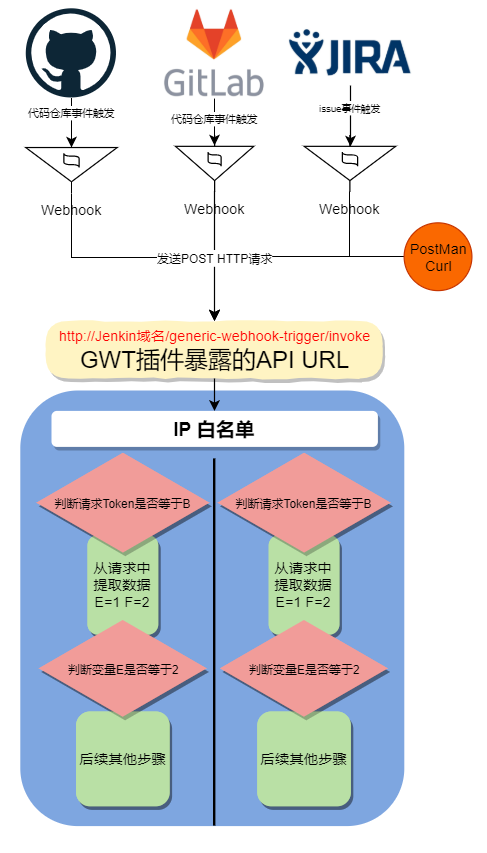
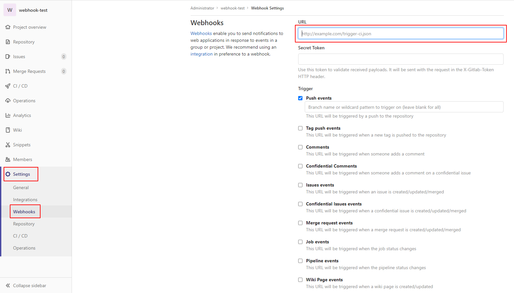

# Generic Webhook Trigger

使用`Generic Webhook Trigger`插件监听`WebHook`触发`job/pipeline`的构建 ，它有如下优势

- 暴露出来的回调`API URL`统一
- 可设置白名单，只允许接收指定`IP`地址的`Webhook`请求
- 不同的`job/pipeline`使用不同的`Token`或者指定特殊的请求参数进行区分
- 可使用不同的方式提取`HTTP`请求中的各种信息，然后通过环境变量的形式传递给`job/pipeline`使用

下图是`Generic Webhook Trigger`的一个执行流程示意图



## Jenkins File配置

```
properties([
    pipelineTriggers([
        [
            $class: 'GenericTrigger',
            genericVariables: [
                // WebHook参数提取
                [key: 'ref', value: '$.ref'],
                // 提取分支名称, 格式为 refs/heads/{branch}
                [key: 'WEBHOOK_REF', value: '$.ref'],
                // 提取用户显示名称
                [key: 'WEBHOOK_USER_NAME', value: '$.user_name'],
                // 提取最近提交id
                [key: 'WEBHOOK_RECENT_COMMIT_ID', value: '$.commits[-1].id'],
                // 提取最近提交message
                [key: 'WEBHOOK_RECENT_COMMIT_MESSAGE', value: '$.commits[-1].message'],
                // 如需更多参数可通过查看request body参数文档进行提取
            ],
            // 构建Token
            token: env.PROJECT_NAME,
            // 项目运行消息, 会显示在Jenkins Blue中的项目活动列表中
            causeString: 'Triggered on $ref',
            // 打印通过genericVariables配置的变量
            printContributedVariables: true,
            // 打印webhook中request body的请求内容
            printPostContent: true,
            // 避免使用已触发工作的信息作出响应
            silentResponse: false,
            // 这个字段跟下面的regexpFilterExpression是成对使用的，正则表达式过滤的就是该字段的内容。我们前面把Git的ref值赋值给了ref变量，这里就可以直接通过$ref来使用ref变量了
            regexpFilterText: '$ref',
            // 这是一个使用正则表达式的过滤器，也是我们做分支触发构建的关键因素。当满足该正则表达式的时候trigger才会触发构建
            regexpFilterExpression: 'refs/heads/' + BRANCH_NAME
        ]
    ])
])
```

配置可以参考文档:https://plugins.jenkins.io/generic-webhook-trigger/

## WebHook配置

进入项目`Webhook`配置页面



`URL`地址格式为`{jenkins 地址}/generic-webhook-trigger/invoke?token={token}`

> 如果`Jenkins`地址为内网需要添加如下配置
>
> 参考链接: https://docs.gitlab.com/ee/security/webhooks.html
>
> 
>
> `Generic Webhook Trigger`插件可以通过配置`IP`白名单的方式仅接受允许的`IP`
>
> 参考链接: https://github.com/jenkinsci/generic-webhook-trigger-plugin#whitelist-hosts

然后点击最下方的保存按钮即可

保存后在`Webhooks`页面最下面可以看到该记录，点击**Test**按钮然后选择**Push events**，此时会手动触发一次`Webhook`请求,

如果响应成功, 会显示一条**Hook executed successfully: HTTP 200**的消息提示

同时在`Jenkins`的`Blue`页面查看项目活动记录，可以看到项目运行成功的记录，其中的消息部分为即为`causeString`属性

## 手动运行构建任务

除了通过`Webhook`运行的方式外，我们可能存在手动运行的需求

如果我们在`Jenkinsfile`中没有依赖`genericVariables`配置的环境变量的话则可以直接手动运行，否则的话使用该变量会出现问题

这个时候需要定义一个与`genericVariables`中`key`名称相同的`parameter`。为了避免不必要的麻烦本例中不使用`WebHook`传递的参数

