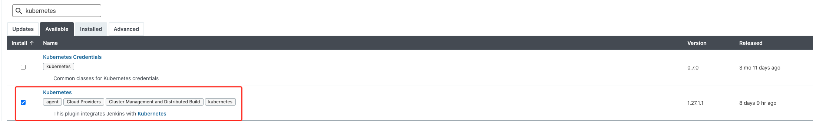
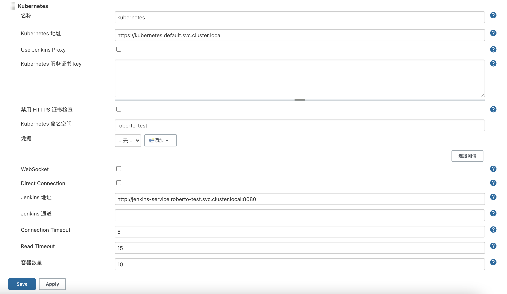
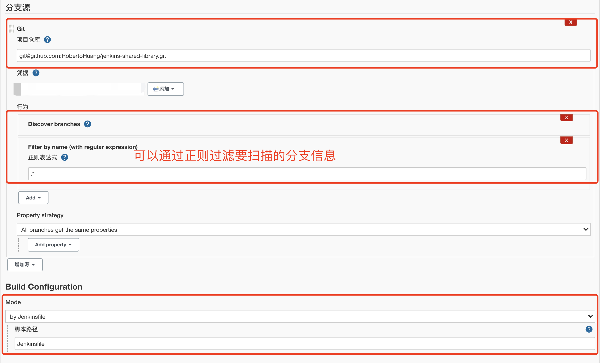

# Jenkins基于K8S动态Slave构建

> 以下是基于`Kubernetes`搭建`Jenkins`集群的简单示意图
>
> 
>
> **服务高可用**:当`Jenkins Master`出现故障时`Kubernetes`会自动创建一个新的`Jenkins Master`容器
>
> **动态伸缩**:每次运行`Job`时会自动创建一个`Jenkins Slave`，`Job`完成后`Slave`自动注销并删除容器资源自动释放
>
> **合理使用资源**:`Kubernetes`会根据每个资源的使用情况动态分配`Slave`到空闲的节点上创建
>
> **扩展性**:当`Kubernetes`集群的资源严重不足而导致`Job`排队等待时，可以很容易的添加一个`Kubernetes Node`到集群中从而实现扩展
>
> 本博客参考自:https://www.qikqiak.com/k8s-book/docs/36.Jenkins%20Slave.html

## 动态Slave环境初始化

接下来我们就需要来配置`Jenkins`，让他能够动态的生成`Slave`的`Pod`。安装插件`kubernetes plugin`



在系统配置`Kubernetes Plugins`基本信息



`kubernetes`命名空间我们这里填`roberto-test`，然后点击**Test Connection**

如果出现`Connected to Kubernetes 1.18+`的提示信息证明 `Jenkins`已经可以和`Kubernetes`系统正常通信了

## 使用Jenkins shard libary

安装插件:

- Git

- Pipeline: Shared Groovy Libraries
- Pipeline Utility Steps

具体使用文档可参考:https://github.com/RobertoHuang/jenkins-shared-library

## 验证阶段

**验证阶段**创建一个多分支流水线任务，验证上述配置是否正确

本例以`jenkins shard libary`仓库为例，配置如下



该项目的`Jenkinsfile`文件内容如下

```
env.DIND_PROJECT_LABEL_DEDICATED='base'

pipelineDefault.run({
  // 测试
  stage('test') {  
    sh '''
      docker info
      kubectl get pods
    '''
  }
});

```

现在我们直接在页面点击做成的`Build now`触发构建即可，然后观察`Kubernetes`集群中`Pod`的变化

```shell
# kubectl get pods
NAME                                   READY   STATUS    RESTARTS   AGE
base-roberto-test-master-jl41v-s7n83   2/2     Running   0          27s
jenkins-55bfc55b76-hg4cm               1/1     Running   0          24m
```

当构建的时候会自动创建`jenkins-slave-xxx`的`pod`，当构建成功后该`pod`会被自动删除。到此我们完成`Jenkins`动态`Slave`的配置
