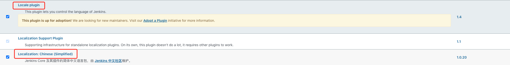
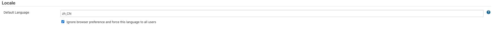
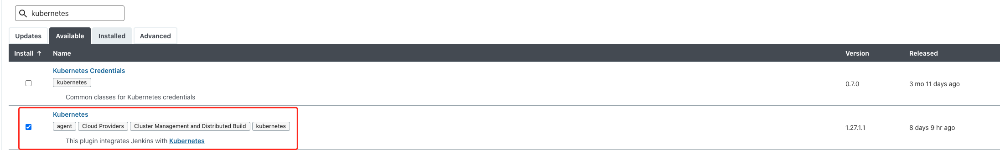
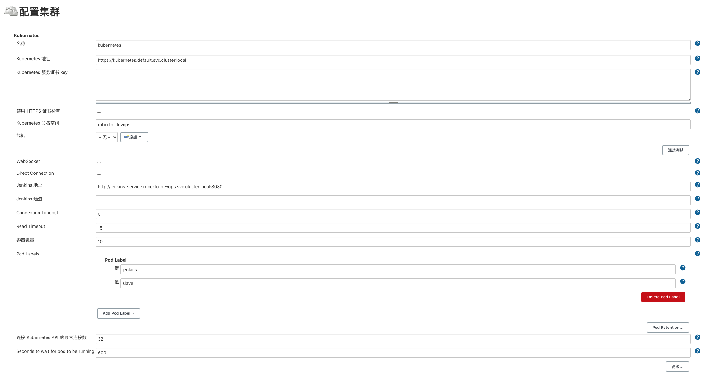
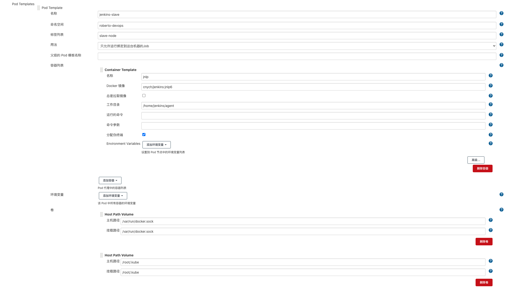
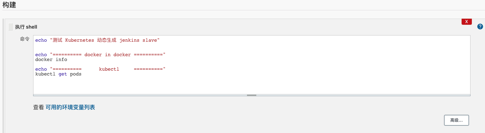

# K8S环境下安装与初始

> 以下是基于`Kubernetes`搭建`Jenkins`集群的简单示意图
>
> 
>
> **服务高可用**:当`Jenkins Master`出现故障时`Kubernetes`会自动创建一个新的`Jenkins Master`容器
>
> **动态伸缩**:每次运行`Job`时会自动创建一个`Jenkins Slave`，`Job`完成后`Slave`自动注销并删除容器资源自动释放
>
> **合理使用资源**:`Kubernetes`会根据每个资源的使用情况动态分配`Slave`到空闲的节点上创建
>
> **扩展性**:当`Kubernetes`集群的资源严重不足而导致`Job`排队等待时，可以很容易的添加一个`Kubernetes Node`到集群中从而实现扩展

## 安装部署

- 为了方便管理，我们将所有和`DevOps`相关的资源放在一个独立的`namespace`下

    ```shell
    kubectl create namespace roberto-devops
    ```

- 创建`Jenkins RPAC`相关的资源对象【该部分内容参考`K8S RBAC`相关博客】

    ```yaml
    cat > jenkins-rbac.yaml <<\EOF
    apiVersion: v1
    kind: ServiceAccount
    metadata:
      name: jenkins
      namespace: roberto-devops
    
    ---
    apiVersion: v1
    kind: ClusterRole
    apiVersion: rbac.authorization.k8s.io/v1beta1
    metadata:
      name: jenkins
    rules:
      - apiGroups: ["extensions", "apps"]
        resources: ["deployments"]
        verbs: ["create", "delete", "get", "list", "watch", "patch", "update"]
      - apiGroups: [""]
        resources: ["services"]
        verbs: ["create", "delete", "get", "list", "watch", "patch", "update"]
      - apiGroups: [""]
        resources: ["pods"]
        verbs: ["create","delete","get","list","patch","update","watch"]
      - apiGroups: [""]
        resources: ["pods/exec"]
        verbs: ["create","delete","get","list","patch","update","watch"]
      - apiGroups: [""]
        resources: ["pods/log"]
        verbs: ["get","list","watch"]
      - apiGroups: [""]
        resources: ["secrets"]
        verbs: ["get"]
    
    ---
    apiVersion: rbac.authorization.k8s.io/v1beta1
    kind: ClusterRoleBinding
    metadata:
      name: jenkins
      namespace: roberto-devops
    roleRef:
      apiGroup: rbac.authorization.k8s.io
      kind: ClusterRole
      name: jenkins
    subjects:
      - kind: ServiceAccount
        name: jenkins
        namespace: roberto-devops
    EOF
    
    kubectl apply -f jenkins-rbac.yaml
    ```

- 创建一个`Deployment`来管理`Jenkins`应用

    ```yaml
    cat > jenkins-deployment.yaml <<\EOF
    ---
    apiVersion: v1
    kind: PersistentVolumeClaim
    metadata:
      labels:
        app: jenkins
      name: jenkins-data
      namespace: roberto-devops
    spec:
      accessModes:
      - ReadWriteOnce
      resources:
        requests:
          storage: 30Gi
      storageClassName: store-class-test
    
    ---
    apiVersion: apps/v1
    kind: Deployment
    metadata:
      name: jenkins
      namespace: roberto-devops
    spec: 
      replicas: 1
      selector:
        matchLabels:
          app: jenkins
      template:
        metadata:
          labels:
            app: jenkins
        spec:
          terminationGracePeriodSeconds: 10
          serviceAccount: jenkins
          containers:
          - name: jenkins
            image: jenkins/jenkins:lts
            imagePullPolicy: IfNotPresent
            ports:
            - containerPort: 8080
              name: web
              protocol: TCP
            - containerPort: 50000
              name: agent
              protocol: TCP
            resources:
              limits:
                cpu: 1000m
                memory: 1Gi
              requests:
                cpu: 500m
                memory: 512Mi
            securityContext:
              runAsUser: 0
              privileged: true
            livenessProbe:
              httpGet:
                path: /login
                port: 8080
              initialDelaySeconds: 60
              timeoutSeconds: 5
              successThreshold: 1
              failureThreshold: 12
            readinessProbe:
              httpGet:
                path: /login
                port: 8080
              initialDelaySeconds: 60
              timeoutSeconds: 5
              successThreshold: 1
              failureThreshold: 12
            volumeMounts:
            - name: jenkins-data
              mountPath: /var/jenkins_home
          volumes:
          - name: jenkins-data
            persistentVolumeClaim:
              claimName: jenkins-data
    
    ---
    apiVersion: v1
    kind: Service
    metadata:
      name: jenkins-service
      namespace: roberto-devops
      labels:
        app: jenkins
    spec:
      selector:
        app: jenkins
      type: NodePort
      ports:
      - name: web
        port: 8080
        targetPort: web
        nodePort: 30888
      - name: agent
        port: 50000
        targetPort: agent
    EOF
    
    kubectl apply -f jenkins-deployment.yaml
    ```

    `Jenkins`安装成功后打开`Jenkins`界面选择自定义插件方式安装(取消所有插件勾选，后续手动安装)。至此`Jenkins`实例安装已完成

## Jenkins K8S环境初始化

接下来我们就需要来配置`Jenkins`，让他能够动态的生成`Slave`的`Pod`

- 汉化`Jenkins`，安装如下两个插件

    

    在系统配置下添加如下配置，重启`Jenkins`后即可显示中文了

    

- 安装插件`kubernetes plugin`，让它能够动态的生成`Slave`的`Pod`

    

    在系统配置`Kubernetes Plugins`基本信息

    

    `kubernetes`命名空间我们这里填`roberto-devops`，然后点击**Test Connection**，如果出现`Connected to Kubernetes 1.18+`的提示信息证明 `Jenkins`已经可以和`Kubernetes`系统正常通信了。下方的`Jenkins URL`根据`Service Name`不同进行修改

    配置`Slave`节点的`Pod Template`信息就是配置 `Jenkins Slave`运行的`Pod`模板，命名空间我们同样是用`roberto-devops`，`Labels` 这里也非常重要，对于后面执行`Job`的时候需要用到该值，然后我们这里使用的是`cnych/jenkins:jnlp6`这个镜像，这个镜像是在官方的`jnlp`镜像基础上定制的，加入了`kubectl`等一些实用的工具

    

    **注意容器的名称:`jnlp`不要修改，否则引起不必要错误**

    我们这里需要在下面挂载两个主机目录

    `/var/run/docker.sock`，该文件是用于`Pod`中的容器能够共享宿主机的`Docker`，这就是大家说的`Docker in Docker`的方式

    `/root/.kube`我们将这个目录挂载到容器的`/root/.kube`目录下面这是为了让我们能够在`Pod`的容器中能够使用`kubectl`工具来访问我们的`Kubernetes`集群

    一些同学在配置了后运行`Slave Pod`的时候出现了权限问题，因为`Jenkins Slave Pod`中没有配置权限，所以需要配置上`ServiceAccount`

    

    **验证阶段**创建一个自由风格任务，验证上述配置是否正确

    

    现在我们直接在页面点击做成的`Build now`触发构建即可，然后观察`Kubernetes`集群中`Pod`的变化

    ```shell
    # kubectl get pods -n roberto-devops
    NAME                       READY   STATUS        RESTARTS   AGE
    jenkins-68569b944b-hdswj   1/1     Running       0          3h6m
    jenkins-slave-rxnvh        1/1     Terminating   0          6s
    ```

    当构建的时候会自动创建`jenkins-slave-xxx`的`pod`，当构建成功后该`pod`会被自动删除。到此我们完成了`Jenkins`动态`Slave`的配置

