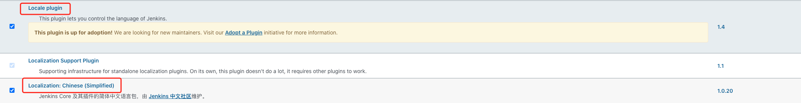
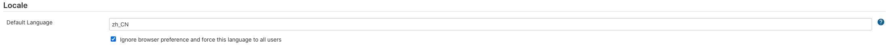

- 为了方便管理，我们将所有和`DevOps`相关的资源放在一个独立的`namespace`下

    ```yaml
    kubectl create namespace roberto-test
    ```

- 创建Service Account并绑定集群角色

    ```yaml
    apiVersion: v1
    kind: ServiceAccount
    metadata:
      name: jenkins-service-account
      namespace: roberto-test
    
    ---
    apiVersion: rbac.authorization.k8s.io/v1beta1
    kind: ClusterRoleBinding
    metadata:
      name: jenkins-clusterrole-binding
      namespace: roberto-test
    roleRef:
      kind: ClusterRole
      name: cluster-admin
      apiGroup: rbac.authorization.k8s.io
    subjects:
      - kind: ServiceAccount
        name: jenkins-service-account
        namespace: roberto-test
    ```

    让`jenkins`拥有对`k8s`资源的操作权限。这一步为`jenkins`后续集成`k8s`部署打下基础

- 为Jenkins提供持久化存储

    ```yaml
    apiVersion: v1
    kind: PersistentVolumeClaim
    metadata:
      name: jenkins-data
      namespace: roberto-test
    spec:
      accessModes:
      - ReadWriteOnce
      resources:
        requests:
          storage: 30Gi
      storageClassName: roberto-cbs-retain
    ```

- 创建Jenkins部署实例

    ```yaml
    apiVersion: apps/v1
    kind: Deployment
    metadata:
      name: jenkins
      namespace: roberto-test
    spec:
      replicas: 1
      selector:
        matchLabels:
          app: jenkins
      template:
        metadata:
          labels:
            app: jenkins
        spec:
          terminationGracePeriodSeconds: 10
          serviceAccount: jenkins-service-account
          containers:
          - name: jenkins
            image: jenkins/jenkins:2.303.3
            imagePullPolicy: IfNotPresent
            ports:
            - containerPort: 8080
              name: web
              protocol: TCP
            - containerPort: 50000
              name: agent
              protocol: TCP
            resources:
              limits:
                cpu: 1000m
                memory: 1Gi
              requests:
                cpu: 500m
                memory: 512Mi
            securityContext:
              runAsUser: 0
              privileged: true
            livenessProbe:
              httpGet:
                path: /login
                port: 8080
              initialDelaySeconds: 60
              timeoutSeconds: 5
              successThreshold: 1
              failureThreshold: 12
            readinessProbe:
              httpGet:
                path: /login
                port: 8080
              initialDelaySeconds: 60
              timeoutSeconds: 5
              successThreshold: 1
              failureThreshold: 12
            volumeMounts:
            - name: jenkins-data
              mountPath: /var/jenkins_home
          volumes:
          - name: jenkins-data
            persistentVolumeClaim:
              claimName: jenkins-data
    ```

- 为Jenkins提供外部网络访问

    ```yaml
    ---
    apiVersion: v1
    kind: Service
    metadata:
      name: jenkins-service
      namespace: roberto-test
    spec:
      selector:
        app: jenkins
      ports:
      - name: web
        port: 8080
        targetPort: web
      - name: agent
        port: 50000
        targetPort: agent
        
    ---
    apiVersion: extensions/v1beta1
    kind: Ingress
    metadata:
      annotations:
        konghq.com/override: https-only
        kubernetes.io/ingress.class: kong
      name: jenkins
      namespace: roberto-test
    spec:
      rules:
      - host: devops.bestvetschool.com
        http:
          paths:
          - backend:
              serviceName: jenkins-service
              servicePort: web
            path: /
      tls:
      - hosts:
        - devops.bestvetschool.com
        secretName: tls-secret
    ```

    其中`ingress`应用的秘钥部分为:`kubectl create secret tls tls-secret --cert=x.pem --key=x.key -n roberto-test`

- 打开网页`devops.bestvetschool.com`查看网页是否访问正常

    `Jenkins`安装成功后打开`Jenkins`界面选择自定义插件方式安装(取消所有插件勾选，后续手动安装)

- 安装完成后，可以选择汉化`Jenkins`

    汉化`Jenkins`，安装如下两个插件

    

    在系统配置下添加如下配置，重启`Jenkins`后即可显示中文了

    