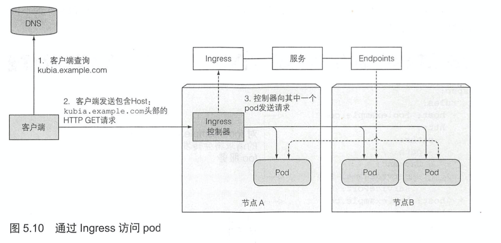

# Service资源

> `kubernetes`集群中的`Pod`通常需要应对来自集群内部的`Pod`以及集群外部的客户端请求作出响应。考虑到如下因素
>
> - `Pod`是短暂的，它们可能会随时启动或者关闭(弹性扩缩容、节点故障等因素)
> - `Pod IP`是不固定的，`Kubernetes`在`Pod`启动前会给已经调度到节点上的`Pod`分配`IP`地址
> - 多个`Pod`可能提供相同服务，客户端无须关心提供服务`Pod`的数量以及各自对应的`IP`
>
> 为了解决上诉问题`Kubernetes`提供了一种资源类型`Service`。开源版本中主要有`ClusterIP`、`NodePort`、`LoadBalance`三种类型

## 定义Service

```yaml
apiVersion: v1
kind: Service
metadata:
  name: my-service
spec:
  selector:
    # 标签选择器
    # 具有app=MyApp的Pod都属于该服务
    app: MyApp
  ports:
    - protocol: TCP
      # 该服务的端口
      port: 80
      # 服务将连接转发到的容器端口
      targetPort: 9376
```

- `Session`保持

    在`Service`的`yaml`的`sepc`里加入以下代码

    ```yaml
    sessionAffinity: ClientIP
    sessionAffinityConfig:
        clientIP:
          timeoutSeconds: 10800
    ```

    如果要确保每次都将来自特定客户端的连接传递到同一`Pod`， 则可以通过将`service.spec.sessionAffinity`设置为`ClientIP`(默认值是`None`)

    还可以通过适当设置`service.spec.sessionAffinityConfig.clientIP.timeoutSeconds`来设置最大会话停留时间(默认值为10800秒，即3小时)

- 使用命名的端口

    假设`Pod`的定义中指定了`Port`名称，如

    ```yaml
    apiVersion: v1
    kind:  Pod 
    metadata: 
      name: my-service
    spec: 
      containers:  
        image: My-Image
        ports:
        - name: http
          containerPort: 8080
    ```

    则可以在服务中引用命名`Port`

    ```yaml
    apiVersion: v1
    kind: Service
    metadata:
      name: my-service
    spec:
      ports:
        - protocol: TCP
          # 该服务的端口
          port: 80
          # 服务将连接转发到的容器端口
          targetPort: http
    ```

    这么做可以使得`Service`和`Pod`的具体端口解耦，在后续`Pod`暴露端口改变的时候无须的`Service`进行更新

- 通过`DNS`发现服务

    在`kube-system`命名空间下运行着一个`kube-dns`的服务

    在集群中的其他`Pod`都配置成使用其作为`DNS`(`Kubenetes`通过修改每个容器的`/etc/resolv.conf`方式实现的)

    运行在`Pod`上的进程`DNS`查询都会被`Kubernetes`自身的`DNS`服务器响应，该服务知道系统内所有在运行的服务信息

    `Pod`是否使用内部的`DNS`服务器是根据`Pod`中`spec`的`dnsPolicy`属性来决定的

    客户端在知道服务名称的前提下可以通过全限定域名`FQDN`来访问，`FQDN`的规则如下

    `my-svc.my-namespace.svc.cluster.local`:`svc.cluster.local`是所有集群本地服务名称中可配置集群域后缀

    如果`Pod`和`Service`对应的`Pod`在同一名称空间下，甚至可以省略`.my-namespace.svc.cluster.local`，简单到不可思议

- 资源对象`Endpoints`以及`ExternalName`介绍

    前者是用来解耦`SVC`和`Pod`的绑定关系，后者是用来解耦内部`Pod`与外部系统`API`的绑定关系

    这两种平时使用较少，可以参考书籍<<Kubernetes In Action>>的5.2小节进行学习

- 将服务暴露给外部客户端

    - 将服务类型设置为`NodePort`

        ```yaml
        apiVersion: v1
        kind: Service
        metadata:
          name: my-service
        spec:
          type: NodePort
          selector:
            app: MyApp
          ports:
            - port: 80
              targetPort: 80
              nodePort: 30007
        ```

        获取所有`Node`节点的`IP`地址命令

        ```shell
        kubectl get nodes -o jsonpath='{.items[*].status.addresses[?(@.type=="ExternalIP")].address}'
        ```

    - 将服务设置为`LoadBalance`，由云厂商提供负载均衡服务

        ```shell
        apiVersion: v1
        kind: Service
        metadata:
          name: my-service
        spec:
          type: LoadBalancer
          selector:
            app: MyApp
          ports:
            - port: 80
              targetPort: 80
        ```

        创建服务后云架构基础需要一段时间后可以创建出负载均衡并将`IP`地址写入`Service`信息中，即`External-IP`信息

    - 创建一个`Ingress`资源，这是一个完全不同的服务，一个`IP`地址公开多个服务，它运行在`HTTP`层因此可以提供比4层服务更多的功能

        首先需要确定集群中已经存在一个运行的`Ingress-Controller`，然后添加`Ingress`资源

        ```yaml
        apiVersion: extensions/v1beta1
        kind: Ingress
        metadata:
          annotations:
            kubernetes.io/ingress.class: kong
          name: my-ingress
        spec:
          rules:
          # 将该域名映射到对应服务
          - host: roberto.example.com
            http:
              paths:
              - backend:
                  将所有该域名的请求发送到my-service服务的80端口
                  serviceName: my-service
                  servicePort: 80
                path: /
        ```

        通过一个`Ingress`访问服务的大致图解

        

        关于`Ingress`的`HTTPS`配置(略)

    - 关于存活探针和就绪探针的区别

        - 存活探针通过杀死异常的容器并用新的正常容器来替代它们保持`Pod`正常工作

        - 就绪探针确保只有准备好处理请求的`Pod`才可以接收来自`Service`的请求，就绪探针失败后会从对应的`EndPoints`资源中移除

    - 无头服务

        如果客户端要连接到某个服务的所有`Pod`则需要通过调用`Kubernetest API`根据`Service`获取所有`Pod`以及其`IP`地址，但是我们应该尽量保证应用程序与`Kubernetes`的无关性，因此使用`Kubernetes API`并不理想。所以`Kubernetes`支持通过`DNS`查找发现单个`Pod`的`IP`地址

        ```yaml
        apiVersion: v1
        kind: Service
        metadata:
          name: my-service
        spec:
          selector:
            # 标签选择器
            # 具有app=MyApp的Pod都属于该服务
            app: MyApp
          clusterIP: None
          ports:
            - protocol: TCP
              # 该服务的端口
              port: 80
              # 服务将连接转发到的容器端口
              targetPort: 9376
        ```

        创建该服务后如果通过`kubectl describe svc`查看该服务会发现没有`Cluster IP`，并且通过以下命令可以查找对该无头服务匹配的`Pod`对应的`IP`

        ```shell
        kubectl run -it --rm --image=busybox:1.28 --restart=Never busybox -- nslookup zookeeper-hs[无头服务名称]
        ```

        如果需要查找指定`Pod`的`IP`可以使用如下命令，其中`zookeeper-0`为`pod`的名称

        ```shell
        kubectl run -it --rm --image=busybox:1.28 --restart=Never busybox -- nslookup zookeeper-0.zookeeper-hs
        ```