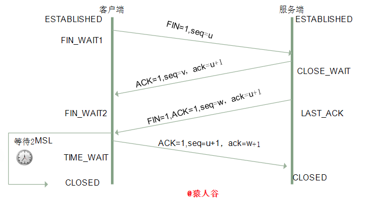

# TCP/IP协议

`TCP/IP`协议在计算机网络中是非常重要的部分

本文主要是简单介绍其中的`TCP`协议和`IP`协议，也会涉及一些在面试中经常遇到的问题

`TCP/IP`是个协议族，可分为四个层次:网络接口层(连接层)、网络层、传输层和应用层

- 连接层负责建立电路连接，是整个网络的物理基础(典型的协议包括以太网、`Wi-Fi`、`MPLS`等)

- 网络层负责分配地址和传送二进制数据，主要协议是`IP`协议

- 传输层负责传送文本数据，主要协议是`TCP`协议与`UDP`协议

- 应用层负责传送各种最终形态的数据(直接与用户打交道)，典型协议是`FTP`、`HTTP`、`TELNET`、`SMTP`、`DNS`等

## TCP协议特征

- `TCP`提供一种面向连接的、可靠的字节流服务
- 在一个`TCP`连接中仅有两方进行彼此通信。广播和多播不能用于`TCP`
- `TCP`使用校验和，确认和重传机制来保证可靠传输
- `TCP`使用累积确认
- `TCP`使用滑动窗口机制来实现流量控制，通过动态改变窗口的大小进行拥塞控制

## TCP的三次握手和四次挥手

### 三次握手

所谓三次握手`Three-way Handshake`是指建立一个`TCP`连接时，需要客户端和服务器总共发送3个包。三次握手的目的是连接服务器指定端口，建立`TCP`连接，并同步连接双方的序列号和确认号，交换`TCP`窗口大小信息


- 第一次握手:客户端主动建立连接
    - 客户端发送连接请求报文段，将`SYN`位置为1，`Sequence Number`为`x`
    - 然后客户端进入`SYN_SEND`状态，等待服务器的确认
- 第二次握手:服务器收到`SYN`报文段
    - 服务器收到客户端的`SYN`报文段需要对这个`SYN`报文段进行确认，设置`ACK`为1`ack`序号为`x+1`
    - 同时自己还要发送`SYN`请求信息，将`SYN`位置为1，`Sequence Number`为`y`；服务器端将上述所有信息放到一个报文段(即 `SYN+ACK` 报文段)中，一并发送给客户端，此时服务器进入`SYN_RECV`状态

- 第三次握手：客户端收到服务器的`SYN+ACK`报文段
    - 设置`ACK`为1`ack`序号为`y+1`向服务器发送`ACK`报文段，客户端和服务器端都进入`ESTABLISHED`状态

完成了三次握手，客户端和服务器端就可以开始传送数据

#### 为什么需要三次握手，两次不行吗

弄清这个问题我们需要先弄明白三次握手的目的是什么，能不能只用两次握手来达到同样的目的

- 第一次握手:客户端发送网络包，服务端收到了。
    这样服务端就能得出结论:客户端的发送能力、服务端的接收能力是正常的
- 第二次握手:服务端发包，客户端收到了
    这样客户端就能得出结论:服务端的接收、发送能力，客户端的接收、发送能力是正常的
- 第三次握手:客户端发包，服务端收到了
    这样服务端就能得出结论:客户端的接收、发送能力正常，服务器自己的发送、接收能力也正常

因此，需要三次握手才能确认双方的接收与发送能力是否正常。谢希仁的《计算机网络》中是这样说的

> 为了防止已失效的连接请求报文段突然又传送到了服务端，因而产生错误

在书中同时举了一个例子，如下：

> "已失效的连接请求报文段"的产生在这样一种情况下:`client`发出的第一个连接请求报文段并没有丢失，而是在某个网络结点长时间的滞留了，以致延误到连接释放以后的某个时间才到达`server`。本来这是一个早已失效的报文段，但`server`收到此失效的连接请求报文段后就误认为是`client`再次发出的一个新的连接请求，于是就向`client`发出确认报文段，同意建立连接
> 
> 假设不采用"三次握手"，那么只要`server`发出确认，新的连接就建立了。由于现在`client`并没有发出建立连接的请求，因此不会理睬`server`的确认，也不会向`server`发送数据。但`server`却以为新的运输连接已经建立，并一直等待`client`发来数据。这样`server`的很多资源就白白浪费掉了。采用"三次握手"的办法可以防止上述现象发生。例如刚才那种情况`client`不会向`server`的确认发出确认。`server`由于收不到确认，就知道`client`并没有要求建立连接【**这就很明白了，防止了服务器端的一直等待而浪费资源**】

#### SYN攻击是什么

- 什么是`SYN`攻击

    在三次握手过程中服务器发送`SYN-ACK`之后，收到客户端的`ACK`之前的`TCP`连接称为半连接。此时服务器处于`SYN_RCVD`状态，当收到客户端`ACK`后服务器才能转入`ESTABLISHED`状态

    `SYN`攻击是指攻击客户端在短时间内伪造大量不存在的`IP`地址，向服务器不断地发送`SYN`包，服务器回复确认包，并等待客户的确认。由于源地址是不存在的，服务器需要不断的重发直至超时，这些伪造的`SYN`包将长时间占用半连接队列，正常的`SYN`请求被丢弃，导致目标系统运行缓慢，严重者会引起网络堵塞甚至系统瘫痪

    `SYN`攻击是一种典型的`DoS/DDoS`攻击

- 如何检测`SYN`攻击

    检测`SYN`攻击非常的方便，当你在服务器上看到大量的半连接状态时，特别是源`IP`地址是随机的，基本上可以断定这是一次`SYN`攻击。在`Linux/Unix`上可以使用系统自带的`netstats`命令来检测`SYN`攻击

    ```shell
    netstat -n -p TCP | grep SYN_RECV
    ```

- 如何预防`SYN`攻击

    `SYN`攻击不能完全被阻止，除非将`TCP`协议重新设计

    我们所做的是尽可能的减轻`SYN`攻击的危害，常见的防御`SYN`攻击的方法有如下几种:

    - 缩短超时`SYN Timeout`时间
    - 增加最大半连接数
    - 过滤网关防护和`SYN Cookies`技术

### 四次挥手



示意图如上图所示。当客户端和服务器通过三次握手建立了`TCP`连接以后

当数据传送完毕肯定是要断开`TCP`连接的，这时候`TCP`采用的是四次挥手【挥手可以由客户端/服务端发起】

- 第一次挥手:客户端发送一个`FIN`报文，报文中会指定一个序列号。此时客户端处于`FIN_WAIT1`状态。即发出**连接释放报文段**(`FIN=1，序号seq=u`)并停止再发送数据主动关闭`TCP`连接，进入`FIN_WAIT1`(终止等待1)状态，等待服务端的确认

- 第二次挥手:服务端收到`FIN`之后，会发送`ACK`报文，且把客户端的序列号值+1作为`ACK`报文的序列号值，表明已经收到客户端的报文了，此时服务端处于`CLOSE_WAIT`状态。即服务端收到连接释放报文段后即发出**确认报文段**(`ACK=1，确认号ack=u+1，序号seq=v`)，服务端进入`CLOSE_WAIT`(关闭等待)状态，此时的`TCP`处于半关闭状态，客户端到服务端的连接释放。客户端收到服务端的确认后，进入`FIN_WAIT2`(终止等待2)状态，等待服务端发出的连接释放报文段

- 第三次挥手:如果服务端也想断开连接了，和客户端的第一次挥手一样，发给`FIN`报文，且指定一个序列号，此时服务端处于`LAST_ACK`的状态。即服务端没有要向客户端发出的数据，服务端发出**连接释放报文段**(`FIN=1，ACK=1，序号seq=w，确认号ack=u+1`)，服务端进入`LAST_ACK`(最后确认)状态，等待客户端的确认

- 第四次挥手:客户端收到`FIN`之后，一样发送一个`ACK`报文作为应答，且把服务端的序列号值+1作为自己`ACK`报文的序列号值，此时客户端处于`TIME_WAIT`状态。需要过一阵子以确保服务端收到自己的`ACK`报文之后才会进入`CLOSED`状态，服务端收到`ACK`报文之后就关闭连接了，处于`CLOSED`状态。客户端收到服务端的连接释放报文段后，对此发出**确认报文段**(`ACK=1，seq=u+1，ack=w+1`)进入`TIME_WAIT`(时间等待)状态。此时`TCP`未释放掉，需要经过时间等待计时器设置的时间`2MSL`后客户端才进入`CLOSED`状态


收到一个`FIN`只意味着在这一方向上没有数据流动。**客户端执行主动关闭并进入`TIME_WAIT`是正常的，服务端通常执行被动关闭，不会进入`TIME_WAIT`状态**

#### 为什么需要四次挥手

因为当服务端收到客户端的`SYN`连接请求报文后，可以直接发送`SYN+ACK`报文。其中**ACK报文是用来应答的，SYN报文是用来同步的**。但是关闭连接时，当服务端收到`FIN`报文时，很可能并不会立即关闭`SOCKET`，所以只能先回复一个`ACK`报文告诉客户端，"你发的`FIN`报文我收到了"【避免客户端一直发送`FIN`报文】。只有等到我服务端所有的报文都发送完了，我才能发送`FIN`报文，因此不能一起发送。故需要四次挥手

#### 四次挥手释放连接时，等待2MSL的意义

> **MSL**是`Maximum Segment Lifetime`的英文缩写
>
> 可译为"最长报文段寿命"它是任何报文在网络上存在的最长时间，超过这个时间报文将被丢弃

- 保证客户端发送的最后一个`ACK`报文段能够到达服务端

    这个`ACK`报文段有可能丢失，使得处于`LAST-ACK`状态的`B`收不到对已发送的`FIN+ACK`报文段的确认，服务端超时重传`FIN+ACK`报文段，而客户端能在`2MSL`时间内收到这个重传的`FIN+ACK`报文段，接着客户端重传一次确认，重新启动`2MSL`计时器，最后客户端和服务端都进入到`CLOSED`状态。若客户端在`TIME-WAIT`状态不等待一段时间，而是发送完`ACK`报文段后立即释放连接，则无法收到服务端重传的`FIN+ACK`报文段，所以不会再发送一次确认报文段，则服务端无法正常进入到`CLOSED`状态
    
- 防止"已失效的连接请求报文段"出现在本连接中

    客户端在发送完最后一个`ACK`报文段后，再经过`2MSL`，就可以使本连接持续的时间内所产生的所有报文段都从网络中消失，使下一个新的连接中不会出现这种旧的连接请求报文段

## TCP和UDP的差别

- `TCP`开销比`UDP`大，`TCP`头部需要20字节，`UDP`头部只要8个字节
- `TCP`无界有拥塞控制，`UDP`有界无拥塞控制
- `TCP`是面向连接的、可靠的、有序的、速度慢的协议；`UDP`是无连接的、不可靠的、无序的、速度快的协议

## 备注

该部分知识只能说了解吧... 涉及的知识太多了